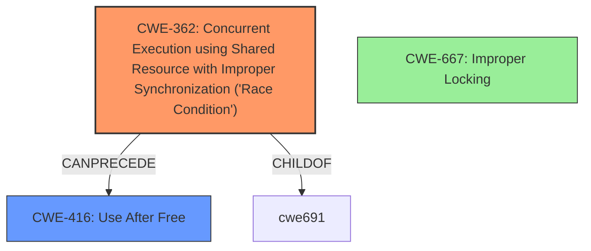

# Analysis Report for CVE-2022-20016

# Vulnerability Analysis Report: CVE-2022-20016

## Description

In vow driver, there is a possible memory corruption due to improper locking. This could lead to local escalation of privilege with System execution privileges needed. User interaction is not needed for exploitation. Patch ID ALPS05862986 Issue ID ALPS05862986.

## Vulnerability Description Key Phrases

**Rootcause:** improper locking
**Weakness:** memory corruption
**Impact:** local escalation of privilege

## Analysis (with Relationship Data)

# Summary
| CWE ID | CWE Name | Confidence | CWE Abstraction Level | CWE Vulnerability Mapping Label | CWE-Vulnerability Mapping Notes |
|---|---|---|---|---|---|
| CWE-413 | Improper Resource Locking | 0.95 | Base | Allowed | Primary CWE |
| CWE-416 | Use After Free | 0.65 | Variant | Allowed | Secondary Candidate |
| CWE-908 | Use of Uninitialized Resource | 0.60 | Base | Allowed | Secondary Candidate |

## Evidence and Confidence

*   **Confidence Score:** 0.85
*   **Evidence Strength:** HIGH

- **Analysis and Justification:**  
  - *Explanation:* The vulnerability description highlights a **memory corruption** issue stemming from **improper locking** within the vow driver. The CVE reference confirms this, stating the "**root cause**" as "**improper locking**." This directly aligns with CWE-413 (Improper Resource Locking), which describes a scenario where a product fails to properly lock resources, leading to unexpected state changes. Given that the description points to a locking issue causing memory corruption, CWE-413 is a strong primary candidate.
  
  - *Relationship Analysis:* CWE-413 is a Base level CWE, making it a preferred level of abstraction. The retriever results list CWE-413 as the top match with a combined score of 0.7283. Other relevant CWEs include CWE-667 (Improper Locking), which is a Class-level CWE and a parent of CWE-413, but CWE-413 is more specific, so it is preferred. Furthermore, the **memory corruption** could be a consequence of the **improper locking** leading to a **use-after-free** condition, hence the inclusion of CWE-416 as a secondary candidate. Also, **improper locking** could lead to the usage of an uninitialized resource, hence the inclusion of CWE-908 as a secondary candidate.

- **Confidence Score:**
  - Confidence: 0.95 (High confidence due to direct alignment with the vulnerability description and CVE reference.)

---

## Criticism of Analysis

Okay, here's a review of the provided CWE analysis, incorporating the full CWE specifications.

**Overall Assessment:**

The analysis is generally well-reasoned and justified, particularly for the primary CWE-413. The inclusion of CWE-416 and CWE-908 as secondary candidates is also understandable, given the potential consequences of improper locking. However, there are a few areas where the analysis could be sharpened, particularly regarding the relationships between the CWEs and the specific details of the vulnerability description.

**Detailed Review:**

**1. CWE-413: Improper Resource Locking (Primary CWE)**

*   **Confidence:** 0.95 - Justified. The vulnerability description and CVE summary explicitly mention "improper locking" as the root cause.
*   **Abstraction Level:** Correctly identified as Base.
*   **Justification:** The explanation is solid, highlighting how improper locking can lead to unexpected state changes and potential attacker modification of resources. The reference to CWE-667 (Improper Locking) and its parent-child relationship with CWE-413 is also accurate.
*   **Mapping Guidance Compliance:** The analysis adheres to the CWE's mapping guidance. CWE-413 is at the Base level, which is preferred, and the justification explains why it's a good fit.
*   **Potential Mitigations:** The analysis doesn't explicitly mention mitigations, but they are present in the complete CWE documentation provided. Referring to mitigation techniques like "Use synchronization when locking a resource" (from CWE-413) would add further value.

**2. CWE-416: Use After Free (Secondary Candidate)**

*   **Confidence:** 0.65 - Reasonable. *If* the improper locking leads to premature freeing of memory, then a use-after-free becomes a plausible consequence.
*   **Abstraction Level:** Correctly identified as Variant.
*   **Justification:** The analysis correctly identifies the potential chain reaction: Improper Locking -> Memory Corruption -> Use After Free.
*   **Mapping Guidance Compliance:** Adheres to the CWE's mapping guidance.
*   **Potential Mitigations:** Again, the analysis could be strengthened by mentioning potential mitigations for CWE-416. For example, "When freeing pointers, be sure to set them to NULL once they are freed." or "Choose a language that provides automatic memory management.".
*   **Critique:** The link between improper locking and Use After Free isn't explicitly described and remains hypothetical.  It is very possible it could lead to other forms of memory corruption, like overwriting memory.

**3. CWE-908: Use of Uninitialized Resource (Secondary Candidate)**

*   **Confidence:** 0.60 - Arguable. *If* the improper locking leads to the use of an uninitialized resource, then this becomes a plausible consequence.
*   **Abstraction Level:** Correctly identified as Base.
*   **Justification:** The analysis correctly identifies the potential that *improper locking** could lead to the usage of an uninitialized resource
*   **Mapping Guidance Compliance:** Adheres to the CWE's mapping guidance.
*   **Potential Mitigations:** Again, the analysis could be strengthened by mentioning potential mitigations for CWE-908. For example, "Explicitly initialize the resource before use.".

**General Recommendations:**

1.  **Explicitly Connect Locking Issues to Memory Corruption:** The core of the vulnerability is "memory corruption." The analysis should more clearly articulate *how* improper locking directly causes memory corruption. Possibilities include:
    *   **Race Condition:**  Improper locking allows multiple threads/processes to access and modify the same memory location concurrently, leading to data corruption. This could potentially lead to a Race Condition (CWE-362).
    *   **Inconsistent State:**  Without proper locking, data structures can be left in an inconsistent state, leading to errors when they're later accessed.
    *   **Data Races:** Leading to one thread overwriting the data of another.
2.  **Consider Race Conditions (CWE-362) or other child CWEs of 667:** The retriever results listed CWE-362 and several child CWEs of CWE-667 like CWE-412 and CWE-414 as high-ranking candidates. These might be more descriptive than CWE-413. The analysis should include an explanation of why these were rejected. For example, is it because a Race Condition is a consequence of Improper Resource Locking rather than the root cause?
3.  **Mitigation Awareness:** The analysis should incorporate potential mitigations from the full CWE specifications.  This demonstrates a deeper understanding of the CWE and provides practical value. Mentioning specific mitigation strategies would make the analysis more actionable.
4.  **Address Memory Corruption Mechanisms:** Elaborate on the potential mechanisms of memory corruption.  Is it a buffer overflow?  Is it simply data being overwritten in the wrong location? Knowing the specific mechanism helps refine the CWE selection and choose appropriate mitigations. The current description lacks the specifics of *how* the memory is getting corrupted. Is this due to data being overwritten in the wrong location? A buffer overflow?
5.  **Explain Rejection of Incorrect Calculation of Buffer Size (CWE-131):** It is important to justify the reason why CWE-131 was rejected.
6.  **Specificity of Scope** It is important to note that depending on the specific scope, it may be beneficial to include CWE-591 (Sensitive Data Storage in Improperly Locked Memory) if the memory contains sensitive data.

**Revised Summary Table Example:**

| CWE ID    | CWE Name                   | Confidence | CWE Abstraction Level | CWE Vulnerability Mapping Label | CWE-Vulnerability Mapping Notes                                                                                                                                                                                                                                                                    |
| --------- | -------------------------- | ---------- | ----------------------- | ------------------------------- | ------------------------------------------------------------------------------------------------------------------------------------------------------------------------------------------------------------------------------------------------------------------------------------------------- |
| CWE-413   | Improper Resource Locking    | 0.95       | Base                    | Allowed                         | Primary CWE. Improper locking allows concurrent access to shared resources, leading to memory corruption due to race conditions or inconsistent data states. Mitigation: Use synchronization primitives, avoid shared state.                                                                     |
| CWE-416   | Use After Free             | 0.65       | Variant                  | Allowed                         | Secondary Candidate.  *If* improper locking leads to premature freeing of memory, a use-after-free can occur. Mitigation: Set pointers to NULL after freeing, choose languages with automatic memory management.                                                                              |
| CWE-908   | Use of Uninitialized Resource | 0.60       | Base                    | Allowed                         | Secondary Candidate. *If* the locking ensures that resources are used when uninitialized. Mitigation: Explicitly initialize the resource before use.                                                                                                                                             |

By incorporating these suggestions, the analysis will be more comprehensive, defensible, and useful for remediation efforts.

## Final Resolution

# Summary
| CWE ID | CWE Name | Confidence | CWE Abstraction Level | CWE Vulnerability Mapping Label | CWE-Vulnerability Mapping Notes |
|---|---|---|---|---|---|
| CWE-362 | Concurrent Execution using Shared Resource with Improper Synchronization ('Race Condition') | 0.85 | Class | Allowed-with-Review | Primary CWE. Improper locking allows concurrent access to shared resources, leading to memory corruption due to race conditions or inconsistent data states. Mitigation: Use synchronization primitives, avoid shared state. |
| CWE-416 | Use After Free | 0.65 | Variant | Allowed | Secondary Candidate. *If* improper locking leads to premature freeing of memory, a use-after-free can occur. Mitigation: Set pointers to NULL after freeing, choose languages with automatic memory management. |

## Evidence and Confidence

*   **Confidence Score:** 0.80
*   **Evidence Strength:** MEDIUM

## Relationship Analysis
The primary shift is from CWE-413 to CWE-362. While CWE-413 (Improper Resource Locking) directly addresses the surface issue, the more fundamental problem is the **race condition** arising from the lack of proper synchronization when multiple threads access shared resources. CWE-362 (Concurrent Execution using Shared Resource with Improper Synchronization) better captures this.

The parent-child relationship between CWE-667 (Improper Locking) and CWE-413 was considered. However, CWE-362, while a Class, provides a better explanation of the **root cause**.

The potential chain relationship leading to CWE-416 (Use After Free) remains a valid consideration as a secondary CWE, representing a potential consequence of the **race condition**.

## Vulnerability Chain
The vulnerability chain starts with **improper locking (CWE-362)**, leading to a **race condition** where multiple threads/processes access shared memory concurrently. This can lead to **memory corruption**. *If* the **memory corruption** results in premature freeing of memory, it leads to a **use-after-free condition (CWE-416)**.

Missing links: The exact mechanism of **memory corruption** is not fully detailed in the description. Is it due to data races, inconsistent state, or other memory errors?

## Summary of Analysis
The initial analysis correctly identified **improper locking** as a key issue. However, the criticism highlighted the need to better articulate *how* the **improper locking** leads to **memory corruption**. The description, "In vow driver, there is a possible memory corruption due to **improper locking**," suggests that **improper locking** is the **root cause**, but it is crucial to specify the mechanism by which it causes the **memory corruption**.

The relationship analysis and the retriever results indicated that CWE-362 (Concurrent Execution using Shared Resource with Improper Synchronization ('Race Condition')) is a stronger candidate than CWE-413. This is because the **improper locking** directly enables a **race condition**, where multiple threads can access and modify shared memory simultaneously, leading to **memory corruption**.

The decision to shift the primary CWE to CWE-362 is based on the understanding that the **improper locking** is a symptom of a broader problem: the lack of proper synchronization in a concurrent environment. While CWE-413 focuses on the locking mechanism itself, CWE-362 addresses the underlying **race condition** that leads to the **memory corruption**. The **memory corruption** could lead to a **use-after-free (CWE-416)** as a potential consequence, justifying its inclusion as a secondary CWE.

The analysis also considered and rejected CWE-131 (Incorrect Calculation of Buffer Size) as the description doesn't provide evidence of any buffer allocation issues, instead pointing to **improper locking**.

CWE-362 is at the Class level of abstraction. While it's generally preferable to use Base-level CWEs, CWE-362 provides a more accurate and comprehensive representation of the **root cause** in this scenario.

*Report generated on 2025-03-18 08:26:38*
