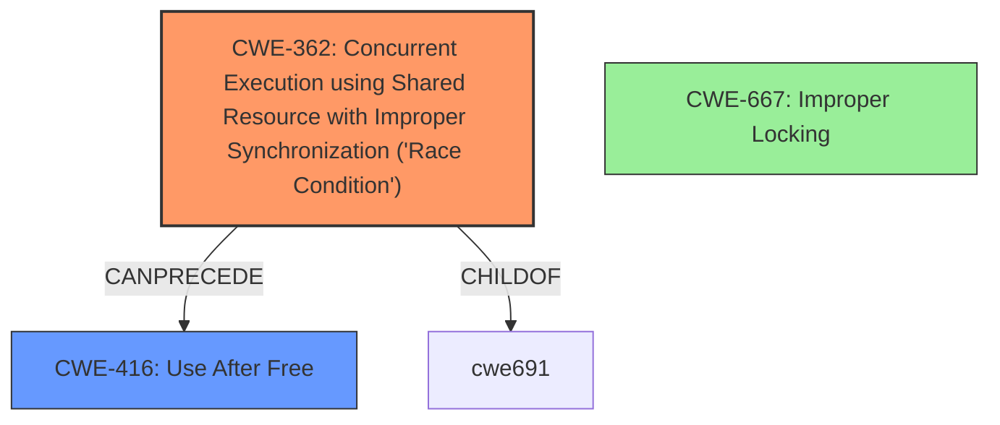

# Final Resolution for CVE-2022-20016

# Summary
| CWE ID | CWE Name | Confidence | CWE Abstraction Level | CWE Vulnerability Mapping Label | CWE-Vulnerability Mapping Notes |
|---|---|---|---|---|---|
| CWE-362 | Concurrent Execution using Shared Resource with Improper Synchronization ('Race Condition') | 0.85 | Class | Allowed-with-Review | Primary CWE. Improper locking allows concurrent access to shared resources, leading to memory corruption due to race conditions or inconsistent data states. Mitigation: Use synchronization primitives, avoid shared state. |
| CWE-416 | Use After Free | 0.65 | Variant | Allowed | Secondary Candidate. *If* improper locking leads to premature freeing of memory, a use-after-free can occur. Mitigation: Set pointers to NULL after freeing, choose languages with automatic memory management. |

## Evidence and Confidence

*   **Confidence Score:** 0.80
*   **Evidence Strength:** MEDIUM

## Relationship Analysis
The primary shift is from CWE-413 to CWE-362. While CWE-413 (Improper Resource Locking) directly addresses the surface issue, the more fundamental problem is the **race condition** arising from the lack of proper synchronization when multiple threads access shared resources. CWE-362 (Concurrent Execution using Shared Resource with Improper Synchronization) better captures this.

The parent-child relationship between CWE-667 (Improper Locking) and CWE-413 was considered. However, CWE-362, while a Class, provides a better explanation of the **root cause**.

The potential chain relationship leading to CWE-416 (Use After Free) remains a valid consideration as a secondary CWE, representing a potential consequence of the **race condition**.

## Vulnerability Chain
The vulnerability chain starts with **improper locking (CWE-362)**, leading to a **race condition** where multiple threads/processes access shared memory concurrently. This can lead to **memory corruption**. *If* the **memory corruption** results in premature freeing of memory, it leads to a **use-after-free condition (CWE-416)**.

Missing links: The exact mechanism of **memory corruption** is not fully detailed in the description. Is it due to data races, inconsistent state, or other memory errors?

## Summary of Analysis
The initial analysis correctly identified **improper locking** as a key issue. However, the criticism highlighted the need to better articulate *how* the **improper locking** leads to **memory corruption**. The description, "In vow driver, there is a possible memory corruption due to **improper locking**," suggests that **improper locking** is the **root cause**, but it is crucial to specify the mechanism by which it causes the **memory corruption**.

The relationship analysis and the retriever results indicated that CWE-362 (Concurrent Execution using Shared Resource with Improper Synchronization ('Race Condition')) is a stronger candidate than CWE-413. This is because the **improper locking** directly enables a **race condition**, where multiple threads can access and modify shared memory simultaneously, leading to **memory corruption**.

The decision to shift the primary CWE to CWE-362 is based on the understanding that the **improper locking** is a symptom of a broader problem: the lack of proper synchronization in a concurrent environment. While CWE-413 focuses on the locking mechanism itself, CWE-362 addresses the underlying **race condition** that leads to the **memory corruption**. The **memory corruption** could lead to a **use-after-free (CWE-416)** as a potential consequence, justifying its inclusion as a secondary CWE.

The analysis also considered and rejected CWE-131 (Incorrect Calculation of Buffer Size) as the description doesn't provide evidence of any buffer allocation issues, instead pointing to **improper locking**.

CWE-362 is at the Class level of abstraction. While it's generally preferable to use Base-level CWEs, CWE-362 provides a more accurate and comprehensive representation of the **root cause** in this scenario.