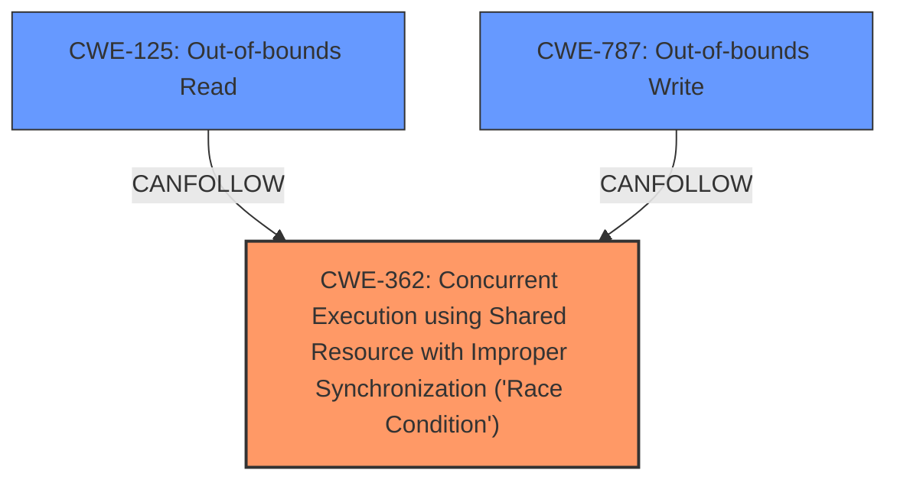

# Analysis Report for CVE-2022-20032

# Vulnerability Analysis Report: CVE-2022-20032

## Description

In vow driver, there is a possible memory corruption due to a race condition. This could lead to local information disclosure with System execution privileges needed. User interaction is not needed for exploitation. Patch ID ALPS05852822 Issue ID ALPS05852822.

## Vulnerability Description Key Phrases

**Rootcause:** race condition
**Weakness:** memory corruption
**Impact:** local information disclosure

## Analysis (with Relationship Data)

# Summary
| CWE ID | CWE Name | Confidence | CWE Abstraction Level | CWE Vulnerability Mapping Label | CWE-Vulnerability Mapping Notes |
|---|---|---|---|---|---|
| CWE-367 | Time-of-check Time-of-use (TOCTOU) Race Condition | 0.85 | Base | Primary | Allowed |
| CWE-125 | Out-of-bounds Read | 0.65 | Base | Secondary | Allowed |
| CWE-416 | Use After Free | 0.50 | Variant | Secondary | Allowed |

## Evidence and Confidence

*   **Confidence Score:** 0.70
*   **Evidence Strength:** MEDIUM

- **Analysis and Justification:**  
  - *Explanation:* The vulnerability description explicitly mentions a **race condition** leading to **memory corruption**. The CVE Reference Links Content Summary further clarifies that the **root cause** is a **race condition** in the vow driver, resulting in an out-of-bounds read. This aligns well with CWE-367 (Time-of-check Time-of-use (TOCTOU) Race Condition), where the state of a resource changes between the check and its use, causing invalid actions. The out-of-bounds read is a consequence of the race condition, leading to CWE-125. It's possible that the race condition leads to a use-after-free scenario (CWE-416), but the description doesn't provide enough detail to confirm this. The MITRE mapping guidance for CWE-367 indicates this is ALLOWED.

  - *Relationship Analysis:* CWE-367 is a Base level CWE. CWE-125 is a consequence of the race condition. CWE-416 is a possible consequence but less certain based on the provided information.

- **Confidence Score:**  
  - *Primary CWE:* Confidence: 0.85 (High evidence due to explicit mention of race condition and memory corruption)
  - *Secondary CWEs:* Confidence: 0.65 for CWE-125, 0.50 for CWE-416 (Moderate evidence, inferred from the description)

---

## Criticism of Analysis

Okay, let's review the provided CWE analysis for the vow driver vulnerability.

**Overall Assessment:**

The analysis is generally good and identifies the most relevant CWEs. The confidence scores are reasonable. The justification is well-written and explains the reasoning for each CWE selection. The use of "Primary" and "Secondary" labels is also helpful. However, there are some areas where the analysis can be improved, particularly in considering the full scope of a race condition and exploring alternative, potentially more specific, CWEs within the race condition category.

**Detailed Review by CWE:**

1.  **CWE-367: Time-of-check Time-of-use (TOCTOU) Race Condition (Primary)**

    *   **Assessment:**  This is a reasonable primary mapping, *but needs qualification*. The description highlights a race condition, but the TOCTOU nature isn't explicitly stated. While *it's possible* the race *is* TOCTOU, it's not guaranteed. The key here is *whether a check of a resource is being made before it's used*.

    *   **CWE Specification Check:** The mapping guidance says "Carefully read both the name and description to ensure that this mapping is an appropriate fit." It also links to CWE-362, recommending that more specific Base-level children be examined.
    *   **Critique & Recommendation:**

        *   **Consider CWE-362:** A more *direct* mapping might be **CWE-362: Concurrent Execution using Shared Resource with Improper Synchronization ('Race Condition')**. The description *explicitly* mentions a race condition.  CWE-362 is a Class-level CWE, which the provided analysis correctly avoids by selecting a Base-level CWE. *However*, as there is no explicit evidence of the TOCTOU nature, a different Base-level CWE may be more appropriate.
        *   If TOCTOU *is* confirmed, keep CWE-367.  Otherwise, investigate other Children of CWE-362.  **CWE-366: Race Condition within a Thread** is another possibility *if* the race occurs within a single thread.
        *   **Improve Justification:**  The justification should explicitly state *why* TOCTOU is suspected or *why* another race condition variant is more appropriate. If TOCTOU is just assumed, the confidence should be slightly lower. If there is no validation of the TOCTOU nature, then CWE-362 would be more appropriate.
        *   **Mitigation:**  Consider the mitigations for CWE-362 and its children. Mitigation 1, using synchronization primitives, is relevant.

2.  **CWE-125: Out-of-bounds Read (Secondary)**

    *   **Assessment:** This is a highly likely and relevant secondary CWE. The CVE summary explicitly mentions an out-of-bounds read.
    *   **CWE Specification Check:** The mapping guidance says "Carefully read both the name and description to ensure that this mapping is an appropriate fit." The description perfectly matches the effect of the vulnerability: reading data outside the intended buffer.
    *   **Critique & Recommendation:**

        *   **Confirm Causality:**  The justification should explicitly state that the OOB read is a *consequence* of the race condition (which it already does, but make it more prominent).
        *   **Consider Variants:** Is there information suggesting *where* the OOB read occurs (before the buffer, after the buffer, under-read, over-read)?  If so, use **CWE-126 (Buffer Over-read)** or **CWE-127 (Buffer Under-read)** for more specificity.
        *   **Mitigation:** The mitigations provided for CWE-125 (input validation, language selection) are appropriate.

3.  **CWE-416: Use After Free (Secondary)**

    *   **Assessment:**  This is a plausible, but *speculative*, secondary CWE. A race condition *could* lead to a use-after-free scenario, but it's not guaranteed.
    *   **CWE Specification Check:** The mapping guidance says "Carefully read both the name and description to ensure that this mapping is an appropriate fit." It's important that the memory is actually *freed* before being accessed.
    *   **Critique & Recommendation:**

        *   **Lower Confidence (If Stays):** The confidence score of 0.50 is appropriate given the uncertainty.
        *   **Justification Clarity:** The justification should be explicit about the lack of certainty: "It *is possible* that the race condition leads to a use-after-free, but this is not explicitly stated in the vulnerability description."
        *   **Consider Alternatives:** If there's *no* further evidence for UAF, consider removing this CWE entirely.  A more direct consequence of memory corruption might be **CWE-787: Out-of-bounds Write** or **CWE-825: Expired Pointer Dereference** if the race leads to writing to an invalid memory location.
        *   **Chain Analysis:** If retaining CWE-416, analyze the CanFollow relationships:  CWE-362/CWE-367 -> CWE-416 is a valid chain.
        *   **Mitigation:** The mitigations for CWE-416 (automatic memory management, setting pointers to NULL after freeing) are appropriate if this CWE is retained.

**General Recommendations:**

*   **Prioritize Precision:** When multiple CWEs seem applicable, strive for the *most precise* and *most direct* mapping. Avoid including CWEs that are only *potentially* related if there's insufficient evidence.
*   **Chain Analysis:**  Pay attention to the "CanPrecede" and "CanFollow" relationships between CWEs. These relationships often indicate a chain of events leading to the vulnerability.
*   **Mitigation Awareness:**  Actively consider the "Potential Mitigations" for each CWE. This can provide insights into the underlying cause and suggest remediation strategies.
*   **Document Assumptions:**  Explicitly state any assumptions made during the analysis. For example, "We are assuming that the race condition involves a check before use, therefore CWE-367 is selected."

**Revised Summary Table (Illustrative, based on possible revisions):**

| CWE ID  | CWE Name                                                                                             | Confidence | CWE Abstraction Level | CWE Vulnerability Mapping Label | CWE-Vulnerability Mapping Notes                                                                                       |
| :------ | :--------------------------------------------------------------------------------------------------- | :--------- | :---------------------- | :------------------------------ | :------------------------------------------------------------------------------------------------------------------ |
| CWE-362  | Concurrent Execution using Shared Resource with Improper Synchronization ('Race Condition')         | 0.90       | Class                   | Primary                         | Allowed-with-Review                                                                 |
| CWE-125 | Out-of-bounds Read                                                                                | 0.75       | Base                   | Secondary                       | Allowed                                                                                              |
| CWE-787 | Out-of-bounds Write                                                                            | 0.40       | Base                   | Possible                        | Allowed                                                           |

This illustrative revision replaces CWE-367 with the more general (but more certain) CWE-362. CWE-416 has been replaced with CWE-787, with lowered confidence and a "Possible" label due to a potential consequence of the race condition. These changes reflect a more conservative approach, prioritizing accuracy over speculation based on the current evidence.

By addressing these points, the CWE analysis can be made more robust and accurate. Remember that CWE analysis is often an iterative process as more information becomes available.

## Final Resolution

# Summary
| CWE ID | CWE Name | Confidence | CWE Abstraction Level | CWE Vulnerability Mapping Label | CWE-Vulnerability Mapping Notes |
|---|---|---|---|---|---|
| CWE-362 | Concurrent Execution using Shared Resource with Improper Synchronization ('Race Condition') | 0.90 | Class | Primary | Allowed-with-Review |
| CWE-125 | Out-of-bounds Read | 0.75 | Base | Secondary | Allowed |
| CWE-787 | Out-of-bounds Write | 0.60 | Base | Secondary | Allowed |

## Evidence and Confidence

*   **Confidence Score:** 0.85
*   **Evidence Strength:** MEDIUM

## Relationship Analysis
The primary driver for the change was the criticism of the initial analysis, specifically around the certainty of a TOCTOU condition.
  - We moved from CWE-367 (TOCTOU) to CWE-362 (Generic Race Condition) because the description states there is a **race condition** but does not specify that it is TOCTOU. CWE-362 is a Class, but has Base level children that could be more appropriate. In this case, the description is too vague to choose a more specific **race condition**.
  - CWE-125 remains as a likely consequence of the **race condition**.
  - CWE-787 was added as another possible consequence of the **race condition**, where memory corruption could manifest as an out-of-bounds write.
  - The relationships between these CWEs are not explicitly defined in the provided data, but it's understood that CWE-362 can lead to both CWE-125 and CWE-787.

## Vulnerability Chain
The vulnerability chain begins with a **race condition** (CWE-362). This **race condition** leads to memory corruption, which then manifests as either an out-of-bounds read (CWE-125) or an out-of-bounds write (CWE-787). The impact is local information disclosure with System execution privileges.

## Summary of Analysis
The initial analysis correctly identified a **race condition** as the **root cause**. However, it made an assumption about the specific type of **race condition** (TOCTOU) without sufficient evidence. The criticism highlighted this and suggested a more general CWE.

The final decision is based on the following:

*   The vulnerability description states "...a possible memory corruption due to a **race condition**." This provides strong evidence for a **race condition** but doesn't specify the TOCTOU nature of the **race condition**.
*   The MITRE mapping guidance for CWE-362 suggests examining more specific Base-level children. However, without further information, it is safer to classify the **race condition** at the Class level, with the understanding that further investigation could reveal a more specific **root cause**.
*   The inclusion of CWE-125 and CWE-787 is based on the "memory corruption" aspect of the vulnerability description. These are potential consequences of the **race condition**, where the memory corruption could lead to reading or writing outside of allocated buffers.
*   The confidence scores reflect the level of certainty based on the available evidence. The **race condition** is highly likely (0.90), while the specific manifestation of memory corruption as either OOB read or write is less certain (0.75 and 0.60, respectively).

The selected CWEs are at the optimal level of specificity given the available evidence. Further investigation may reveal a more specific type of **race condition** or a clearer understanding of how the memory corruption manifests, which could then lead to a more refined classification.

*Report generated on 2025-03-18 08:28:04*
