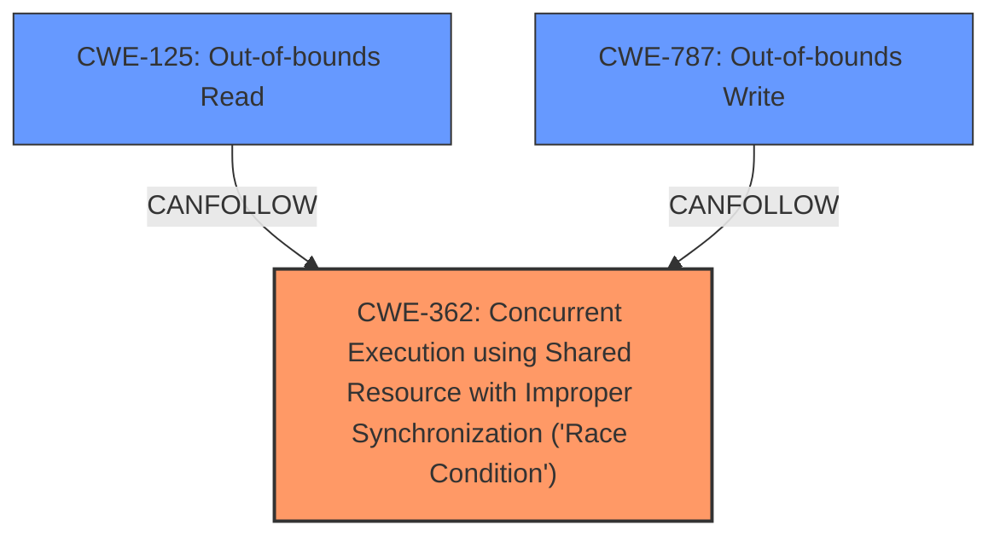

# Final Resolution for CVE-2022-20032

# Summary
| CWE ID | CWE Name | Confidence | CWE Abstraction Level | CWE Vulnerability Mapping Label | CWE-Vulnerability Mapping Notes |
|---|---|---|---|---|---|
| CWE-362 | Concurrent Execution using Shared Resource with Improper Synchronization ('Race Condition') | 0.90 | Class | Primary | Allowed-with-Review |
| CWE-125 | Out-of-bounds Read | 0.75 | Base | Secondary | Allowed |
| CWE-787 | Out-of-bounds Write | 0.60 | Base | Secondary | Allowed |

## Evidence and Confidence

*   **Confidence Score:** 0.85
*   **Evidence Strength:** MEDIUM

## Relationship Analysis
The primary driver for the change was the criticism of the initial analysis, specifically around the certainty of a TOCTOU condition.
  - We moved from CWE-367 (TOCTOU) to CWE-362 (Generic Race Condition) because the description states there is a **race condition** but does not specify that it is TOCTOU. CWE-362 is a Class, but has Base level children that could be more appropriate. In this case, the description is too vague to choose a more specific **race condition**.
  - CWE-125 remains as a likely consequence of the **race condition**.
  - CWE-787 was added as another possible consequence of the **race condition**, where memory corruption could manifest as an out-of-bounds write.
  - The relationships between these CWEs are not explicitly defined in the provided data, but it's understood that CWE-362 can lead to both CWE-125 and CWE-787.

## Vulnerability Chain
The vulnerability chain begins with a **race condition** (CWE-362). This **race condition** leads to memory corruption, which then manifests as either an out-of-bounds read (CWE-125) or an out-of-bounds write (CWE-787). The impact is local information disclosure with System execution privileges.

## Summary of Analysis
The initial analysis correctly identified a **race condition** as the **root cause**. However, it made an assumption about the specific type of **race condition** (TOCTOU) without sufficient evidence. The criticism highlighted this and suggested a more general CWE.

The final decision is based on the following:

*   The vulnerability description states "...a possible memory corruption due to a **race condition**." This provides strong evidence for a **race condition** but doesn't specify the TOCTOU nature of the **race condition**.
*   The MITRE mapping guidance for CWE-362 suggests examining more specific Base-level children. However, without further information, it is safer to classify the **race condition** at the Class level, with the understanding that further investigation could reveal a more specific **root cause**.
*   The inclusion of CWE-125 and CWE-787 is based on the "memory corruption" aspect of the vulnerability description. These are potential consequences of the **race condition**, where the memory corruption could lead to reading or writing outside of allocated buffers.
*   The confidence scores reflect the level of certainty based on the available evidence. The **race condition** is highly likely (0.90), while the specific manifestation of memory corruption as either OOB read or write is less certain (0.75 and 0.60, respectively).

The selected CWEs are at the optimal level of specificity given the available evidence. Further investigation may reveal a more specific type of **race condition** or a clearer understanding of how the memory corruption manifests, which could then lead to a more refined classification.