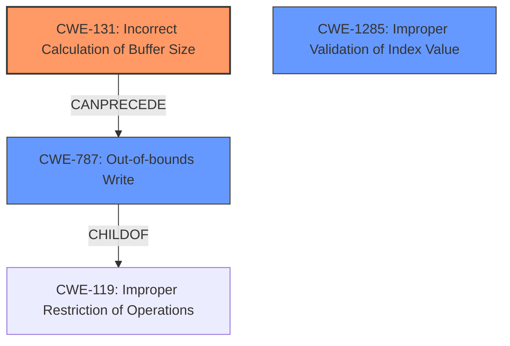

# Final Resolution for CVE-2022-20038

# Summary
| CWE ID  | CWE Name                                     | Confidence | CWE Abstraction Level | CWE Vulnerability Mapping Label | CWE-Vulnerability Mapping Notes |
| :-------- | :------------------------------------------- | :--------- | :---------------------- | :------------------------------ | :------------------------------ |
| CWE-131 | Incorrect Calculation of Buffer Size     | 0.80      | Base                    | Allowed                        | Primary CWE                   |
| CWE-787 | Out-of-bounds Write                        | 0.65      | Base                    | Allowed                        | Secondary Candidate |
| CWE-1285 | Improper Validation of Index Value         | 0.60      | Base                    | Allowed                        | Secondary Candidate           |

## Evidence and Confidence

*   **Confidence Score:** 0.75
*   **Evidence Strength:** MEDIUM

## Relationship Analysis
The primary relationship impacting the decision is the chain: CWE-131 (Incorrect Calculation of Buffer Size) CANPRECEDE CWE-787 (Out-of-bounds Write). While CWE-1285 (Improper Validation of Index Value) is also considered, the initial **incorrect bounds check** points more directly to a size calculation issue (CWE-131) causing a write outside the intended buffer (CWE-787). CWE-787 is a CHILDOF CWE-119 (Improper Restriction of Operations Within the Bounds of a Memory Buffer), however, CWE-119 is discouraged due to its high level of abstraction.

## Vulnerability Chain
The vulnerability chain starts with the **ROOTCAUSE** CWE-131 (Incorrect Calculation of Buffer Size). This leads to the weakness CWE-787 (Out-of-bounds Write), manifesting as memory corruption. The **incorrect bounds check** in the description serves as the bridge between the incorrect size calculation and the out-of-bounds write. CWE-1285 could be a contributing factor if index validation is also flawed, but it is secondary to the primary issue of size calculation.

## Summary of Analysis
The analysis and criticism both align on CWE-131 as the primary weakness, and the **memory corruption** points to CWE-787 (Out-of-bounds Write). The vulnerability description explicitly mentions an "**incorrect bounds check**," which directly aligns with the concept of incorrectly calculating the buffer size. The statement that this "**could lead to local escalation of privilege**" supports the inclusion of CWE-787 as the impact. The retriever results also support the inclusion of CWE-787.

The graph relationships, especially the CANPRECEDE relationship between CWE-131 and CWE-787, solidified the decision to include both CWEs. CWE-1285 remains a secondary candidate because the description doesn't definitively confirm an issue with index validation, but it could be a contributing factor. The selected CWEs are at the optimal level of specificity because they are Base-level CWEs, providing more precise mappings than Class or Pillar level CWEs.