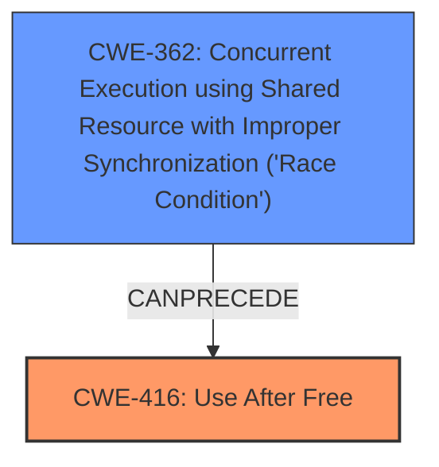

# Analysis Report for CVE-2022-2007

# Vulnerability Analysis Report: CVE-2022-2007

## Description

Use after free in WebGPU in Google Chrome prior to 102.0.5005.115 allowed a remote attacker to potentially exploit heap corruption via a crafted HTML page.

## Vulnerability Description Key Phrases

**Rootcause:** use after free
**Weakness:** heap corruption
**Vector:** crafted HTML page
**Attacker:** remote attacker
**Product:** Google Chrome
**Version:** prior to 102.0.5005.115
**Component:** WebGPU

## Analysis (with Relationship Data)

# Summary
| CWE ID | CWE Name | Confidence | CWE Abstraction Level | CWE Vulnerability Mapping Label | CWE-Vulnerability Mapping Notes |
|---|---|---|---|---|---|
| CWE-416 | Use After Free | 1.0 | Variant |  | Allowed |

## Evidence and Confidence

*   **Confidence Score:** 1.0
*   **Evidence Strength:** HIGH

- **Analysis and Justification:**  
  - *Explanation:* The vulnerability description clearly states a **"use after free"** in WebGPU in Google Chrome. CWE-416 "Use After Free" is a variant level CWE that precisely describes this condition, where memory is reused or referenced after it has been freed. The **heap corruption** also supports this as UAF often leads to memory corruption. The CVE Reference Links Content Summary section confirms the **root cause** as a **use-after-free** vulnerability in WebGPU. The retriever results also confirm that CWE-416 is the top candidate with a high score. MITRE mapping guidance for CWE-416 indicates that its usage is ALLOWED.
  
  - *Relationship Analysis:* No direct relationships found.

- **Confidence Score:**  
  - Confidence: 1.0 (High evidence from technical description, CVE reference materials, and retriever results)

## Criticism of Analysis

Okay, here's a review of the analysis, considering the full CWE specifications provided.

**Overall Assessment:**

The primary CWE mapping to **CWE-416 (Use After Free)** is accurate and well-justified. The analysis correctly identifies the vulnerability based on the description, CVE details, and retriever results. The confidence score of 1.0 is appropriate. The additional information and explanations provided are clear and helpful.

**Detailed Review:**

1.  **CWE-416 Mapping:**

    *   **Correctness:** The mapping to CWE-416 is highly accurate. The vulnerability description clearly states "use after free," which directly aligns with the definition of CWE-416. The evidence presented is strong: the vulnerability description, CVE Reference Links, and retriever results all point to this weakness.
    *   **Justification:** The justification is well-articulated. It clearly explains why CWE-416 is the most appropriate choice. It emphasizes the "use after free" condition and its potential for leading to memory corruption (heap corruption).
    *   **Abstraction Level:**  The analysis correctly identifies CWE-416 as a `Variant` level weakness, which is preferred for root cause mapping. The CWE specification's *Mapping Guidance* explicitly states that its usage is `Allowed` because "This CWE entry is at the Variant level of abstraction, which is a preferred level of abstraction for mapping to the root causes of vulnerabilities."
    *   **Mitigation:** The analysis doesn't explicitly discuss mitigations in the context of the specific vulnerability, but the provided CWE specifications for CWE-416 include relevant mitigations:
        *   Language selection (using languages with automatic memory management).
        *   Setting freed pointers to NULL (although the CWE specification acknowledges the limitations of this in complex scenarios).
        *   Static analysis tools to detect double frees, which can be a precursor to UAF.
    *   **Observed Examples:** The analysis shows multiple CVEs that also map to CWE-416.

2.  **Consideration of other CWEs from Retriever Results:**
    The Retriever Results show other possible CWEs which the analysis needs to justify excluding.

    *   **CWE-843 (Access of Resource Using Incompatible Type ('Type Confusion')):** While type confusion could potentially contribute to memory corruption, it's not the *primary* cause described in the vulnerability description.  The description focuses on the *timing* of the memory access (after it's been freed), not on the *type* of the data being accessed. If the UAF results in accessing memory with an incompatible type, that *could* be a secondary effect, but the core issue remains the UAF. Without further evidence, excluding CWE-843 is reasonable.
    *   **CWE-366 (Race Condition within a Thread)** and **CWE-362 (Concurrent Execution using Shared Resource with Improper Synchronization ('Race Condition'))**: A race condition *could* be a contributing factor to the UAF, *if* the freeing and subsequent access happen in different threads. However, the initial description doesn't explicitly mention threading or concurrency. If there's no evidence of multiple threads involved, excluding these is acceptable. Note that the CWE specifications for CWE-416 and CWE-362 show that CWE-362 can precede CWE-416. If multiple threads are present in WebGPU it is possible that a chain is present.
    *   **CWE-415 (Double Free):** A double free could *lead* to a use-after-free, but the core description is of a UAF. If the vulnerability were explicitly described as a double free that then gets used, this would be worth considering as a chain.
    *   **CWE-122 (Heap-based Buffer Overflow)** and **CWE-787 (Out-of-bounds Write):**  While memory corruption is mentioned, the vulnerability is not explicitly described as a buffer overflow. A UAF *could* lead to a heap overflow if the freed memory is reallocated and then overwritten, but this would be a *consequence* of the UAF, not the root cause.
    *   **CWE-190 (Integer Overflow or Wraparound)** and **CWE-193 (Off-by-one Error):**  These are unlikely to be directly relevant to the described UAF.
    *   **CWE-367 (Time-of-check Time-of-use (TOCTOU) Race Condition):**  This is less likely to apply as there isn't a clear indication of a 'check' followed by a 'use' with a timing window in between.

3.  **CWE Specification Completeness:**

    *   The analysis would benefit from briefly acknowledging the retriever results and *explicitly* stating why those CWEs were considered but ultimately excluded (as described above). This shows a thorough consideration of all possibilities.
    *   The inclusion of the *Potential Mitigations* from the CWE specification in the analysis would make the analysis more actionable.

**Recommendations:**

1.  **Acknowledge and Exclude Other CWEs:**  Add a short paragraph acknowledging the top CWEs from the retriever results and explaining *why* they are not the primary weakness in this case. This demonstrates a thorough analysis.
2.  **Include Potential Mitigations:**  Incorporate the relevant *Potential Mitigations* from the CWE-416 specification into the analysis. This makes the analysis more practical and informative.
3.  **Consider Threading:** If there is a known multi-threaded aspect to WebGPU, add a sentence or two acknowledging the possibility of a race condition contributing to the UAF. If there is concrete evidence of the multiple threads, recommend a chain of CWE-362 -> CWE-416.

By incorporating these recommendations, the analysis would become even stronger and more comprehensive. However, the current mapping to CWE-416 is already well-supported and justified.

## Final Resolution

# Summary
| CWE ID | CWE Name | Confidence | CWE Abstraction Level | CWE Vulnerability Mapping Label | CWE-Vulnerability Mapping Notes |
|---|---|---|---|---|---|
| CWE-416 | Use After Free | 0.95 | Variant | Primary | Allowed |
| CWE-362 | Concurrent Execution using Shared Resource with Improper Synchronization ('Race Condition') | 0.6 | Secondary | Secondary Candidate | Allowed-with-Review |

## Evidence and Confidence

*   **Confidence Score:** 0.9
*   **Evidence Strength:** MEDIUM

## Relationship Analysis
The primary weakness is identified as **CWE-416 (Use After Free)**, a variant-level CWE. The analysis suggests a possible secondary weakness: **CWE-362 (Concurrent Execution using Shared Resource with Improper Synchronization ('Race Condition'))**.

The relationship analysis indicates that **CWE-362** can precede **CWE-416**. If the use-after-free condition is triggered due to concurrent access and improper synchronization in WebGPU, a vulnerability chain exists. However, without explicit evidence of threading or concurrency, **CWE-416** remains the primary **root cause**.

## Vulnerability Chain
The vulnerability chain starts with a potential race condition (**CWE-362**) if multiple threads are involved in WebGPU's memory management. This race condition leads to memory being freed while another thread still holds a reference to it. Subsequently, the thread attempts to access the freed memory, resulting in a use-after-free (**CWE-416**). The impact is heap corruption, potentially leading to arbitrary code execution.

Missing link: Concrete evidence of multi-threading in WebGPU to confirm the presence of **CWE-362**.

## Summary of Analysis
The initial analysis correctly identifies **CWE-416 (Use After Free)** as the primary **weakness** based on the vulnerability description, CVE details, and retriever results. The criticism suggests acknowledging and excluding other potential CWEs from the retriever results.

Based on the retriever results, other CWEs were considered:
*   **CWE-843 (Access of Resource Using Incompatible Type ('Type Confusion'))**: Excluded as the primary cause is related to the timing of memory access, not the type of data.
*   **CWE-366 (Race Condition within a Thread)** and **CWE-362 (Concurrent Execution using Shared Resource with Improper Synchronization ('Race Condition'))**: Considered as potential contributing factors if the freeing and subsequent access happen in different threads.
*   **CWE-415 (Double Free):** A double free could lead to a use-after-free.
*   **CWE-122 (Heap-based Buffer Overflow)** and **CWE-787 (Out-of-bounds Write):** A UAF could lead to a heap overflow if the freed memory is reallocated and then overwritten
*   **CWE-190 (Integer Overflow or Wraparound)** and **CWE-193 (Off-by-one Error):** Unlikely to be directly relevant to the described UAF.
*   **CWE-367 (Time-of-check Time-of-use (TOCTOU) Race Condition):** Less likely to apply as there isn't a clear indication of a 'check' followed by a 'use' with a timing window in between.

The analysis is primarily based on the provided evidence, which clearly states a **"use after free"** condition. The graph relationships influenced the consideration of **CWE-362** as a potential secondary **weakness**, as it can precede **CWE-416**.

The selected CWEs are at the optimal level of specificity. **CWE-416** is a variant-level CWE that precisely describes the vulnerability. While **CWE-362** is a class-level CWE, it provides context if the use-after-free is triggered by a race condition.

Without confirmation of multi-threading activity, the confidence in **CWE-362** remains moderate (0.6). If there's concrete evidence of multiple threads present in WebGPU, the confidence in **CWE-362** and its inclusion in the vulnerability chain would increase.

The retriever results show that CWE-362 can precede CWE-416. If multiple threads are present in WebGPU it is possible that a chain is present.

*Report generated on 2025-03-18 08:31:59*
