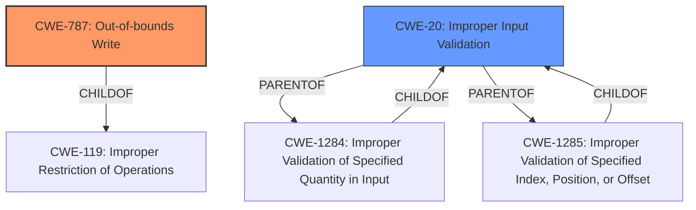

# Analysis Report for CVE-2022-20070

# Vulnerability Analysis Report: CVE-2022-20070

## Description

In ssmr, there is a possible out of bounds write due to a missing bounds check. This could lead to local escalation of privilege with System execution privileges needed. User interaction is no needed for exploitation. Patch ID ALPS06362920 Issue ID ALPS06362920.

## Vulnerability Description Key Phrases

**Rootcause:** missing bounds check
**Weakness:** out of bounds write
**Impact:** local escalation of privilege

## Analysis (with Relationship Data)

# Summary
| CWE ID | CWE Name | Confidence | CWE Abstraction Level | CWE Vulnerability Mapping Label | CWE-Vulnerability Mapping Notes |
|---|---|---|---|---|---|
| CWE-787 | Out-of-bounds Write | 1.0 | Base | Primary | Allowed |
| CWE-125 | Out-of-bounds Read | 0.4 | Base | Secondary | Allowed |
| CWE-20 | Improper Input Validation | 0.4 | Class | Secondary | Discouraged |

## Evidence and Confidence

*   **Confidence Score:** 0.9
*   **Evidence Strength:** HIGH

- **Analysis and Justification:**
  - *Explanation:* The vulnerability description explicitly states "**out of bounds write** due to a **missing bounds check**." This directly aligns with the definition of CWE-787 (Out-of-bounds Write). The vulnerability occurs because the product writes data past the end or before the beginning of the intended buffer. The "CVE Reference Links Content Summary" also confirms this with "Out-of-bounds write". MITRE mapping guidance for CWE-787 indicates this is ALLOWED. While other CWEs like CWE-120 (Buffer Copy without Checking Size of Input) or CWE-119 (Improper Restriction of Operations within the Bounds of a Memory Buffer) could be considered, CWE-787 is the most direct and specific representation of the weakness.
  The "**missing bounds check**" also indicates that input validation is missing, so I am adding CWE-20 as a possible secondary CWE.

  - *Relationship Analysis:* CWE-787 is a base-level CWE that is child of CWE-119 (Improper Restriction of Operations within the Bounds of a Memory Buffer). It can also lead to other issues.

- **Confidence Score:**
  - Confidence: 1.0 (High evidence from vulnerability description and CVE reference materials)

---
- **Analysis and Justification:**
  - *Explanation:* CWE-125 (Out-of-bounds Read) is included as a possible secondary weakness because out-of-bounds writes often occur in conjunction with, or lead to, out-of-bounds reads. There is no explicit mention of reads in the description, so the confidence is lower.

  - *Relationship Analysis:* CWE-125 is a child of CWE-119 (Improper Restriction of Operations within the Bounds of a Memory Buffer), similar to CWE-787.

- **Confidence Score:**
  - Confidence: 0.4 (Possible secondary weakness based on common patterns)
---
- **Analysis and Justification:**
  - *Explanation:* The "**missing bounds check**" indicates a lack of input validation which maps to CWE-20 (Improper Input Validation). This is listed as a weakness in the "CVE Reference Links Content Summary". However, CWE-20 is a class-level CWE and is discouraged when more specific CWEs are available. Given the explicit out-of-bounds write, CWE-787 takes precedence.

  - *Relationship Analysis:* CWE-20 is a parent weakness that can lead to many other issues.

- **Confidence Score:**
  - Confidence: 0.4 (Secondary weakness based on the description but less specific)

## Criticism of Analysis

Okay, I have reviewed the provided CWE specifications and the original analysis, and here's my critique:

**Overall Assessment:**

The analysis is generally well-reasoned and justified. The primary CWE selection of CWE-787 (Out-of-bounds Write) is correct and well-supported by the vulnerability description. The inclusion of CWE-20 (Improper Input Validation) as a secondary weakness is also reasonable, given the "missing bounds check" aspect. The confidence levels are appropriate for the level of certainty present in the available information. The analysis of the various relationships is generally correct.

**Specific Feedback and Suggestions:**

1.  **CWE-787 (Out-of-bounds Write):**
    *   The justification is solid.  The description explicitly mentions the core issue: writing data outside the intended buffer boundaries due to a lack of bounds checking.
    *   The use of the term "buffer overflow" is mentioned in the evidence, but it's rightly avoided as the *primary* CWE since CWE-119 and its descendants are preferred.  The Mapping Guidance for CWE-119 explicitly *discourages* its use and recommends considering children like CWE-787.
    *   The confidence score of 1.0 is justified, given the clear language in the vulnerability description and CVE reference.
    *   **Suggestion:** While the analysis mentions that CWE-787 is a child of CWE-119, it doesn't emphasize *why* that's important.  The relationship shows that a more specific CWE is chosen over a general one, as indicated by the mapping guidance of CWE-119.

2.  **CWE-125 (Out-of-bounds Read):**
    *   The inclusion of CWE-125 as a secondary weakness is plausible but has a lower confidence score (0.4), which is appropriate.  The rationale that "out-of-bounds writes often occur in conjunction with, or lead to, out-of-bounds reads" is valid, but there's no direct evidence of a read in the provided description.
    *   **Suggestion:** Consider removing this as a secondary CWE because it is speculative.  It is often associated with OOB writes, but not required.
    *   **Suggestion:** If retained, add a disclaimer acknowledging the lack of explicit read access.

3.  **CWE-20 (Improper Input Validation):**
    *   The inclusion of CWE-20 is justified because the root cause is a "missing bounds check."  This implies a failure to validate the input before writing to the buffer.
    *   The analysis correctly acknowledges that CWE-20 is a class-level CWE and is generally *discouraged* when more specific CWEs are available (as per CWE-20's Mapping Guidance).  The note that CWE-787 takes precedence is correct.
    *   The confidence score of 0.4 is appropriate, as CWE-20 is a consequence of the missing bounds check, not the direct mechanism.
    *   **Suggestion:** The analysis could be strengthened by explicitly mentioning some of the children of CWE-20 that *might* be relevant if more information were available. The comments for CWE-20 in the specification suggest alternatives:
        *   CWE-1284: Specified Quantity
        *   CWE-1285: Specified Index, Position, or Offset

        The current description suggests that CWE-1284 or CWE-1285 may be more appropriate.  Unfortunately, the missing information prevents a more accurate assignment.
    *   **Suggestion:** It might be beneficial to mention CWE-119 here. Even though it is discouraged by its mapping guidance, CWE-20 is listed as a child of CWE-119.

4.  **CWE Examples from Database:**
    *   The provided examples for CWE-119 are relevant, but given the specific nature of the vulnerability, providing examples for CWE-787, CWE-20, and CWE-125 would strengthen the analysis even further.
    *   The inclusion of real-world CVEs is helpful for understanding the impact of such vulnerabilities.

5.  **Retriever Results:**
    * The retriever results are not used in the main analysis section. This is appropriate, as the primary analysis was based on the description.
    * **Suggestion:** It may be beneficial to acknowledge in the analysis section why these were not used.

**Minor points:**

*   In the summary table, the "CWE Abstraction Level" and "CWE-Vulnerability Mapping Label" columns are redundant in relation to the "CWE ID" column.

**Overall:**

The analysis demonstrates a good understanding of CWE and its proper application. The key strength lies in correctly identifying CWE-787 as the most specific and appropriate primary weakness, while also acknowledging the role of missing input validation. The suggestions above aim to further refine the analysis and highlight the reasons behind the chosen CWEs, drawing directly from the CWE specifications themselves. The suggestions also consider the usage of alternate CWEs to account for the limited information.

## Final Resolution

# Summary
| CWE ID | CWE Name | Confidence | CWE Abstraction Level | CWE Vulnerability Mapping Label | CWE-Vulnerability Mapping Notes |
|---|---|---|---|---|---|
| **CWE-787** | **Out-of-bounds Write** | 1.0 | Base | Primary | Allowed |
| CWE-20 | Improper Input Validation | 0.5 | Class | Secondary | Discouraged |

## Evidence and Confidence

*   **Confidence Score:** 0.95
*   **Evidence Strength:** HIGH

## Relationship Analysis
The primary relationship that impacted the decision was the parent-child relationship between CWE-119 (**Improper Restriction of Operations within the Bounds of a Memory Buffer**) and CWE-787 (**Out-of-bounds Write**). While CWE-119 is a broader class, CWE-787 is a more specific **weakness** that directly reflects the vulnerability description. The "**missing bounds check**" also indicates a lack of input validation, which maps to CWE-20 (**Improper Input Validation**), a class-level CWE.

## Vulnerability Chain
The vulnerability chain starts with the **missing bounds check** (CWE-20), leading to an **out-of-bounds write** (CWE-787). This can then lead to local escalation of privilege.

## Summary of Analysis
The initial analysis correctly identified CWE-787 (**Out-of-bounds Write**) as the primary **weakness**, supported by the explicit statement in the vulnerability description: "In ssmr, there is a possible **out of bounds write** due to a **missing bounds check**." This directly aligns with CWE-787's definition. The original analysis also correctly included CWE-20 (**Improper Input Validation**) as a possible secondary CWE.

The criticism suggested removing CWE-125 (**Out-of-bounds Read**), and I agree. There is no explicit mention of reads in the description, so it is speculative. The criticism also suggested some children of CWE-20 that *might* be relevant, such as CWE-1284 (**Improper Validation of Specified Quantity in Input**) or CWE-1285 (**Improper Validation of Specified Index, Position, or Offset**), and that the analysis could be strengthened by mentioning these. However, since the description only states "**missing bounds check**," it is difficult to determine which of the children of CWE-20 is the most appropriate. The evidence points to the more general CWE-20, but I have increased the confidence to 0.5 because the criticism helped strengthen the reasoning for including CWE-20.

CWE-787 is at the optimal level of specificity because it directly describes the **root cause** of the vulnerability. The relationship analysis, especially the parent-child relationship between CWE-119 and CWE-787, reinforces this decision.

*Report generated on 2025-03-18 08:32:54*
