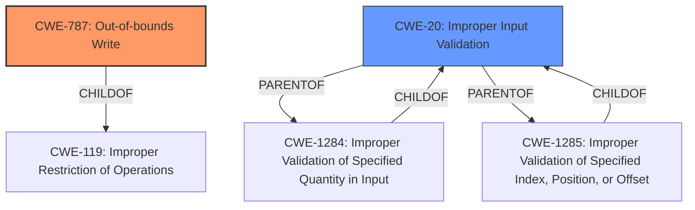

# Final Resolution for CVE-2022-20070

# Summary
| CWE ID | CWE Name | Confidence | CWE Abstraction Level | CWE Vulnerability Mapping Label | CWE-Vulnerability Mapping Notes |
|---|---|---|---|---|---|
| **CWE-787** | **Out-of-bounds Write** | 1.0 | Base | Primary | Allowed |
| CWE-20 | Improper Input Validation | 0.5 | Class | Secondary | Discouraged |

## Evidence and Confidence

*   **Confidence Score:** 0.95
*   **Evidence Strength:** HIGH

## Relationship Analysis
The primary relationship that impacted the decision was the parent-child relationship between CWE-119 (**Improper Restriction of Operations within the Bounds of a Memory Buffer**) and CWE-787 (**Out-of-bounds Write**). While CWE-119 is a broader class, CWE-787 is a more specific **weakness** that directly reflects the vulnerability description. The "**missing bounds check**" also indicates a lack of input validation, which maps to CWE-20 (**Improper Input Validation**), a class-level CWE.

## Vulnerability Chain
The vulnerability chain starts with the **missing bounds check** (CWE-20), leading to an **out-of-bounds write** (CWE-787). This can then lead to local escalation of privilege.

## Summary of Analysis
The initial analysis correctly identified CWE-787 (**Out-of-bounds Write**) as the primary **weakness**, supported by the explicit statement in the vulnerability description: "In ssmr, there is a possible **out of bounds write** due to a **missing bounds check**." This directly aligns with CWE-787's definition. The original analysis also correctly included CWE-20 (**Improper Input Validation**) as a possible secondary CWE.

The criticism suggested removing CWE-125 (**Out-of-bounds Read**), and I agree. There is no explicit mention of reads in the description, so it is speculative. The criticism also suggested some children of CWE-20 that *might* be relevant, such as CWE-1284 (**Improper Validation of Specified Quantity in Input**) or CWE-1285 (**Improper Validation of Specified Index, Position, or Offset**), and that the analysis could be strengthened by mentioning these. However, since the description only states "**missing bounds check**," it is difficult to determine which of the children of CWE-20 is the most appropriate. The evidence points to the more general CWE-20, but I have increased the confidence to 0.5 because the criticism helped strengthen the reasoning for including CWE-20.

CWE-787 is at the optimal level of specificity because it directly describes the **root cause** of the vulnerability. The relationship analysis, especially the parent-child relationship between CWE-119 and CWE-787, reinforces this decision.