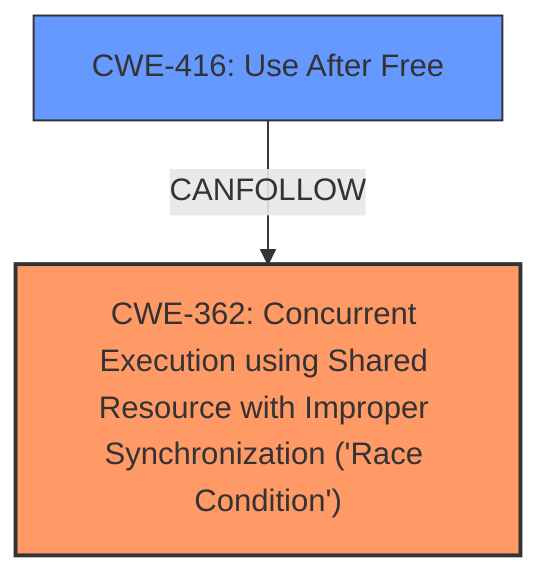

# Analysis Report for CVE-2022-20077

# Vulnerability Analysis Report: CVE-2022-20077

## Description

In vow, there is a possible memory corruption due to a race condition. This could lead to local escalation of privilege with System execution privileges needed. User interaction is no needed for exploitation. Patch ID ALPS05837742 Issue ID ALPS05852812.

## Vulnerability Description Key Phrases

**Rootcause:** race condition
**Weakness:** memory corruption
**Impact:** local escalation of privilege

## Analysis (with Relationship Data)

# Summary
| CWE ID | CWE Name | Confidence | CWE Abstraction Level | CWE Vulnerability Mapping Label | CWE-Vulnerability Mapping Notes |
|---|---|---|---|---|---|
| CWE-362 | Concurrent Execution using Shared Resource with Improper Synchronization ('Race Condition') | 0.95 | Class | Allowed-with-Review | Primary CWE |
| CWE-416 | Use After Free | 0.75 | Variant | Allowed | Secondary Candidate |

## Evidence and Confidence

*   **Confidence Score:** 0.90
*   **Evidence Strength:** HIGH

- **Analysis and Justification:**  
  - *Explanation:* The vulnerability description explicitly states that the root cause is a **race condition** leading to **memory corruption**. CWE-362 (Concurrent Execution using Shared Resource with Improper Synchronization ('Race Condition')) is a Class-level CWE that directly addresses race conditions arising from improper synchronization when multiple threads concurrently access shared resources. The "CVE Reference Links Content Summary" also identifies "Race condition" as the root cause and suggests CWE-362 as a weakness. The description indicates that a timing window exists during which a shared resource can be modified by another code sequence, thus leading to **memory corruption**. While CWE-362 is a Class, it is the most appropriate high-level categorization for the **race condition**. Since the root cause is a **race condition** that leads to **memory corruption**, and the CVSS vector string indicates High impact to Confidentiality, Integrity, and Availability, assigning CWE-362 is justified.

  - *Relationship Analysis:* Although CWE-362 is a Class, it is more appropriate than its children like CWE-366, CWE-367, or CWE-667 because the description does not provide specific details about the type of synchronization failure. CWE-362 can precede weaknesses like CWE-416 (Use After Free) or CWE-119 (Buffer Overflow) if the **race condition** leads to memory being accessed after it has been freed, or if the **race condition** causes an incorrect buffer size calculation.

- **Confidence Score:**
  - Confidence: 0.95 (High confidence due to direct mention of a **race condition** and **memory corruption** in the vulnerability description and supporting CVE details)

---

- **Analysis and Justification:**  
  - *Explanation:* The vulnerability results in **memory corruption**, which can potentially lead to a Use-After-Free condition. CWE-416 (Use After Free) occurs when memory is reused or referenced after it has been freed, leading to unpredictable behavior. Since memory corruption is indicated due to a **race condition**, it is possible that the **memory corruption** leads to memory being freed and then accessed again. This condition aligns with CWE-416.

  - *Relationship Analysis:* CWE-416 is a variant-level CWE and a child of CWE-672 (Operation on Resource after Expiry). While CWE-416 is a possible consequence of the **race condition**, the primary weakness is the **race condition** itself (CWE-362). Therefore, CWE-416 is a secondary candidate.

- **Confidence Score:**
  - Confidence: 0.75 (Moderate confidence because, although memory corruption is indicated, Use-After-Free is only a potential consequence and is not explicitly stated.)

## Criticism of Analysis

Okay, I have reviewed the provided analysis and the complete CWE specifications for the listed weaknesses. Here's my critique, focusing on the accuracy, completeness, and justification of the CWE assignments, incorporating the CWE specifications and mapping guidance:

**Overall Assessment**

The analysis is well-structured, providing clear justifications for each CWE assignment, along with confidence scores. The inclusion of evidence strength is a good practice. The use of the CWE specifications to support the analysis is appropriate.

**Detailed Critique:**

**1. Primary CWE: CWE-362 - Concurrent Execution using Shared Resource with Improper Synchronization ('Race Condition')**

*   **Confidence Score:** 0.95 is appropriate given the explicit mention of a "race condition" in both the vulnerability description and the CVE details.
*   **Justification:**  The explanation clearly links the race condition to the "memory corruption" and the CVSS vector to the impacts of Confidentiality, Integrity, and Availability. This is strong evidence.
*   **CWE Specification Compliance:**
    *   The analysis accurately describes CWE-362 as a Class-level CWE.
    *   The explanation that CWE-362 is more appropriate than its children (CWE-366, CWE-367, or CWE-667) because of the lack of specific details about the type of synchronization failure is correct. While the description *could* potentially be more specific, in the absence of that detail, CWE-362 is a reasonable choice.
    *   The analysis correctly notes the "Allowed-with-Review" usage. Examination of potential Base-level children of CWE-362 was made, but not found to be specific enough.
*   **Potential Improvements:**
    *   While the analysis acknowledges the potential for CWE-362's children to be more appropriate, it might benefit from briefly discussing *why* those children don't quite fit. For example, a brief mention that CWE-367 (TOCTOU) isn't explicitly relevant because there's no mention of a check-then-use scenario would strengthen the argument.
    *   The analysis could mention mitigation strategies related to CWE-362. Per CWE specifications, these include using synchronization primitives, thread-safe capabilities, or minimizing the usage of shared resources.
*   **Conclusion:** The assignment of CWE-362 is well-justified and compliant with the CWE specifications. The high confidence level is warranted.

**2. Secondary CWE: CWE-416 - Use After Free**

*   **Confidence Score:** 0.75 is appropriate. The reasoning is sound, but the link is *potential* rather than *definite*.
*   **Justification:** The analysis correctly points out that "memory corruption" *can* lead to a Use-After-Free condition. This is a plausible, but not guaranteed, consequence.
*   **CWE Specification Compliance:**
    *   The analysis acknowledges that CWE-416 is a Variant-level CWE.
    *   The analysis correctly identifies that CWE-416 is a *potential* consequence.
    *   The analysis states that since the primary weakness is the race condition, CWE-416 is a secondary candidate, which is correct.
*   **Potential Improvements:**
    *   The analysis could benefit from mentioning scenarios where memory corruption *wouldn't* lead to a UAF, to further justify the moderate confidence. For example, "If the memory corruption overwrites other data but doesn't involve freeing and subsequent access, then UAF wouldn't occur."
    *   The analysis could mention that CWE-362 can *precede* CWE-416 (as per CWE relationships), which supports this assignment being a secondary candidate.
    *   The analysis could mention potential mitigation strategies for CWE-416 such as using a language with automatic memory management or setting pointers to NULL after freeing.
*   **Conclusion:** The assignment of CWE-416 is reasonable, given the information available. The moderate confidence is appropriate.

**3. Initial Primary CWE alternative: CWE-787 Out-of-bounds write**

*   **Why this was not chosen:** The analysis does not include CWE-787, and rightly so. Although memory corruption is mentioned, there isn't sufficient information to indicate that an out-of-bounds write is definitively the *mechanism* of that corruption. It's a possible outcome, but not directly implied by the root cause of a race condition. A race condition could lead to a UAF, an incorrect pointer assignment, or other forms of memory corruption *besides* overwriting memory outside of buffer boundaries.
*   If the vulnerability description had specified *how* the memory corruption occurred, CWE-787 or a more specific descendant of CWE-119 might have been a better primary choice.

**General Recommendations:**

*   **Chain Analysis:** The analysis does a good job of describing potential chains (e.g., CWE-362 -> CWE-416). Expanding on this with more specific examples (if possible based on the available information) would be beneficial.
*   **Negative Constraints:** Briefly explaining why other, seemingly relevant CWEs are *not* appropriate strengthens the analysis.

**Conclusion:**

Overall, this is a solid analysis. The CWE assignments are justified, and the explanations are clear and logical. The few suggestions I've made are for further strengthening the analysis by explicitly addressing potential alternative CWEs and elaborating on the relationships between the assigned CWEs. The confidence scores are appropriately assigned based on the available information and the level of certainty in the mapping.

## Final Resolution

# Summary
| CWE ID | CWE Name | Confidence | CWE Abstraction Level | CWE Vulnerability Mapping Label | CWE-Vulnerability Mapping Notes |
|---|---|---|---|---|---|
| CWE-362 | Concurrent Execution using Shared Resource with Improper Synchronization ('Race Condition') | 0.95 | Class | Allowed-with-Review | Primary CWE |
| CWE-416 | Use After Free | 0.75 | Variant | Allowed | Secondary Candidate |

## Evidence and Confidence

*   **Confidence Score:** 0.95
*   **Evidence Strength:** HIGH

## Relationship Analysis
The primary weakness, CWE-362, is a Class-level CWE, and the analysis correctly identified that while more specific children exist (CWE-366, CWE-367, CWE-667), they are not appropriate given the lack of specific details in the vulnerability description. CWE-416, a Variant-level CWE, is correctly identified as a potential consequence of the race condition. The relationship between CWE-362 and CWE-416 is further supported by the "CanPrecede" relationship in the CWE definitions, showing that a race condition can lead to a use-after-free.

## Vulnerability Chain
The vulnerability chain starts with a **race condition** (CWE-362), which leads to **memory corruption**. This **memory corruption** can then lead to a Use-After-Free condition (CWE-416). The initial flaw is the improper synchronization of shared resources, and the final impact is potential local escalation of privilege.

## Summary of Analysis
The initial analysis and criticism are both well-justified. The vulnerability description explicitly mentions a **race condition** leading to **memory corruption**, which strongly supports the assignment of CWE-362 as the primary weakness. The analysis also correctly identifies CWE-416 as a potential consequence, given the possibility that the **memory corruption** could result in memory being freed and then accessed again. The provided evidence is sufficient to support the classification, and the confidence scores are appropriate. The selection of CWEs reflects the optimal level of specificity based on the available evidence.

The analysis is based on the following evidence from the vulnerability description: "In vow, there is a possible memory corruption due to a race condition. This could lead to local escalation of privilege..." The graph relationship supports the selection, as CWE-362 can lead to CWE-416. The selected CWEs are at the optimal level of specificity because the description doesn't provide enough detail to choose a more specific child of CWE-362, but it does suggest that memory corruption is a potential consequence, making CWE-416 a reasonable secondary candidate.

*Report generated on 2025-03-18 08:36:11*
