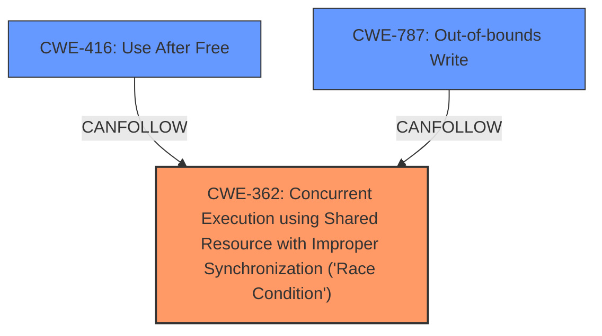

# Analysis Report for CVE-2022-20078

# Vulnerability Analysis Report: CVE-2022-20078

## Description

In vow, there is a possible memory corruption due to a race condition. This could lead to local escalation of privilege with System execution privileges needed. User interaction is no needed for exploitation. Patch ID ALPS05852819 Issue ID ALPS05852819.

## Vulnerability Description Key Phrases

**Rootcause:** race condition
**Weakness:** memory corruption
**Impact:** local escalation of privilege

## Analysis (with Relationship Data)

# Summary
| CWE ID | CWE Name | Confidence | CWE Abstraction Level | CWE Vulnerability Mapping Label | CWE-Vulnerability Mapping Notes |
|---|---|---|---|---|---|
| CWE-362 | Concurrent Execution using Shared Resource with Improper Synchronization ('Race Condition') | 0.85 | Class | Primary | Allowed-with-Review |
| CWE-416 | Use After Free | 0.70 | Variant | Secondary | Allowed |
| CWE-787 | Out-of-bounds Write | 0.60 | Base | Secondary | Allowed |

## Evidence and Confidence

*   **Confidence Score:** 0.80
*   **Evidence Strength:** HIGH

- **Analysis and Justification:**  
  - *Explanation:* The vulnerability description explicitly mentions a **race condition** leading to **memory corruption**. CWE-362 (Concurrent Execution using Shared Resource with Improper Synchronization ('**Race Condition**')) is a Class-level CWE that describes this scenario. The CVE reference links content summary reinforces this by stating that the root cause is "Concurrent execution using a shared resource without proper synchronization, leading to a race condition." While CWE-367 (Time-of-check Time-of-use (TOCTOU) Race Condition) is also relevant, the description doesn't specifically mention a time-of-check time-of-use issue, making CWE-362 a more appropriate starting point. CWE-362 is tagged Allowed-with-Review.
  - Additionally, the **memory corruption** aspect suggests possible memory safety violations. Given that the vulnerability could lead to local escalation of privilege, potential consequences of memory corruption, such as **use-after-free** or **out-of-bounds write**, should be considered.
  - CWE-416 (Use After Free) is a Variant-level CWE that describes memory corruption resulting from using memory after it has been freed. The description does not directly state that the vulnerability is specifically a Use-After-Free, so this is a secondary candidate.
  - CWE-787 (Out-of-bounds Write) is a Base-level CWE that describes writing to a memory location outside the intended buffer. The description does not directly state that the vulnerability is specifically an Out-of-Bounds Write, so this is a secondary candidate.

  - *Relationship Analysis:* CWE-362 is a Class-level CWE, and while it has more specific child CWEs, the information available does not allow for selecting a child CWE. CWE-416 and CWE-787 are potential consequences of the **memory corruption**, indicating a possible chain of weaknesses.

- **Confidence Score:**  
  - Confidence: 0.85 (High evidence from the vulnerability description and CVE reference materials supporting the presence of a **race condition** and **memory corruption**).
  - Confidence: 0.70 (Evidence suggest that memory corruption could lead to Use After Free)
  - Confidence: 0.60 (Evidence suggest that memory corruption could lead to Out-of-bounds Write)

---

## Criticism of Analysis

Okay, here's a review of the provided CWE analysis, incorporating the full CWE specifications.

**Overall Assessment:**

The analysis does a good job of identifying the key weaknesses described in the vulnerability report. The primary CWE of CWE-362 (Race Condition) is well-supported. The secondary CWEs (CWE-416, CWE-787) represent plausible consequences of the race condition leading to memory corruption. However, the confidence scores for the secondary CWEs could perhaps be adjusted slightly based on the specifics. Let's break it down further:

**CWE-362: Concurrent Execution using Shared Resource with Improper Synchronization ('Race Condition')**

*   **Confidence: 0.85 (Primary)**
*   **Rationale:** This is the strongest and most well-supported mapping. The vulnerability description explicitly mentions a race condition as the root cause, and the CVE summary further reinforces this. The selection of CWE-362 is appropriate as it accurately describes the core concurrency issue.
*   **CWE Specification Review:** The "Description" perfectly matches the problem: "The product contains a concurrent code sequence that requires temporary, exclusive access to a shared resource, but a timing window exists in which the shared resource can be modified by another code sequence operating concurrently." The extended description gives a good explanation of race conditions, exclusivity, and atomicity.
*   **Mapping Guidance Review:** The mapping guidance suggests "Allowed-with-Review" because CWE-362 is a Class. However, without more detail, a more specific Base CWE is difficult to select. Child CWEs like CWE-366 (Race Condition within a Thread), CWE-367 (TOCTOU), or CWE-368 (Context Switching Race Condition) could be considered if more detail was available. Given the generic description of the vulnerability, it's reasonable to stick with CWE-362.
*   **Mitigations:** The mitigations listed in CWE-362 are relevant: using synchronization primitives, thread-safe capabilities, and minimizing shared resource usage.
*   **Suggested Improvement:** Consider explicitly acknowledging the "Allowed-with-Review" mapping guidance and explain why a more specific Base CWE isn't possible with the available information.

**CWE-416: Use After Free**

*   **Confidence: 0.70 (Secondary)**
*   **Rationale:** This is a reasonable secondary CWE.  A race condition corrupting memory *could* lead to a use-after-free scenario. However, it's not a *direct* consequence in the same way that the race condition *is* the primary cause.  The connection requires an extra step of inference.
*   **CWE Specification Review:** The "Description" aligns with the potential consequence of memory corruption, but it's not explicitly stated in the vulnerability description.
*   **Mapping Guidance Review:** The "Allowed" usage is appropriate.
*   **Mitigations:** Mitigations like language selection with automatic memory management or setting freed pointers to NULL are standard UAF defenses and relevant *if* this is indeed the outcome.
*   **Suggested Improvement:** The confidence score seems a bit high for a secondary CWE that requires an assumption about the *specific type* of memory corruption. Reducing the confidence to 0.60 or 0.65 might be more appropriate. Emphasize in the justification that this is a *possible* consequence of memory corruption resulting from the race condition.

**CWE-787: Out-of-bounds Write**

*   **Confidence: 0.60 (Secondary)**
*   **Rationale:** Similar to CWE-416, this is a plausible but not directly stated consequence of memory corruption. A race condition could overwrite memory outside of allocated bounds.
*   **CWE Specification Review:**  The "Description" (writing data past buffer boundaries) is a valid potential outcome of memory corruption.
*   **Mapping Guidance Review:**  The "Allowed" usage is appropriate.
*   **Mitigations:** The provided mitigations, such as language selection, safe libraries, and compiler-based overflow detection, are all relevant to preventing out-of-bounds writes.
*   **Suggested Improvement:** Since it's another *possible* consequence of the memory corruption, maintain the confidence of 0.60. Just make sure the justification clearly states that this is a *potential* result, not a certainty.

**Specific Recommendations:**

1.  **Acknowledge "Allowed-with-Review" for CWE-362:** Explicitly state that you considered the guidance to look for a more specific Base CWE but, given the lack of specific details in the vulnerability description, selecting a child of CWE-362 isn't possible.
2.  **Adjust Confidence of CWE-416:** Consider reducing the confidence to 0.60 or 0.65, and strengthen the justification to emphasize its potential as a *consequence*.
3.  **Clarify Relationships:**  Explicitly state the relationship between CWE-362 and the secondary CWEs. For example: "CWE-416 and CWE-787 are potential consequences of the memory corruption caused by CWE-362, indicating a possible weakness chain where a race condition leads to memory corruption and ultimately either a use-after-free or an out-of-bounds write."
4.  **Consider CWE-667 (Improper Locking) or a child:** It could be that the race condition arises because locking or other synchronization mechanisms are simply missing. Is the race condition caused by not locking the proper mutex?
5.  **Consider CWE-908 (Use of Uninitialized Resource):** A race condition could cause an uninitialized resource to be used.

By incorporating these suggestions, the analysis will be even more robust and demonstrate a thorough understanding of the vulnerability and the CWE specifications.

## Final Resolution

# Summary
| CWE ID | CWE Name | Confidence | CWE Abstraction Level | CWE Vulnerability Mapping Label | CWE-Vulnerability Mapping Notes |
|---|---|---|---|---|---|
| CWE-362 | Concurrent Execution using Shared Resource with Improper Synchronization ('**Race Condition**') | 0.85 | Class | Primary | Allowed-with-Review |
| CWE-416 | Use After Free | 0.60 | Variant | Secondary | Allowed |
| CWE-787 | Out-of-bounds Write | 0.60 | Base | Secondary | Allowed |

## Evidence and Confidence

*   **Confidence Score:** 0.80
*   **Evidence Strength:** HIGH

## Relationship Analysis
The primary **CWE-362** (Concurrent Execution using Shared Resource with Improper Synchronization ('**Race Condition**')) is a Class-level CWE. While more specific Base CWEs exist as children, the provided information doesn't allow for a more specific selection. **CWE-416** (Use After Free) and **CWE-787** (Out-of-bounds Write) are potential consequences of the **memory corruption** caused by the **race condition**, forming a potential chain of weaknesses.

## Vulnerability Chain
The vulnerability chain starts with **CWE-362** (Concurrent Execution using Shared Resource with Improper Synchronization ('**Race Condition**')), which leads to **memory corruption**. This **memory corruption** can manifest as either **CWE-416** (Use After Free) or **CWE-787** (Out-of-bounds Write), ultimately leading to local escalation of privilege.

## Summary of Analysis
The initial analysis correctly identifies **CWE-362** (Concurrent Execution using Shared Resource with Improper Synchronization ('**Race Condition**')) as the primary weakness due to the explicit mention of a **race condition** in the vulnerability description: "In vow, there is a possible **memory corruption** due to a **race condition**." The secondary **CWEs**, **CWE-416** (Use After Free) and **CWE-787** (Out-of-bounds Write), are plausible consequences of the **memory corruption**.

The criticism suggests acknowledging the "Allowed-with-Review" mapping guidance for **CWE-362** and explaining why a more specific Base **CWE** isn't possible with the available information. It also suggests reducing the confidence score for **CWE-416** and clarifying the relationships between the **CWEs**.

I agree with the criticism. Given the generic description of the vulnerability, selecting a child of **CWE-362** isn't feasible. The confidence score for **CWE-416** has been reduced to 0.60 to reflect that it's a *possible* consequence of the **memory corruption**. The relationships have been clarified to state that **CWE-416** and **CWE-787** are potential consequences of the **memory corruption** caused by **CWE-362**. The selected **CWEs** are at the optimal level of specificity based on the available evidence.

*Report generated on 2025-03-18 08:47:09*
