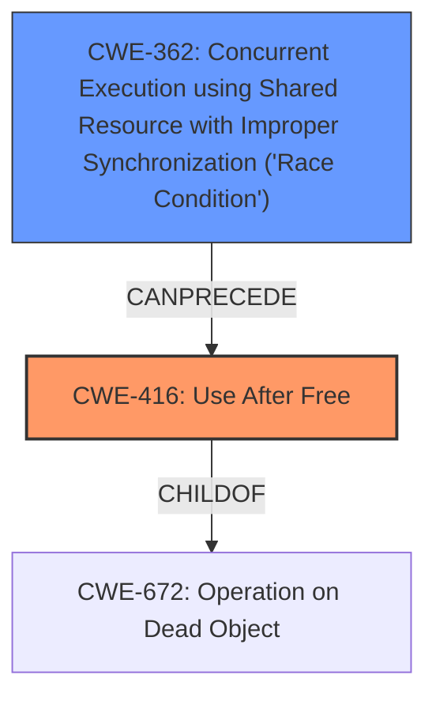

# Final Resolution for CVE-2022-20082

# Summary
| CWE ID | CWE Name | Confidence | CWE Abstraction Level | CWE Vulnerability Mapping Label | CWE-Vulnerability Mapping Notes |
|---|---|---|---|---|---|
| **CWE-416** | **Use After Free** | 0.95 | Variant | Allowed | Primary CWE |
| **CWE-362** | **Concurrent Execution using Shared Resource with Improper Synchronization ('Race Condition')** | 0.90 | Class | Allowed-with-Review | Secondary Candidate |

## Evidence and Confidence

*   **Confidence Score:** 0.93
*   **Evidence Strength:** HIGH

## Relationship Analysis
The primary relationship is that the **CWE-362** Concurrent Execution using Shared Resource with Improper Synchronization ('**Race Condition**') can lead to **CWE-416** **Use After Free**. **CWE-416** is a variant of **CWE-672** which is Operations on Dead Object. **CWE-362** is a class level CWE, with more specific base level CWEs as children.

## Vulnerability Chain
The vulnerability chain starts with a **CWE-362** Concurrent Execution using Shared Resource with Improper Synchronization ('**Race Condition**'). Due to the improper synchronization, a memory resource is freed while another thread is still accessing it, leading to **CWE-416** **Use After Free**. The impact is local escalation of privilege.

## Summary of Analysis
The initial analysis and the criticism are both well-reasoned and accurate. The vulnerability description explicitly states a "**use after free** due to a **race condition**". This provides direct evidence for both **CWE-416** and **CWE-362**.

The relationship analysis confirms that **CWE-362** can lead to **CWE-416**, solidifying the proposed vulnerability chain. Although **CWE-362** is a Class level CWE, the criticism correctly notes that without further investigation to determine a more specific type of race condition, it is difficult to select a more specific Base level CWE.

The selected CWEs are at the optimal level of specificity given the available evidence. More detailed information would be required to select a more specific child of **CWE-362**.