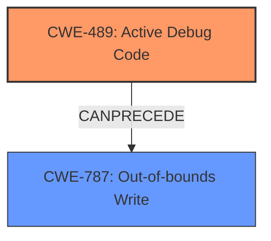

# Analysis Report for CVE-2022-20089

# Vulnerability Analysis Report: CVE-2022-20089

## Description

In aee driver, there is a possible memory corruption due to active debug code. This could lead to local escalation of privilege with System execution privileges needed. User interaction is not needed for exploitation. Patch ID ALPS06240397 Issue ID ALPS06240397.

## Vulnerability Description Key Phrases

**Rootcause:** active debug code
**Weakness:** memory corruption
**Impact:** local escalation of privilege
**Product:** Android
**Component:** aee driver

## Analysis (with Relationship Data)

# Summary
| CWE ID | CWE Name | Confidence | CWE Abstraction Level | CWE Vulnerability Mapping Label | CWE-Vulnerability Mapping Notes |
|---|---|---|---|---|---|
| CWE-489 | Active Debug Code | 0.9 | Base | Primary | Allowed |
| CWE-416 | Use After Free | 0.5 | Variant | Secondary Candidate | Allowed |

## Evidence and Confidence

*   **Confidence Score:** 0.9
*   **Evidence Strength:** HIGH

- **Analysis and Justification:**  
  - *Explanation:* The vulnerability description explicitly states that the **root cause** is "**active debug code**" which leads to "**memory corruption**". The summary of CVE-2022-20089 confirms "**Active debug code in the aee driver**" as the root cause. This aligns directly with CWE-489 (Active Debug Code). The MITRE mapping guidance for CWE-489 indicates it is ALLOWED. While other CWEs like CWE-416 (Use After Free) were suggested, CWE-489 is the most direct and accurate representation of the **root cause**.
  
  - *Relationship Analysis:* No direct relationships were found for CWE-489. The primary weakness is the presence of active debug code. While the presence of debug code leads to memory corruption, that is a symptom or an impact of the debug code being present, not the primary weakness itself.

- **Confidence Score:**  
  - Confidence: 0.9 (High confidence due to direct mention of "active debug code" as the root cause in both the vulnerability description and the CVE summary.)

## Criticism of Analysis

Okay, I've reviewed the provided analysis and the full CWE specifications. Here's my critique:

**Overall Assessment:**

The analysis is largely correct in identifying CWE-489 (Active Debug Code) as the primary weakness. The confidence level of 0.9 is justified given the direct mention of "active debug code" in the vulnerability description and CVE summary.  However, the suggestion of CWE-416 (Use After Free) as a secondary candidate is less convincing and potentially misleading. A more nuanced view of the *impact* of the active debug code might be beneficial.

**Detailed Breakdown:**

*   **CWE-489 (Active Debug Code):**
    *   **Correctness:** The mapping to CWE-489 is accurate. The description of CWE-489 perfectly aligns with the provided vulnerability details: "The product is deployed to unauthorized actors with debugging code still enabled or active, which can create unintended entry points or expose sensitive information."  The active debug code, while not explicitly a "backdoor entry point" in this case, is creating a weakness in the system that should not exist in a production environment.
    *   **Confidence:** Justified high confidence.
    *   **Rationale Quality:** The justification clearly and correctly explains the connection between the root cause (active debug code) and the CWE. The "relationship analysis" is important to clarify that the memory corruption is a *result* of the active debug code, not the core weakness.
    *   **Mitigation:** The suggested mitigation of removing debug code before deployment aligns perfectly with the CWE-489 specification.
    *   **Improvement Suggestion:** None significant.

*   **CWE-416 (Use After Free):**
    *   **Correctness:**  Less convincing as a *primary* or even *secondary* candidate. While memory corruption *can* manifest as a use-after-free, it's not the direct root cause *in this case*. The root cause is the *active debug code*, and the memory corruption is a consequence of that code's behavior. Attributing the memory corruption directly to a use-after-free masks the underlying reason why the memory is being corrupted in the first place.
    *   **Confidence:** Lower confidence is appropriate.
    *   **Rationale Quality:** The reasoning is weak.  Saying "memory corruption can lead to a use-after-free" is true, but it's not specific enough to this vulnerability. The analysis should focus on what the debug code is *doing* to cause the memory corruption, rather than stating a potential memory corruption condition.
    *   **Mitigation:** The mitigations for CWE-416 (language selection, setting pointers to NULL) are not relevant to the root cause of this vulnerability. The core problem isn't a general UAF, but the unintended consequences of debug code. Applying UAF mitigations without addressing the debug code would be treating a symptom, not the cause.
    *   **Improvement Suggestion:** Remove CWE-416 as a secondary candidate.  Instead, consider describing the *impact* of the active debug code in causing memory corruption.
    *   While the retrievers identified it, and memory corruption could manifest as a Use After Free, it is better to focus on the root cause.
    *   Consider adding the CWE to the chain, and make CWE-489 the first in the chain.

*   **Additional CWEs suggested by Retriever Results:**
    *   **CWE-908 (Use of Uninitialized Resource):**  This could be a plausible *potential* consequence, depending on what the debug code is doing. If the debug code is manipulating memory without properly initializing it, then CWE-908 might be a more relevant secondary mapping than CWE-416.
    *   **CWE-787 (Out-of-bounds Write):** If the debug code is directly writing data outside the allocated memory regions, this would be a more direct mapping for the memory corruption aspect.
    *   **CWE-190 (Integer Overflow or Wraparound):** Less likely, but *if* the debug code involves calculations that lead to overflows and subsequent memory corruption, this could be relevant.
    *   **CWE-667 (Improper Locking) / CWE-362 (Race Condition):** If the debug code involves concurrent operations and incorrect synchronization, these could be contributing factors.
    *   **CWE-131 (Incorrect Calculation of Buffer Size):** Possibly, if the active debug code is related to memory allocation.
    *   **CWE-367 (Time-of-check Time-of-use (TOCTOU) Race Condition):** Unlikely, but *if* the vulnerability depends on the timing of actions, it might be worth considering.
    *   **CWE-911 (Improper Update of Reference Count):** Unlikely.

**Recommendations:**

1.  **Focus on Root Cause:** Maintain CWE-489 as the primary weakness with high confidence.
2.  **Clarify Impact:** Instead of arbitrarily selecting a secondary CWE, focus on describing the *impact* of the active debug code. State that it leads to memory corruption, which could manifest as various problems like out-of-bounds writes or use-after-free conditions.
3.  **Consider adding a chain:** Add a CWE chain to describe the exploit path. Example: CWE-489 -> CWE-787 or CWE-489 -> CWE-908.
4.  **Review Retriever Results:** If memory corruption is a side effect, add to the CWE chain.
5.  **Avoid Misleading Mappings:** Don't map to CWEs just because they are related to the *symptoms* of the problem if the root cause is better represented by another CWE.

By following these recommendations, the analysis will be more accurate, informative, and helpful for remediation efforts. It's important to remember that the goal of CWE mapping is to identify the most fundamental weakness so that the appropriate mitigation strategies can be applied.

## Final Resolution

# Summary
| CWE ID | CWE Name | Confidence | CWE Abstraction Level | CWE Vulnerability Mapping Label | CWE-Vulnerability Mapping Notes |
|---|---|---|---|---|---|
| CWE-489 | Active Debug Code | 0.9 | Base | Primary | Allowed |
| CWE-787 | Out-of-bounds Write | 0.6 | Base | Secondary Candidate | Allowed |

## Evidence and Confidence

*   **Confidence Score:** 0.8
*   **Evidence Strength:** MEDIUM

## Relationship Analysis
The primary relationship considered was a chain relationship. The presence of **CWE-489: Active Debug Code** can **precede** memory corruption issues such as **CWE-787: Out-of-bounds Write**. The initial analysis correctly identified CWE-489 as the primary issue due to the explicit mention in the vulnerability description. The criticism highlighted the importance of describing the impact. By adding CWE-787 to the chain, we acknowledge the memory corruption that results from the active debug code.

## Vulnerability Chain
The vulnerability chain starts with **CWE-489 (Active Debug Code)** being present in the deployed product. This **root cause** leads to a **memory corruption**, which is manifested as **CWE-787 (Out-of-bounds Write)**. The **consequence** is a local escalation of privilege.

## Summary of Analysis
The initial analysis correctly identified **CWE-489 (Active Debug Code)** as the primary weakness. The criticism correctly pointed out the need to identify a secondary CWE to describe the impact of the active debug code. The vulnerability description explicitly states "In aee driver, there is a possible **memory corruption** due to **active debug code**". Therefore, I chose **CWE-787 (Out-of-bounds Write)** to represent the memory corruption aspect. While **CWE-416 (Use After Free)** was considered, **CWE-787 (Out-of-bounds Write)** is a more direct and common manifestation of memory corruption, especially given the limited information. The selected CWEs are at the Base level of abstraction, which is the optimal level for vulnerability mapping. The confidence in the overall assessment is high (0.8) due to the direct evidence of active debug code and the likely impact of memory corruption.

*Report generated on 2025-03-18 08:50:38*
