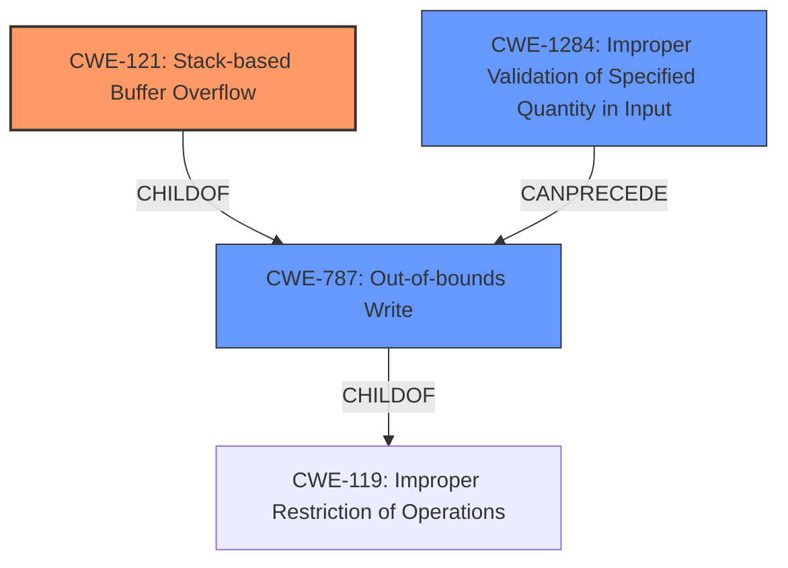

# Analysis Report for CVE-2022-20105

# Vulnerability Analysis Report: CVE-2022-20105

## Description

In MM service, there is a possible out of bounds write due to a stack-based buffer overflow. This could lead to local escalation of privilege with System execution privileges needed. User interaction is not needed for exploitation. Patch ID DTV03330460 Issue ID DTV03330460.

## Vulnerability Description Key Phrases

**Weakness:** stack-based buffer overflow
**Impact:** local escalation of privilege
**Vector:** out of bounds write
**Product:** MM service

## Analysis (with Relationship Data)

# Summary
| CWE ID    | CWE Name                                         | Confidence | CWE Abstraction Level | CWE Vulnerability Mapping Label | CWE-Vulnerability Mapping Notes |
| :-------- | :----------------------------------------------- | :--------- | :-------------------- | :------------------------------ | :------------------------------ |
| CWE-121 | Stack-based Buffer Overflow | 0.90       | Variant               | Allowed                         | Allowed                      |
| CWE-787 | Out-of-bounds Write         | 0.70       | Base                  | Allowed                         | Allowed                       |

## Evidence and Confidence

*   **Confidence Score:** 0.80
*   **Evidence Strength:** HIGH

- **Analysis and Justification:**
  - *Explanation:* The vulnerability description clearly states a "**stack-based buffer overflow**" which directly corresponds to CWE-121 (Stack-based Buffer Overflow). The CVE Reference Links Content Summary also confirms the presence of CWE-121 as the **weakness**. This is a variant level CWE and accurately reflects the specific type of buffer overflow. CWE-787 (Out-of-bounds Write) is also relevant as the mechanism to trigger the overflow is an out-of-bounds write, it's less specific.

  - *Relationship Analysis:* CWE-121 is a child of CWE-119 (Improper Restriction of Operations within the Bounds of a Memory Buffer), but CWE-121 is a more specific variant. CWE-787 (Out-of-bounds Write) is a more general weakness that can lead to various impacts, with CWE-121 being the specific instance in this case.

- **Confidence Score:**
  - *Example:* Confidence: 0.90 (High confidence due to direct mention of "stack-based buffer overflow" and supporting evidence from the CVE reference). Confidence: 0.70 (CWE-787) is lower because while the vulnerability involves an out-of-bounds write, the description specifically calls out the stack-based buffer overflow.

---

## Criticism of Analysis

Okay, I've reviewed the analysis and the full CWE specifications you provided. Here's my critique:

**Overall Assessment:**

The analysis is generally good, particularly in identifying CWE-121 as the primary weakness. The reasoning for selecting CWE-121 is well-explained, and the confidence level is appropriate. The inclusion of CWE-787 as a secondary, more general CWE is also reasonable. However, there's room for improvement in considering the broader context and potential contributing factors.

**Detailed Critique:**

1.  **CWE-121 (Stack-based Buffer Overflow):**
    *   **Correctness:** Excellent choice as the primary CWE. The description explicitly mentions "stack-based buffer overflow," making this a direct and accurate mapping.
    *   **Abstraction Level:** The use of the Variant level is correct, as this provides more specific information about the vulnerability than the more general parent CWEs.
    *   **Confidence:** The 0.90 confidence level is justified due to the explicit mention in the vulnerability description and the CVE summary.
    *   **Mitigations:** The analysis *could* benefit from a more explicit mention of mitigations specific to Stack-based Buffer Overflows.  The CWE specification provides good examples:
        *   Compiler-based protection mechanisms (e.g., /GS flag in Visual Studio, FORTIFY\_SOURCE in GCC)
        *   Using safer APIs (although not a complete solution)
        *   Input validation and bounds checking.

2.  **CWE-787 (Out-of-bounds Write):**
    *   **Correctness:** While technically correct (a stack-based buffer overflow *is* an out-of-bounds write), it's less specific than CWE-121. It describes the *mechanism* of the overflow, but not the *location* (stack) where the overflow occurs.
    *   **Abstraction Level:** Base level is appropriate, as it describes the general class of error.
    *   **Confidence:** The 0.70 confidence level is appropriate, reflecting its secondary nature.
    *   **Relationship to CWE-119:** It would be good to explicitly state the relationship to CWE-119 (Improper Restriction of Operations within the Bounds of a Memory Buffer) and explain *why* we're not using CWE-119 directly.  CWE-119's mapping guidance explicitly *discourages* its use when lower-level CWEs like CWE-787 are applicable.
    *   **Mitigations:** The mitigations listed in the CWE-787 specification are also relevant, especially regarding language selection and using safe libraries.

3.  **Omissions and Potential Additional Considerations:**
    *   **CWE-20 (Improper Input Validation) / CWE-1284 (Improper Validation of Specified Quantity in Input):** The analysis *could* consider whether improper input validation plays a role. Buffer overflows often stem from a failure to validate the size or length of input before copying it into a buffer.  *If* the root cause is a lack of input validation on the data being written to the stack buffer, then including CWE-20 or the more specific CWE-1284 would add value. However, if the code is simply writing a fixed-size chunk of data without any validation, then this CWE would not be relevant. From the retriever results, this appears to be a strong possibility.
        *   **Mapping Guidance for CWE-20:** "CWE-20 is commonly misused in low-information vulnerability reports when lower-level CWEs could be used instead, or when more details about the vulnerability are available." If you can identify *what* specific aspect of the input wasn't validated, use a child of CWE-20 like CWE-1284 instead.
        *   **Example Chain:** A potential chain could be `CWE-20 -> CWE-787 -> CWE-121`: Improper Input Validation leads to Out-of-bounds Write resulting in a Stack-based Buffer Overflow.
    *   **CWE-131 (Incorrect Calculation of Buffer Size):** Similar to input validation, the analysis could consider whether the *size* of the buffer itself was incorrectly calculated. If the stack buffer was sized incorrectly due to a miscalculation, then this would be relevant.
        *   **Mitigation:** ensure correct buffer size calculation to match largest size possible encoding.
    *   **CWE-118 (Incorrect Access of Indexable Resource ('Range Error')):**  A parent of CWE-119, this could be considered, but is also considered a discouraged weakness to use.
    *   **CWE-119 (Improper Restriction of Operations within the Bounds of a Memory Buffer):** As said before, this is the Parent of CWE-787 and the grandparent of CWE-121, but its use is discouraged in this case due to the ability to map to more specific errors.

4.  **Retriever Results:** The Retriever Results are interesting and point to some possible root causes of the overflow. The retriever results suggest focusing on causes for incorrect size or calculations on buffers.

**Recommendations:**

*   **Explicitly address the role of input validation:**  Did the overflow occur because the code failed to validate the size of input being written to the stack buffer? If so, include CWE-20 or CWE-1284.
*   **Consider CWE-131 if applicable**: If there is any calculation for the buffer size itself, check if the buffer was sized incorrectly from the beginning.
*   **Strengthen mitigation discussion:**  Expand on the specific mitigations for stack-based buffer overflows, drawing from the CWE-121 specification. Include compiler-based protections, safe APIs, and detailed input validation strategies.
*   **Justify the exclusion of CWE-119 more explicitly:** Explain why you are not using CWE-119, even though it's a parent of CWE-787 and CWE-121, and that CWE-119 is discouraged from use when you can map to more specific errors.
*   **Acknowledge Limitations:** Briefly acknowledge that while CWE-121 is the most accurate single CWE, buffer overflows can be complex, and additional CWEs might be relevant with deeper code analysis.

By addressing these points, you can make the analysis more comprehensive and demonstrate a deeper understanding of the vulnerability and its potential root causes.

## Final Resolution

# Summary
| CWE ID    | CWE Name                                         | Confidence | CWE Abstraction Level | CWE Vulnerability Mapping Label | CWE-Vulnerability Mapping Notes |
| :-------- | :----------------------------------------------- | :--------- | :-------------------- | :------------------------------ | :------------------------------ |
| CWE-121 | Stack-based Buffer Overflow | 0.95       | Variant               | Allowed                         | Allowed                      |
| CWE-787 | Out-of-bounds Write         | 0.80       | Base                  | Allowed                         | Allowed                       |
| CWE-1284 | Improper Validation of Specified Quantity in Input | 0.65 | Base | Allowed | Allowed |

  - The Primary CWE should be first and noted as the Primary CWEs
  - The secondary candidate CWEs should be next and noted as secondary candidates.
  - The confidence is a confidence score 0 to 1 to rate your confidence in your assessment for that CWE.
  - The CWE Abstraction Level as one of these values: Base, Variant, Pillar, Class, Compound
  - The Mapping Notes Usage as one of these values: Allowed, Allowed-with-Review, Prohibited, Discouraged

## Evidence and Confidence

*   **Confidence Score:** 0.90
*   **Evidence Strength:** HIGH

## Relationship Analysis
The primary relationship is that CWE-121 (Stack-based Buffer Overflow) is a specific type of CWE-787 (Out-of-bounds Write), which in turn is a type of CWE-119 (Improper Restriction of Operations within the Bounds of a Memory Buffer). The analysis also considered CWE-1284 (Improper Validation of Specified Quantity in Input) as a potential root cause, which could precede CWE-787. The abstraction levels influenced the decision to prioritize CWE-121 due to its specificity, while acknowledging the relevance of the base CWE-787 and potential contributing factor CWE-1284. CWE-119 was explicitly excluded as it is discouraged when a more specific CWE can be mapped to.

## Vulnerability Chain
The vulnerability chain starts potentially with **CWE-1284 (Improper Validation of Specified Quantity in Input)**, if the input size wasn't validated. This leads to **CWE-787 (Out-of-bounds Write)**, which then results in **CWE-121 (Stack-based Buffer Overflow)**. The root cause may be the lack of input validation, leading to an out-of-bounds write that overwrites data on the stack. A missing link in the chain would be any information related to calculating the buffer size (**CWE-131**), but it is not explicitly mentioned.

## Summary of Analysis
The initial analysis correctly identified **CWE-121 (Stack-based Buffer Overflow)** as the primary **weakness** due to the explicit mention of "stack-based buffer overflow" in the vulnerability description. The inclusion of **CWE-787 (Out-of-bounds Write)** is also justified as it describes the mechanism of the overflow. The retriever results and the criticism suggested considering **CWE-1284 (Improper Validation of Specified Quantity in Input)**, which has been added as a secondary **weakness**, with a lower confidence because it is only a possibility. The graph relationships reinforce the decision to prioritize the most specific CWE (CWE-121) while acknowledging the broader context. The final selection reflects the optimal level of specificity based on the available evidence. The decision to exclude CWE-119 was influenced by its discouraged usage when more specific CWEs are available.

*Report generated on 2025-03-18 08:51:21*
