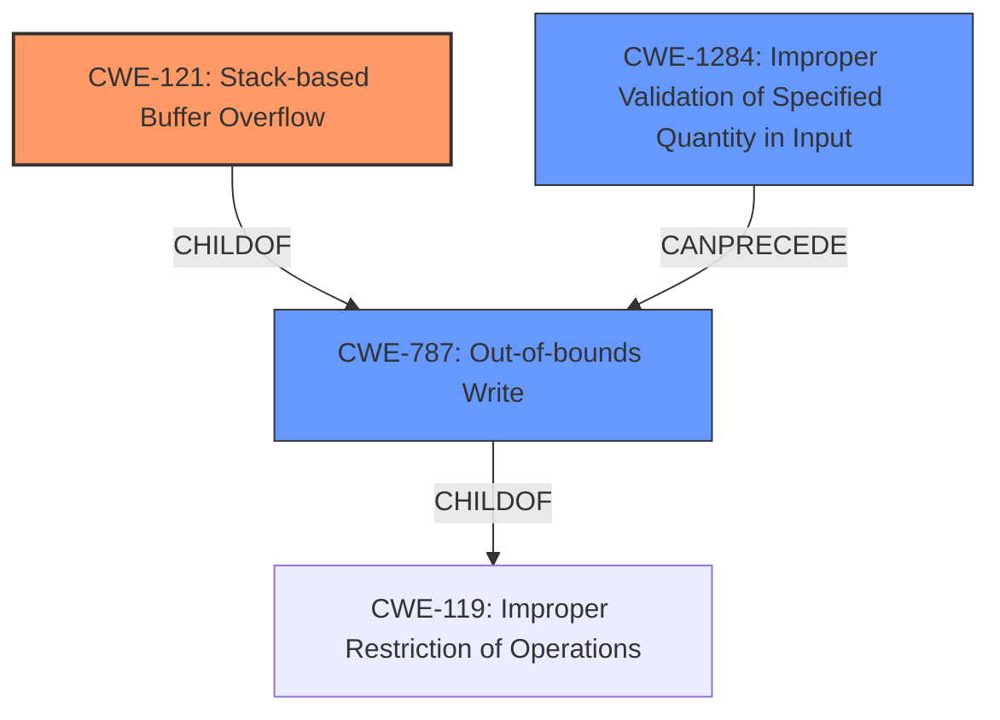

# Final Resolution for CVE-2022-20105

# Summary
| CWE ID    | CWE Name                                         | Confidence | CWE Abstraction Level | CWE Vulnerability Mapping Label | CWE-Vulnerability Mapping Notes |
| :-------- | :----------------------------------------------- | :--------- | :-------------------- | :------------------------------ | :------------------------------ |
| CWE-121 | Stack-based Buffer Overflow | 0.95       | Variant               | Allowed                         | Allowed                      |
| CWE-787 | Out-of-bounds Write         | 0.80       | Base                  | Allowed                         | Allowed                       |
| CWE-1284 | Improper Validation of Specified Quantity in Input | 0.65 | Base | Allowed | Allowed |

  - The Primary CWE should be first and noted as the Primary CWEs
  - The secondary candidate CWEs should be next and noted as secondary candidates.
  - The confidence is a confidence score 0 to 1 to rate your confidence in your assessment for that CWE.
  - The CWE Abstraction Level as one of these values: Base, Variant, Pillar, Class, Compound
  - The Mapping Notes Usage as one of these values: Allowed, Allowed-with-Review, Prohibited, Discouraged

## Evidence and Confidence

*   **Confidence Score:** 0.90
*   **Evidence Strength:** HIGH

## Relationship Analysis
The primary relationship is that CWE-121 (Stack-based Buffer Overflow) is a specific type of CWE-787 (Out-of-bounds Write), which in turn is a type of CWE-119 (Improper Restriction of Operations within the Bounds of a Memory Buffer). The analysis also considered CWE-1284 (Improper Validation of Specified Quantity in Input) as a potential root cause, which could precede CWE-787. The abstraction levels influenced the decision to prioritize CWE-121 due to its specificity, while acknowledging the relevance of the base CWE-787 and potential contributing factor CWE-1284. CWE-119 was explicitly excluded as it is discouraged when a more specific CWE can be mapped to.

## Vulnerability Chain
The vulnerability chain starts potentially with **CWE-1284 (Improper Validation of Specified Quantity in Input)**, if the input size wasn't validated. This leads to **CWE-787 (Out-of-bounds Write)**, which then results in **CWE-121 (Stack-based Buffer Overflow)**. The root cause may be the lack of input validation, leading to an out-of-bounds write that overwrites data on the stack. A missing link in the chain would be any information related to calculating the buffer size (**CWE-131**), but it is not explicitly mentioned.

## Summary of Analysis
The initial analysis correctly identified **CWE-121 (Stack-based Buffer Overflow)** as the primary **weakness** due to the explicit mention of "stack-based buffer overflow" in the vulnerability description. The inclusion of **CWE-787 (Out-of-bounds Write)** is also justified as it describes the mechanism of the overflow. The retriever results and the criticism suggested considering **CWE-1284 (Improper Validation of Specified Quantity in Input)**, which has been added as a secondary **weakness**, with a lower confidence because it is only a possibility. The graph relationships reinforce the decision to prioritize the most specific CWE (CWE-121) while acknowledging the broader context. The final selection reflects the optimal level of specificity based on the available evidence. The decision to exclude CWE-119 was influenced by its discouraged usage when more specific CWEs are available.