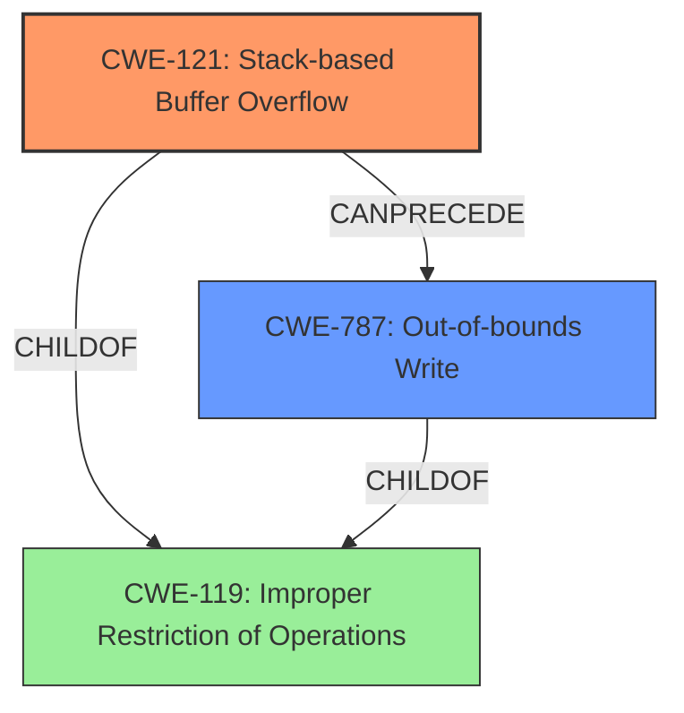

# Analysis Report for CVE-2022-20108

# Vulnerability Analysis Report: CVE-2022-20108

## Description

In voice service, there is a possible out of bounds write due to a stack-based buffer overflow. This could lead to local escalation of privilege with System execution privileges needed. User interaction is not needed for exploitation. Patch ID DTV03330702 Issue ID DTV03330702.

## Vulnerability Description Key Phrases

**Rootcause:** stack-based buffer overflow
**Weakness:** out of bounds write
**Impact:** local escalation of privilege
**Component:** voice service

## Analysis (with Relationship Data)

# Summary
| CWE ID | CWE Name | Confidence | CWE Abstraction Level | CWE Vulnerability Mapping Label | CWE-Vulnerability Mapping Notes |
|---|---|---|---|---|---|
| CWE-121 | Stack-based Buffer Overflow | 0.95 | Variant | Allowed | Primary CWE: The vulnerability is explicitly described as a stack-based buffer overflow. |
| CWE-787 | Out-of-bounds Write | 0.85 | Base | Allowed | Secondary CWE: The vulnerability leads to an out-of-bounds write, a direct consequence of the buffer overflow. |

## Evidence and Confidence

*   **Confidence Score:** 0.90
*   **Evidence Strength:** HIGH

- **Analysis and Justification:**  
  - *Explanation:* The vulnerability description explicitly states a "**stack-based buffer overflow**" leading to an "**out of bounds write**". The CVE reference summary confirms this. CWE-121 (Stack-based Buffer Overflow) directly matches the stated root cause. CWE-787 (Out-of-bounds Write) represents the consequence of overflowing the buffer. Since the overflow occurs on the stack, CWE-121 is more specific than a general buffer overflow (CWE-119) and more precise than out-of-bounds write alone. The MITRE mapping guidance allows the use of CWE-121 and CWE-787.
  
  - *Relationship Analysis:* CWE-121 is a variant of CWE-119 (Improper Restriction of Operations within the Bounds of a Memory Buffer). CWE-787 (Out-of-bounds Write) is a child of CWE-119 and represents the result of writing beyond the allocated buffer, which is a direct consequence of the stack-based buffer overflow. CWE-121 can precede CWE-787 as the overflow leads to the out-of-bounds write.

- **Confidence Score:**  
  - Confidence: 0.95 (High confidence due to direct match with vulnerability description and CVE reference materials)

---

## Criticism of Analysis

Okay, I've reviewed the analysis and the full CWE specifications. Here's my critique:

**Overall Assessment:**

The analysis is generally good. The primary CWE mapping to CWE-121 (Stack-based Buffer Overflow) is accurate and well-justified. The inclusion of CWE-787 (Out-of-bounds Write) as a secondary CWE is also appropriate as it describes the direct consequence of the overflow. The confidence scores are reasonable. The evidence strength is justified based on the vulnerability description and CVE reference data.

**Specific Points & Suggestions:**

*   **CWE-121 (Stack-based Buffer Overflow):**

    *   The analysis correctly identifies this as the root cause described explicitly in the vulnerability information.
    *   The explanation of why CWE-121 is more specific than CWE-119 is accurate.
    *   The MITRE mapping guidance supports the usage of CWE-121, further justifying this selection.
    *   The provided mitigations for CWE-121 are directly relevant, focusing on environment hardening through compiler extensions and bounds checking.
    *   *Potential Improvement:* While not strictly *necessary*, it could be beneficial to briefly mention *how* the stack-based buffer overflow manifests. Does it overwrite a return address? A function pointer? Specifying this (if known) further strengthens the analysis. As the CWE description notes: "Stack-based buffer overflows can instantiate in return address overwrites, stack pointer overwrites or frame pointer overwrites. They can also be considered function pointer overwrites, array indexer overwrites or write-what-where condition, etc."
*   **CWE-787 (Out-of-bounds Write):**

    *   The analysis correctly identifies this as the direct consequence of the buffer overflow.
    *   The justification for its inclusion as a secondary CWE is sound.
    *   The provided mitigations for CWE-787 are relevant, emphasizing language selection, safe libraries, and overflow detection mechanisms.
*   **Confidence Score:** The confidence scores of 0.95 for CWE-121 and 0.85 for CWE-787 are well justified given the explicit naming of "stack-based buffer overflow" and "out-of-bounds write" in the vulnerability descriptions.

**Points to Consider (and Why the Lower Ranked CWEs Don't Fit):**

The retriever results include several other CWEs that were ranked highly, but correctly not chosen. Here's why:

*   **CWE-131 (Incorrect Calculation of Buffer Size):**  While a buffer overflow often *involves* an incorrect buffer size, the vulnerability description focuses on the *overflow itself* and not specifically on *how* the buffer size was calculated.  If the details mentioned *how* the size was incorrect (e.g., an integer overflow led to a smaller-than-expected allocation), then CWE-131 might be relevant. But without that information, it is not the primary issue.
*   **CWE-190 (Integer Overflow or Wraparound) & CWE-191 (Integer Underflow):** These CWEs *could* potentially lead to a buffer overflow if the integer is used to determine buffer size, but the description doesn't suggest this is the case.  It's more likely a simple failure to bounds-check the input data being copied into the buffer.
*   **CWE-125 (Out-of-bounds Read):** The description mentions an out-of-bounds *write*, not a read.
*   **CWE-1285 (Improper Validation of Specified Index, Position, or Offset in Input):** This could be a contributing factor, but it's less direct than the buffer overflow and out-of-bounds write. The primary issue is that *data* is written beyond the boundary, rather than an incorrect index/offset being the sole cause.
*   **CWE-770 (Allocation of Resources Without Limits or Throttling):** This is generally used for denial-of-service conditions related to excessive resource consumption, not buffer overflows.
*   **CWE-908 (Use of Uninitialized Resource):** This is unrelated to a buffer overflow.
*    **CWE-1284 (Improper Validation of Specified Quantity in Input):** Similar to CWE-1285, this is an indirect cause and not the main problem.

**In summary,** the analysis is strong and accurately reflects the nature of the vulnerability. The high confidence scores are supported by the evidence. The explanation of the primary and secondary CWEs is clear and logical.

## Final Resolution

# Summary
| CWE ID | CWE Name | Confidence | CWE Abstraction Level | CWE Vulnerability Mapping Label | CWE-Vulnerability Mapping Notes |
|---|---|---|---|---|---|
| CWE-121 | Stack-based Buffer Overflow | 0.95 | Variant | Allowed | Primary CWE: The vulnerability is explicitly described as a stack-based buffer overflow. |
| CWE-787 | Out-of-bounds Write | 0.85 | Base | Allowed | Secondary CWE: The vulnerability leads to an out-of-bounds write, a direct consequence of the buffer overflow. |

## Evidence and Confidence

*   **Confidence Score:** 0.95
*   **Evidence Strength:** HIGH

## Relationship Analysis
The analysis correctly identifies CWE-121 as a variant of CWE-119, providing a more specific classification for the **buffer overflow** occurring on the stack. CWE-787 is accurately positioned as a consequence of CWE-121, describing the **out-of-bounds write** that results from the overflow. The relationship between these CWEs is a chain where CWE-121 *CanPrecede* CWE-787. The abstraction levels are appropriate, with CWE-121 as a Variant and CWE-787 as a Base.

## Vulnerability Chain
The vulnerability chain starts with the **stack-based buffer overflow** (CWE-121), which leads to an **out-of-bounds write** (CWE-787). The initial flaw is the lack of proper bounds checking when copying data to a stack buffer, and the consequence is the ability to overwrite adjacent memory regions.

## Summary of Analysis
The initial analysis and criticism are well-reasoned and justified. The assessment is based on the provided evidence, which explicitly mentions "**stack-based buffer overflow**" and "**out of bounds write**".

The graph relationships influenced the final selection by confirming that CWE-121 is a more specific variant of CWE-119, and CWE-787 is a direct consequence of CWE-121. This understanding of the chain helped to determine the optimal level of specificity for the classification.

The selected CWEs are at the optimal level of specificity because CWE-121 directly addresses the type of **buffer overflow** (stack-based), and CWE-787 accurately describes the resulting **out-of-bounds write**. While other CWEs such as CWE-131 (Incorrect Calculation of Buffer Size) could potentially be involved, the provided evidence does not support their inclusion. The focus is on the *overflow* and its *consequence*, as stated in the vulnerability description.

*Report generated on 2025-03-18 08:52:59*
