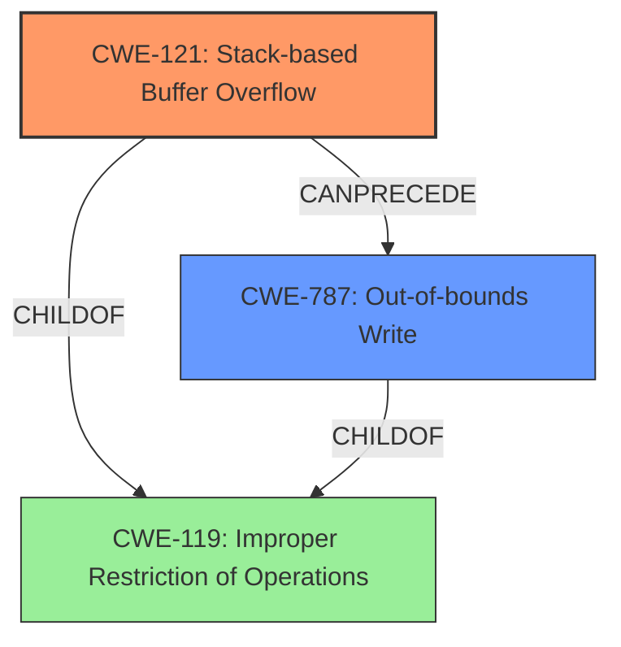

# Final Resolution for CVE-2022-20108

# Summary
| CWE ID | CWE Name | Confidence | CWE Abstraction Level | CWE Vulnerability Mapping Label | CWE-Vulnerability Mapping Notes |
|---|---|---|---|---|---|
| CWE-121 | Stack-based Buffer Overflow | 0.95 | Variant | Allowed | Primary CWE: The vulnerability is explicitly described as a stack-based buffer overflow. |
| CWE-787 | Out-of-bounds Write | 0.85 | Base | Allowed | Secondary CWE: The vulnerability leads to an out-of-bounds write, a direct consequence of the buffer overflow. |

## Evidence and Confidence

*   **Confidence Score:** 0.95
*   **Evidence Strength:** HIGH

## Relationship Analysis
The analysis correctly identifies CWE-121 as a variant of CWE-119, providing a more specific classification for the **buffer overflow** occurring on the stack. CWE-787 is accurately positioned as a consequence of CWE-121, describing the **out-of-bounds write** that results from the overflow. The relationship between these CWEs is a chain where CWE-121 *CanPrecede* CWE-787. The abstraction levels are appropriate, with CWE-121 as a Variant and CWE-787 as a Base.

## Vulnerability Chain
The vulnerability chain starts with the **stack-based buffer overflow** (CWE-121), which leads to an **out-of-bounds write** (CWE-787). The initial flaw is the lack of proper bounds checking when copying data to a stack buffer, and the consequence is the ability to overwrite adjacent memory regions.

## Summary of Analysis
The initial analysis and criticism are well-reasoned and justified. The assessment is based on the provided evidence, which explicitly mentions "**stack-based buffer overflow**" and "**out of bounds write**".

The graph relationships influenced the final selection by confirming that CWE-121 is a more specific variant of CWE-119, and CWE-787 is a direct consequence of CWE-121. This understanding of the chain helped to determine the optimal level of specificity for the classification.

The selected CWEs are at the optimal level of specificity because CWE-121 directly addresses the type of **buffer overflow** (stack-based), and CWE-787 accurately describes the resulting **out-of-bounds write**. While other CWEs such as CWE-131 (Incorrect Calculation of Buffer Size) could potentially be involved, the provided evidence does not support their inclusion. The focus is on the *overflow* and its *consequence*, as stated in the vulnerability description.