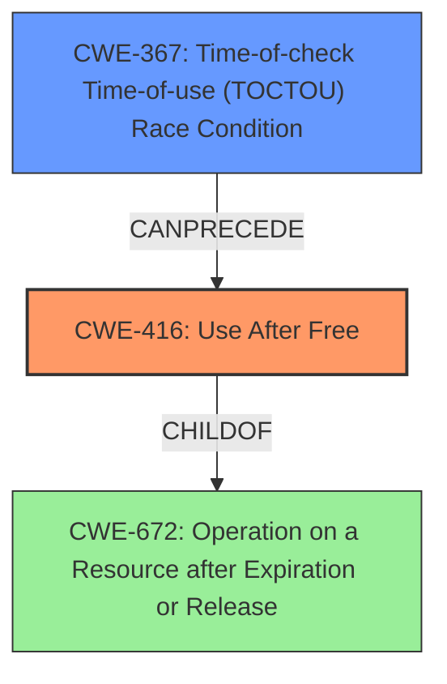

# Final Resolution for CVE-2022-20110

# Summary
| CWE ID  | CWE Name                                                                                                              | Confidence | CWE Abstraction Level | CWE Vulnerability Mapping Label | CWE-Vulnerability Mapping Notes |
| ------- | --------------------------------------------------------------------------------------------------------------------- | ---------- | ----------------------- | ------------------------------- | ----------------------------- |
| CWE-416 | Use After Free                                                                                                        | 0.95       | Variant                 | Primary                         | Allowed                       |
| CWE-367 | Time-of-check Time-of-use (TOCTOU) Race Condition                                                                    | 0.85       | Base                    | Secondary                       | Allowed                       |

## Evidence and Confidence

*   **Confidence Score:** 0.90
*   **Evidence Strength:** HIGH

## Relationship Analysis
The primary relationship is that the **CWE-367** (Time-of-check Time-of-use (TOCTOU) **Race Condition**) can precede **CWE-416** (**Use After Free**). This means the race condition sets the stage for the use-after-free to occur. **CWE-416** is a variant of **CWE-672** (Operation on a Resource after Expiration or Release), which indicates that the memory is accessed after it has been freed. The analysis also considered other potential CWEs suggested by the retriever, such as **CWE-366**, **CWE-911**, **CWE-908**, **CWE-413**, and **CWE-362**, but correctly dismissed them as less accurate or too abstract based on the provided information.

## Vulnerability Chain
The vulnerability chain starts with the **CWE-367** (TOCTOU **race condition**), where the state of a resource is checked, but changes before it is used. This leads to **CWE-416** (**use after free**), where memory is accessed after it has been freed, potentially leading to local escalation of privilege.

## Summary of Analysis
The initial analysis and criticism both align well with the available evidence. The vulnerability description explicitly mentions a "**use after free** due to a **race condition**," justifying the selection of **CWE-416** as the primary weakness and **CWE-367** as the secondary weakness. The graph relationships confirm that the race condition can precede the use-after-free. The selection of CWEs is at the optimal level of specificity, with **CWE-416** being a Variant and **CWE-367** being a Base level CWE. The analysis considered other potential CWEs but correctly determined that they were less accurate or too abstract. The high confidence ratings are appropriate given the direct evidence and the corroborating information from CVE reference links.