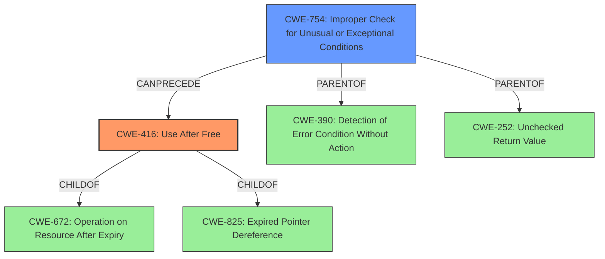

# Final Resolution for CVE-2022-20111

# Summary

| CWE ID | CWE Name | Confidence | CWE Abstraction Level | CWE Vulnerability Mapping Label | CWE-Vulnerability Mapping Notes |
|---|---|---|---|---|---|
| CWE-416 | Use After Free | 0.95 | Variant | Allowed | Primary CWE. The vulnerability is a **use-after-free** caused by **incorrect error handling**. |
| CWE-754 | Improper Check for Unusual or Exceptional Conditions | 0.75 | Class | Allowed-with-Review | Secondary CWE. The **use-after-free** stems from an inability to properly check for error conditions. |

## Evidence and Confidence

*   **Confidence Score:** 0.93
*   **Evidence Strength:** HIGH

## Relationship Analysis
The primary relationship influencing the decision is the chain where **improper error checking (CWE-754)** can lead to a **use-after-free condition (CWE-416)**. CWE-416 is a variant of CWE-672 (Operation on Resource After Expiry) and CWE-825 (Expired Pointer Dereference). CWE-754 is a class and parent of CWE-390 (Detection of Error Condition Without Action) and CWE-252 (Unchecked Return Value). The relationships highlight how a failure to anticipate or check for exceptional conditions can result in the use of freed memory.

## Vulnerability Chain
The vulnerability chain starts with the **root cause** being the **Improper Check for Unusual or Exceptional Conditions (CWE-754)**. The product does not adequately check for error conditions. This leads to a scenario where memory is freed prematurely or erroneously. Subsequently, the program attempts to access this freed memory, resulting in a **Use After Free (CWE-416)**. The impact of this **use-after-free** can be local escalation of privilege.

## Summary of Analysis
The initial analysis correctly identified CWE-416 as the primary weakness due to the explicit mention of "**use after free**" in the vulnerability description. The criticism suggested considering CWE-754 or CWE-390 as alternatives to CWE-755. After further consideration, CWE-754 (Improper Check for Unusual or Exceptional Conditions) is a more accurate secondary classification than CWE-755. The vulnerability description mentions "**incorrect error handling**", which aligns better with the description of CWE-754, where the product does not check for unusual or exceptional conditions.

The decision is based on the evidence from the vulnerability description ("**use after free**", "**incorrect error handling**"), the relationship between CWEs (CWE-754 can precede CWE-416), and the abstraction level (CWE-416 is a Variant, CWE-754 is a Class). The selection of CWE-416 and CWE-754 provides the optimal level of specificity.