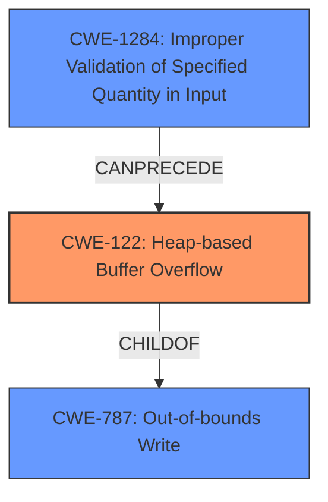

# Final Resolution for CVE-2022-20130

# Summary
| CWE ID | CWE Name | Confidence | CWE Abstraction Level | CWE Vulnerability Mapping Label | CWE-Vulnerability Mapping Notes |
|---|---|---|---|---|---|
| CWE-122 | Heap-based Buffer Overflow | 0.95 | Variant | Allowed | Primary CWE: Root cause of the vulnerability due to a heap buffer overflow. |
| CWE-1284 | Improper Validation of Specified Quantity in Input | 0.75 | Base | Allowed | Secondary CWE: Contributes to the vulnerability chain by failing to validate the size specified in the out-of-band configuration. |
| CWE-787 | Out-of-bounds Write | 0.70 | Base | Allowed | Secondary CWE: Describes the nature of the write operation causing the overflow. |

## Evidence and Confidence

*   **Confidence Score:** 0.90
*   **Evidence Strength:** HIGH

## Relationship Analysis
The analysis focuses on the parent-child relationship between CWE-787 and CWE-122, where CWE-122 is a specific type of CWE-787 (heap-based). It also identifies CWE-1284 as a contributing factor due to the lack of input validation.

## Vulnerability Chain
The vulnerability chain starts with **CWE-1284 (Improper Validation of Specified Quantity in Input)**, where the size from the out-of-band configuration is not validated. This leads to **CWE-122 (Heap-based Buffer Overflow)** when memory is allocated based on the invalid size, and finally results in **CWE-787 (Out-of-bounds Write)** due to writing beyond the allocated buffer.

## Summary of Analysis
The initial analysis and criticism both correctly identified CWE-122 and CWE-787. The criticism suggested including CWE-1284, which is valuable as it highlights the root cause related to missing input validation. The final decision incorporates this suggestion.

The vulnerability description states: "In transportDec_OutOfBandConfig of tpdec_lib.cpp, there is a possible **out of bounds write** due to a **heap buffer overflow**." This provides direct evidence for CWE-122 and CWE-787. The inclusion of CWE-1284 is supported by the fix, which involves preventing the decoder from reallocating memory when invalid out-of-band configuration is encountered, implying the logic for reallocation based on the out-of-band configuration was the issue. This confirms that a lack of input validation (**CWE-1284**) contributes to the vulnerability.

The graph relationships clearly show how these CWEs are related, with **CWE-122** as the primary issue and **CWE-1284** as a contributing factor. This chain highlights the importance of input validation in preventing buffer overflows.

The selected CWEs are at the optimal level of specificity. **CWE-122** precisely describes the type of buffer overflow (heap-based), **CWE-787** describes the nature of the write, and **CWE-1284** explains why the overflow occurs (lack of input validation).