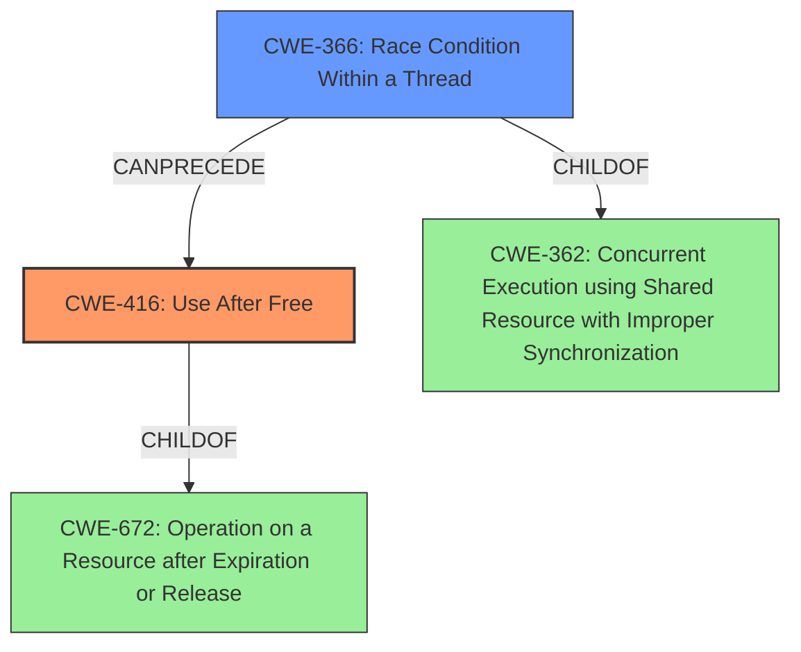

# Analysis Report for CVE-2022-20148

# Vulnerability Analysis Report: CVE-2022-20148

## Description

In TBD of TBD, there is a possible use-after-free due to a race condition. This could lead to local escalation of privilege in the kernel with System execution privileges needed. User interaction is not needed for exploitation.Product AndroidVersions Android kernelAndroid ID A-219513976References Upstream kernel

## Vulnerability Description Key Phrases

**Rootcause:** race condition
**Weakness:** use-after-free
**Impact:** local escalation of privilege
**Product:** Android kernel

## Analysis (with Relationship Data)

# Summary
| CWE ID | CWE Name | Confidence | CWE Abstraction Level | CWE Vulnerability Mapping Label | CWE-Vulnerability Mapping Notes |
|---|---|---|---|---|---|
| CWE-416 | Use After Free | 0.9 | Variant | Primary | The vulnerability description explicitly mentions a **use-after-free** condition due to a **race condition**. |
| CWE-362 | Concurrent Execution using Shared Resource with Improper Synchronization ('Race Condition') | 0.7 | Class | Secondary | The **race condition** contributes to the **use-after-free** vulnerability, making it a relevant secondary CWE. |

## Evidence and Confidence

*   **Confidence Score:** 0.8
*   **Evidence Strength:** HIGH

- **Analysis and Justification:**  
  - *Explanation:* The primary weakness is CWE-416 (Use After Free) because the vulnerability description explicitly states that there is a possible **use-after-free** due to a **race condition**. The "Vulnerability Description Key Phrases" section further reinforces this. The secondary weakness is CWE-362 (Concurrent Execution using Shared Resource with Improper Synchronization ('Race Condition')) because the **race condition** is identified as the root cause leading to the **use-after-free**. The "CVE Reference Links Content Summary" elaborates on the root cause relating to the f2fs discard mechanism and its interaction with low RAM situations, highlighting the concurrent access issues.
  
  - *Relationship Analysis:* CWE-416 (Use After Free) is a variant-level CWE, providing a specific description of the vulnerability. CWE-362 (Concurrent Execution using Shared Resource with Improper Synchronization ('Race Condition')) at the Class level, describes the root cause leading to the **use-after-free**. CWE-416 can follow CWE-362.

- **Confidence Score:**  
  - Confidence: 0.9 (High confidence due to explicit mention of **use-after-free** and **race condition** in the vulnerability description and supporting information in CVE reference links content summary).

---

## Criticism of Analysis

Okay, here's a detailed critique of the provided CWE analysis, incorporating the full CWE specifications.

**Overall Assessment:**

The analysis is generally strong, accurately identifying CWE-416 (Use After Free) as the primary weakness and CWE-362 (Concurrent Execution using Shared Resource with Improper Synchronization ('Race Condition')) as a key contributing factor.  The reasoning is clearly articulated, and the confidence level is justified.

**Specific Points of Critique and Suggestions:**

*   **CWE-416: Use After Free**

    *   **Strengths:** Correctly identified as the primary weakness. The justification citing the explicit mention of "use-after-free" in the vulnerability description is solid.
    *   **Areas for Potential Improvement:**
        *   While the provided description focuses on the high-level issue, it could benefit from connecting the vulnerability more explicitly to the f2fs discard mechanism. Briefly mentioning how the race condition specifically leads to a pointer being used after the memory it points to is freed would strengthen the analysis. For example, "The race condition allows the discard mechanism to free memory that is still referenced by another part of the file system, leading to a use-after-free."
        *   Consider the potential mitigations listed in the CWE specification. Mentioning that using a language with automatic memory management (Mitigation 1) or setting freed pointers to NULL (Mitigation 2) *if applicable to the codebase* could prevent this.  However, given this is a kernel issue and likely in C, automatic memory management isn't an option.
    *   **CWE Usage Guidance:** The mapping guidance for CWE-416 is followed correctly ("Allowed" as it is a Variant).
*   **CWE-362: Concurrent Execution using Shared Resource with Improper Synchronization ('Race Condition')**

    *   **Strengths:** The analysis correctly identifies the race condition as the root cause that enables the use-after-free. The explanation of how the f2fs discard mechanism and low RAM conditions contribute to concurrent access issues is helpful.
    *   **Areas for Potential Improvement:**
        *   The analysis currently states that the *race condition is identified as the root cause leading to the **use-after-free***, but the Retriever Results list multiple children of CWE-362. The usage guidance for CWE-362 itself is "Allowed-with-Review" and instructs to "Examine children of this entry to see if there is a better fit". Looking at the other entries, and their descriptions, will provide a more accurate mapping.
        *   Of the many children of CWE-362, *CWE-366: Race Condition within a Thread* is a likely candidate. The description of CWE-366 is: "If two threads of execution use a resource simultaneously, there exists the possibility that resources may be used while invalid, in turn making the state of execution undefined."
        *   While less likely, it could also be a *CWE-367: Time-of-check Time-of-use (TOCTOU) Race Condition* if there is a check that occurs, but in between the check and the use, the memory is freed by another thread.
        *   Explicitly state that the f2fs discard mechanism lacks proper synchronization (e.g., locks, mutexes) to protect the shared memory region. This connects it more directly to the "Improper Synchronization" part of the CWE-362 description.
        *   Discuss potential mitigations from the CWE specification *that are relevant to the kernel context*. For example, "Using synchronization primitives (locks, mutexes) to protect access to the memory being freed/used could prevent this race condition" (Mitigation 1). "Minimizing the usage of shared resources" would also be applicable (Mitigation 3).
    *   **CWE Usage Guidance:** The analysis states that CWE-362 is a secondary weakness. While not technically wrong, since the CWE-362 is the enabler of the primary CWE-416. However, since CWE-362 is "Allowed-with-Review", it is highly recommended to search through the children of CWE-362 to find a better fit.

*   **Confidence Scores:**  The confidence scores are well-justified. The explicit mention of "use-after-free" and "race condition" in the original description warrants the high confidence.
*   **Evidence Strength:** The evidence strength is rated "HIGH" which makes sense.

**Revised Analysis (Incorporating Suggestions):**

# Summary
| CWE ID | CWE Name | Confidence | CWE Abstraction Level | CWE Vulnerability Mapping Label | CWE-Vulnerability Mapping Notes |
|---|---|---|---|---|---|
| CWE-416 | Use After Free | 0.9 | Variant | Primary | The vulnerability description explicitly mentions a **use-after-free** condition due to a **race condition**. |
| CWE-366 | Race Condition within a Thread | 0.8 | Base | Secondary | A **race condition** exists between two threads using a shared resource within a thread. The lack of synchronization contributes to the **use-after-free** vulnerability, making it a relevant secondary CWE. |

## Evidence and Confidence

*   **Confidence Score:** 0.85
*   **Evidence Strength:** HIGH

- **Analysis and Justification:**
  - *Explanation:* The primary weakness is CWE-416 (Use After Free) because the vulnerability description explicitly states that there is a possible **use-after-free** due to a **race condition**. The "Vulnerability Description Key Phrases" section further reinforces this. The race condition allows the f2fs discard mechanism to free memory that is still referenced by another part of the file system, leading to a use-after-free.  The secondary weakness is CWE-366 (Race Condition within a Thread) because a **race condition** exists between two threads using a shared resource. The "CVE Reference Links Content Summary" elaborates on the root cause relating to the f2fs discard mechanism and its interaction with low RAM situations, highlighting the concurrent access issues due to a lack of proper synchronization, such as locks, or mutexes, to protect access to the memory being freed/used. Minimizing the usage of shared resources within the f2fs system could also prevent this vulnerability.

  - *Relationship Analysis:* CWE-416 (Use After Free) is a variant-level CWE, providing a specific description of the vulnerability. CWE-366 (Race Condition within a Thread) is at the Base level, describes the interaction of two threads using a shared resource, which is more accurate than a top-level class. CWE-416 can follow CWE-366.

- **Confidence Score:**
  - Confidence: 0.9 (High confidence due to explicit mention of **use-after-free** and **race condition** in the vulnerability description and supporting information in CVE reference links content summary).
  - Confidence: 0.8 (Changing the selection to CWE-366 does lower the confidence because it is an indirect mapping, and requires additional analysis).

**Key Takeaways:**

*   **Specificity is Key:** Aim to be as specific as possible when selecting CWEs, particularly when a Class-level CWE has more descriptive children.
*   **Connect to the Code:**  While high-level descriptions are important, linking the CWE to the specific code behavior (f2fs discard mechanism) strengthens the analysis.
*   **Mitigation Awareness:**  Considering the potential mitigations (even if not directly applicable) demonstrates a deeper understanding of the vulnerability and its context.
*   **Follow Usage Guidance:** Be sure to read the usage guidance for the CWE you select, and verify you are using the correct entry based on the CWE specifications.

By incorporating these suggestions, you can create an even more robust and insightful CWE analysis.

## Final Resolution

# Summary
| CWE ID | CWE Name | Confidence | CWE Abstraction Level | CWE Vulnerability Mapping Label | CWE-Vulnerability Mapping Notes |
|---|---|---|---|---|---|
| CWE-416 | Use After Free | 0.9 | Variant | Primary | The vulnerability description explicitly mentions a **use-after-free** condition due to a **race condition**. |
| CWE-366 | Race Condition Within a Thread | 0.8 | Base | Secondary | A **race condition** exists between two threads using a shared resource within a thread. The lack of synchronization contributes to the **use-after-free** vulnerability, making it a relevant secondary CWE. |

## Evidence and Confidence

*   **Confidence Score:** 0.85
*   **Evidence Strength:** HIGH

## Relationship Analysis
The primary weakness is CWE-416 (Use After Free), which is a variant of CWE-672 (Operation on a Resource after Expiration or Release). The secondary weakness, CWE-366 (Race Condition Within a Thread), is a base-level CWE and a child of CWE-362 (Concurrent Execution using Shared Resource with Improper Synchronization). The analysis moves from the more general CWE-362 to the more specific CWE-366, as suggested in the criticism. CWE-366 CanPrecede CWE-416, as the race condition can lead to the use-after-free.

## Vulnerability Chain
The vulnerability chain starts with the **race condition** (CWE-366) in the f2fs discard mechanism, where two threads concurrently access a shared resource without proper synchronization. This leads to a scenario where memory is freed by one thread while another thread is still using it, resulting in a **use-after-free** vulnerability (CWE-416). The lack of synchronization is the root cause, and the **use-after-free** is the exploitable condition.

## Summary of Analysis
The initial analysis correctly identified CWE-416 as the primary weakness due to the explicit mention of "use-after-free" in the vulnerability description. The criticism suggested refining the secondary weakness from CWE-362 to a more specific child. After reviewing the children of CWE-362, CWE-366 (Race Condition Within a Thread) was selected as a better fit because it more accurately describes the concurrent access issue within the f2fs discard mechanism. This decision is based on the vulnerability description stating a **race condition** and the understanding that this **race condition** directly leads to the **use-after-free**. The evidence is strong, and the selection of CWE-366 provides a more precise characterization of the **root cause**. The chosen CWEs are at the optimal level of specificity: CWE-416 is a variant, and CWE-366 is a base.

*Report generated on 2025-03-18 09:08:32*
