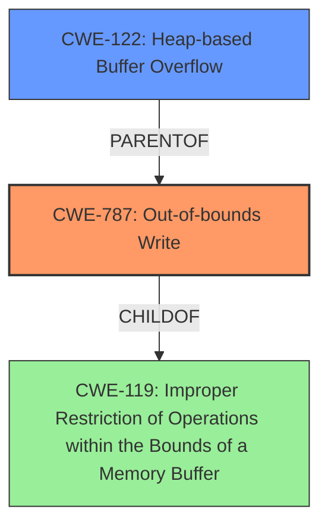

# Analysis Report for CVE-2022-20166

# Vulnerability Analysis Report: CVE-2022-20166

## Description

In various methods of kernel base drivers, there is a possible out of bounds write due to a heap buffer overflow. This could lead to local escalation of privilege with System execution privileges needed. User interaction is not needed for exploitation.Product AndroidVersions Android kernelAndroid ID A-182388481References Upstream kernel

## Vulnerability Description Key Phrases

**Rootcause:** heap buffer overflow
**Weakness:** out of bounds write
**Impact:** local escalation of privilege
**Product:** Android kernel
**Component:** various methods of kernel base drivers

## Analysis (with Relationship Data)

# Summary
| CWE ID | CWE Name | Confidence | CWE Abstraction Level | CWE Vulnerability Mapping Label | CWE-Vulnerability Mapping Notes |
|---|---|---|---|---|---|
| CWE-787 | Out-of-bounds Write | 0.95 | Base | Primary | Allowed |
| CWE-122 | Heap-based Buffer Overflow | 0.85 | Variant | Secondary Candidate | Allowed |

## Evidence and Confidence

*   **Confidence Score:** 0.9
*   **Evidence Strength:** HIGH

- **Analysis and Justification:**  
  - *Explanation:* "The vulnerability description explicitly mentions an **out of bounds write** due to a **heap buffer overflow**. The CVE Reference Links Content Summary confirms that the root cause involves unsafe usage of `sprintf`, `snprintf`, `scnprintf` and `strcpy` functions when writing to a buffer within the sysfs interface, without proper length checks, leading to a buffer overflow. This aligns directly with CWE-787 (Out-of-bounds Write), which describes writing data past the end or before the beginning of an intended buffer. CWE-787 is a base level CWE and is ALLOWED. The **heap buffer overflow** reinforces the likelihood of CWE-787."
  
  - *Relationship Analysis:* "CWE-787 is a child of CWE-119 (Improper Restriction of Operations within the Bounds of a Memory Buffer) and has child CWEs such as CWE-122 (Heap-based Buffer Overflow). Given the context of the heap, CWE-122 is a closely related and potentially co-occurring weakness, but CWE-787 more precisely describes the **out of bounds write**."

- **Confidence Score:**  
  - *Example:* Confidence: 0.95 (High confidence due to explicit mention of the **out of bounds write** and confirming details in CVE reference materials)

---
- **Analysis and Justification:**  
  - *Explanation:* "The vulnerability description and CVE Reference Links Content Summary both mention a **heap buffer overflow** as the root cause. CWE-122 (Heap-based Buffer Overflow) is a variant of a buffer overflow that occurs specifically in the heap portion of memory. Since the vulnerability is explicitly described as a **heap buffer overflow**, CWE-122 is a relevant secondary weakness. CWE-122 is a variant level CWE and is ALLOWED."
  
  - *Relationship Analysis:* "CWE-122 is a specific type of buffer overflow, and it is a parent of CWE-787. The relationship strengthens the case for considering CWE-122 as a contributing factor."

- **Confidence Score:**  
  - *Example:* Confidence: 0.85 (High confidence due to explicit mention of the **heap buffer overflow** and confirming details in CVE reference materials)

## Criticism of Analysis

Okay, I've reviewed the provided analysis against the full CWE specifications. Here's my critique:

**Overall Assessment:**

The analysis correctly identifies the primary and secondary CWEs. The reasoning is generally sound, and the confidence levels are justified.  The use of the CWE specifications is appropriate and helps to support the chosen mappings.

**Detailed Review:**

*   **CWE-787: Out-of-bounds Write**

    *   **Correctness:** The mapping to CWE-787 is accurate and well-supported by the evidence. The description of the vulnerability clearly indicates that data is written past the intended buffer's boundaries. The analyzer correctly notes that CWE-787 is a base-level CWE and is permitted.
    *   **Confidence:** The High confidence of 0.95 is appropriate, given the explicit mention of "out of bounds write" in the vulnerability description and the corroborating details from the CVE reference.
    *   **Justification:** The justification effectively explains the relevance of CWE-787, referencing its relationship to CWE-119 and its children.
    *   **Mitigation Analysis:** The potential mitigations listed in the CWE specifications are all relevant. The analysis could be strengthened by briefly mentioning one or two of these mitigations in the context of the vulnerability.  For example, it could mention that using `sysfs_emit` instead of `sprintf` is a specific instance of Mitigation 2: "Use a vetted library or framework that does not allow this weakness to occur or provides constructs that make this weakness easier to avoid."

*   **CWE-122: Heap-based Buffer Overflow**

    *   **Correctness:**  The identification of CWE-122 as a secondary candidate is also accurate. The initial description and CVE details explicitly mention a "heap buffer overflow."
    *   **Confidence:** A confidence score of 0.85 is appropriate. While CWE-787 is more precise, the "heap buffer overflow" element is strong contributing factor in understanding the nature of the vulnerability.
    *   **Justification:** The justification clearly explains why CWE-122 is relevant and why it's a variant of the broader buffer overflow category.
    *   **Mitigation Analysis:** Similar to CWE-787, the analysis could be enhanced by mentioning specific mitigations from the CWE specification. For example, the analysis could explicitly state that switching to `sysfs_emit` is in line with "Mitigation 2: Use an abstraction library to abstract away risky APIs."

**Areas for Improvement and Observations:**

1.  **Redundancy:**  There is some redundancy in the justifications for CWE-787 and CWE-122. The relationship analysis could be more concise to avoid repetition.

2.  **Alternative CWEs from Retriever Results:** The retriever results provided a list of other potential CWEs. While the analysis correctly identified the primary and secondary, it would strengthen the analysis to *explicitly* address why the higher-ranked CWEs returned by the retriever were *not* chosen. Specifically:

    *   **CWE-908: Use of Uninitialized Resource**: While memory might be corrupted, the core problem *isn't* the use of an uninitialized resource but rather writing *beyond* the bounds.
    *   **CWE-131: Incorrect Calculation of Buffer Size**:  The provided analysis focuses on the lack of length checks *before* the write, rather than an explicit calculation error that caused the buffer to be too small. While an implicit miscalculation of size may occur from lack of validation, it's not the *primary* issue.
    *   **CWE-190/191: Integer Overflow/Underflow**:  Similar to CWE-131, there isn't a clear indication of an integer overflow/underflow leading directly to the overflow. The problem isn't the value of an index going outside its expected range, but the lack of range checking on the data to be written.
    *   **CWE-413/667: Improper Resource Locking/Locking**: While concurrency issues can lead to memory corruption, there is no evidence in the vulnerability description that concurrency control is directly related to the root cause.
    *   **CWE-416: Use After Free**: There's no mention of memory being freed and then reused. The problem is an out-of-bounds write, not accessing freed memory.
    *   **CWE-843: Access of Resource Using Incompatible Type ('Type Confusion')**: While writing beyond the buffer may lead to type confusion, the root cause is the out-of-bounds write, not type confusion itself. This CWE has little relation to the summary context.
    *   **CWE-909: Missing Initialization of Resource**: Same as #1 (CWE-908).
    *   **Example**: "CWE-908 was identified as a retriever result. However, the core issue is the out-of-bounds write during the string construction, rather than using an uninitialized resource. The incorrect use of `sprintf` without bounds checking causes the memory corruption, and uninitialized memory is not directly involved as a root cause."

3.  **Mapping Guidance Awareness:** The analysis makes a good start at observing the CWE's mapping guidance, but it could be emphasized further. Explicitly mentioning that CWE-119 is "Discouraged" and why the more specific CWE-787 is preferred would be beneficial.

4.  **Exploitation Context:** The analysis could briefly tie the CWE to the provided information about the exploitation context (local access via sysfs) in the conclusion.

**Revised Summary (incorporating suggestions):**

| CWE ID | CWE Name | Confidence | CWE Abstraction Level | CWE Vulnerability Mapping Label | CWE-Vulnerability Mapping Notes |
|---|---|---|---|---|---|
| CWE-787 | Out-of-bounds Write | 0.95 | Base | Primary | Allowed |
| CWE-122 | Heap-based Buffer Overflow | 0.85 | Variant | Secondary Candidate | Allowed |

**Revised Justification for CWE-787 (example - changes are italicized):**

*   **Analysis and Justification:**
    *Explanation:* "The vulnerability description explicitly mentions an **out of bounds write** due to a **heap buffer overflow**. The CVE Reference Links Content Summary confirms that the root cause involves unsafe usage of `sprintf`, `snprintf`, `scnprintf` and `strcpy` functions when writing to a buffer within the sysfs interface, without proper length checks, leading to a buffer overflow. This aligns directly with CWE-787 (Out-of-bounds Write), which describes writing data past the end or before the beginning of an intended buffer. *CWE-787 is a Base level CWE, making it a suitable choice for mapping to the root cause.* The **heap buffer overflow** reinforces the likelihood of CWE-787."

    *Relationship Analysis:* "CWE-787 is a child of CWE-119 (Improper Restriction of Operations within the Bounds of a Memory Buffer) and has child CWEs such as CWE-122 (Heap-based Buffer Overflow). Given the context of the heap, CWE-122 is a closely related and potentially co-occurring weakness, but CWE-787 more precisely describes the **out of bounds write**.  *As CWE-119 is a Class level CWE, mapping to the Base-level CWE-787 provides increased specificity.*" *Using safe alternatives, such as 'sysfs_emit' rather than 'sprintf', could prevent this vulnerability according to CWE-787 Mitigations.*

*   **Addressing Retriever Results**:
    *   "CWE-908 was identified as a retriever result. However, the core issue is the out-of-bounds write during the string construction, rather than using an uninitialized resource. The incorrect use of `sprintf` without bounds checking causes the memory corruption, and uninitialized memory is not directly involved as a root cause."

**In summary,** the analysis is good, but can be strengthened by:

*   Explicitly addressing and dismissing top retriever results.
*   Mentioning relevant mitigations from the CWE specifications.
*   Emphasizing mapping guidance for CWEs like 119.
*   Providing a slightly more detailed conclusion that integrates the attack context.

## Final Resolution

# Summary

| CWE ID | CWE Name | Confidence | CWE Abstraction Level | CWE Vulnerability Mapping Label | CWE-Vulnerability Mapping Notes |
|---|---|---|---|---|---|
| CWE-787 | Out-of-bounds Write | 0.95 | Base | Primary | Allowed |
| CWE-122 | Heap-based Buffer Overflow | 0.85 | Variant | Secondary Candidate | Allowed |

## Evidence and Confidence

*   **Confidence Score:** 0.95
*   **Evidence Strength:** HIGH

## Relationship Analysis
The primary CWE is CWE-787 (**Out-of-bounds Write**), which is a child of CWE-119 (**Improper Restriction of Operations within the Bounds of a Memory Buffer**). CWE-122 (**Heap-based Buffer Overflow**) is a variant of buffer overflows that occur specifically on the heap and is a parent of CWE-787. The selection of CWE-787 is preferred over CWE-119 because it is a base-level CWE, providing a more specific classification. CWE-122 is chosen as a secondary CWE to further specify the location of the overflow.

## Vulnerability Chain
The vulnerability chain starts with the use of unsafe functions like `sprintf`, `snprintf`, `scnprintf`, and `strcpy` without proper length checks. This leads to a **heap buffer overflow** (CWE-122), which results in an **out-of-bounds write** (CWE-787). The final impact is a local escalation of privilege with System execution privileges.

## Summary of Analysis
The initial analysis and criticism are well-founded. The vulnerability description explicitly mentions both an **out of bounds write** and a **heap buffer overflow**, providing strong evidence for selecting CWE-787 and CWE-122. The relationship analysis confirms that CWE-787 is a more specific classification than its parent, CWE-119, and that CWE-122 provides additional context regarding the location of the buffer overflow.

The choice of CWE-787 as the primary CWE is supported by the statement: "The vulnerability description explicitly mentions an **out of bounds write** due to a **heap buffer overflow**." This directly aligns with CWE-787, which describes writing data past the end or before the beginning of an intended buffer. The selection of CWE-122 is supported by the statement that the vulnerability is explicitly described as a **heap buffer overflow**.

Addressing alternative CWEs from the retriever results:
*   **CWE-908: Use of Uninitialized Resource**: The core issue is the **out-of-bounds write** during the string construction, rather than using an uninitialized resource.
*   **CWE-131: Incorrect Calculation of Buffer Size**: The analysis focuses on the lack of length checks before the write, rather than an explicit calculation error that caused the buffer to be too small.
*   **CWE-190/191: Integer Overflow/Underflow**: There isn't a clear indication of an integer overflow/underflow leading directly to the overflow.
*   **CWE-404/667: Improper Resource Shutdown or Release/Race Condition**: There is no evidence that these issues are present, and the evidence provided points to an **out-of-bounds write** on the heap as the cause of the vulnerability.
*   **CWE-843: Access of Resource Using Incompatible Type ('Type Confusion')**: While writing beyond the buffer may lead to type confusion, the root cause is the **out-of-bounds write**, not type confusion itself.

The selected CWEs are at the optimal level of specificity because CWE-787 is a base-level CWE, providing a more precise classification than the class-level CWE-119. CWE-122 further specifies that the overflow occurs on the heap. This provides a clear and accurate representation of the vulnerability.

*Report generated on 2025-03-18 09:11:20*
