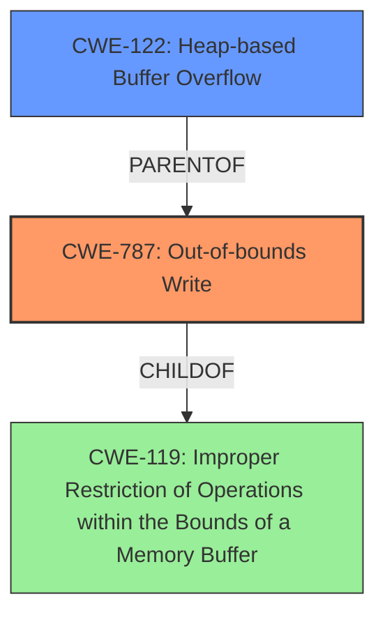

# Final Resolution for CVE-2022-20166

# Summary

| CWE ID | CWE Name | Confidence | CWE Abstraction Level | CWE Vulnerability Mapping Label | CWE-Vulnerability Mapping Notes |
|---|---|---|---|---|---|
| CWE-787 | Out-of-bounds Write | 0.95 | Base | Primary | Allowed |
| CWE-122 | Heap-based Buffer Overflow | 0.85 | Variant | Secondary Candidate | Allowed |

## Evidence and Confidence

*   **Confidence Score:** 0.95
*   **Evidence Strength:** HIGH

## Relationship Analysis
The primary CWE is CWE-787 (**Out-of-bounds Write**), which is a child of CWE-119 (**Improper Restriction of Operations within the Bounds of a Memory Buffer**). CWE-122 (**Heap-based Buffer Overflow**) is a variant of buffer overflows that occur specifically on the heap and is a parent of CWE-787. The selection of CWE-787 is preferred over CWE-119 because it is a base-level CWE, providing a more specific classification. CWE-122 is chosen as a secondary CWE to further specify the location of the overflow.

## Vulnerability Chain
The vulnerability chain starts with the use of unsafe functions like `sprintf`, `snprintf`, `scnprintf`, and `strcpy` without proper length checks. This leads to a **heap buffer overflow** (CWE-122), which results in an **out-of-bounds write** (CWE-787). The final impact is a local escalation of privilege with System execution privileges.

## Summary of Analysis
The initial analysis and criticism are well-founded. The vulnerability description explicitly mentions both an **out of bounds write** and a **heap buffer overflow**, providing strong evidence for selecting CWE-787 and CWE-122. The relationship analysis confirms that CWE-787 is a more specific classification than its parent, CWE-119, and that CWE-122 provides additional context regarding the location of the buffer overflow.

The choice of CWE-787 as the primary CWE is supported by the statement: "The vulnerability description explicitly mentions an **out of bounds write** due to a **heap buffer overflow**." This directly aligns with CWE-787, which describes writing data past the end or before the beginning of an intended buffer. The selection of CWE-122 is supported by the statement that the vulnerability is explicitly described as a **heap buffer overflow**.

Addressing alternative CWEs from the retriever results:
*   **CWE-908: Use of Uninitialized Resource**: The core issue is the **out-of-bounds write** during the string construction, rather than using an uninitialized resource.
*   **CWE-131: Incorrect Calculation of Buffer Size**: The analysis focuses on the lack of length checks before the write, rather than an explicit calculation error that caused the buffer to be too small.
*   **CWE-190/191: Integer Overflow/Underflow**: There isn't a clear indication of an integer overflow/underflow leading directly to the overflow.
*   **CWE-404/667: Improper Resource Shutdown or Release/Race Condition**: There is no evidence that these issues are present, and the evidence provided points to an **out-of-bounds write** on the heap as the cause of the vulnerability.
*   **CWE-843: Access of Resource Using Incompatible Type ('Type Confusion')**: While writing beyond the buffer may lead to type confusion, the root cause is the **out-of-bounds write**, not type confusion itself.

The selected CWEs are at the optimal level of specificity because CWE-787 is a base-level CWE, providing a more precise classification than the class-level CWE-119. CWE-122 further specifies that the overflow occurs on the heap. This provides a clear and accurate representation of the vulnerability.