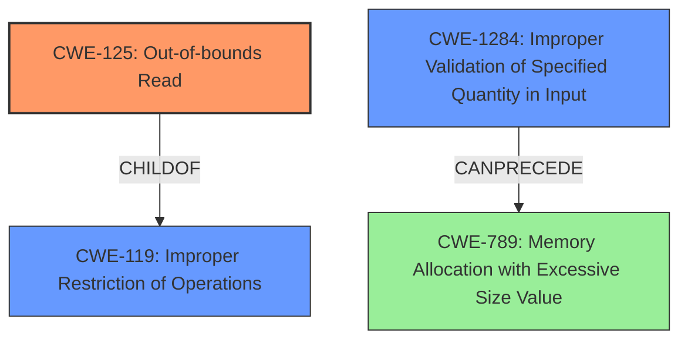

# Final Resolution for CVE-2022-20201

# Summary
| CWE ID | CWE Name | Confidence | CWE Abstraction Level | CWE Vulnerability Mapping Label | CWE-Vulnerability Mapping Notes |
|---|---|---|---|---|---|
| CWE-125 | Out-of-bounds Read | 0.95 | Base | Allowed | Primary CWE |
| CWE-1284 | Improper Validation of Specified Quantity in Input | 0.8 | Base | Allowed | Secondary Candidate |

## Evidence and Confidence

*   **Confidence Score:** 0.9
*   **Evidence Strength:** HIGH

## Relationship Analysis
The primary CWE is CWE-125 (**Out-of-bounds Read**), which is a child of CWE-119 (**Improper Restriction of Operations Within the Bounds of a Memory Buffer**). This parent-child relationship indicates that CWE-125 is a more specific type of buffer access issue. The secondary CWE is CWE-1284 (**Improper Validation of Specified Quantity in Input**). CWE-1284 can precede CWE-789 (**Memory Allocation with Excessive Size Value**), illustrating a potential chain where improper input validation leads to memory allocation issues and subsequent **out-of-bounds reads**.

## Vulnerability Chain
The vulnerability chain starts with the **ROOTCAUSE** of a **missing bounds check** (CWE-1284), leading to an **out-of-bounds read** (CWE-125). The prerequisite is that the application reads a size or length value without proper validation. The consequence is potential information disclosure or privilege escalation due to reading from unintended memory locations.

## Summary of Analysis
The initial analysis correctly identified CWE-125 and CWE-1284 as the primary and secondary weaknesses, respectively. The vulnerability description explicitly mentions "**out of bounds read** due to a **missing bounds check**," which directly maps to CWE-125 and implies CWE-1284. The criticism provided valuable suggestions, including explaining why none of CWE-125's children (CWE-126, CWE-127) are more suitable and focusing on relevant mitigation strategies. The reason CWE-125's children are not suitable is because the description provided doesn't have enough detail to differentiate if the access is definitely *after* the buffer (implying CWE-126) or is it potentially *before* (implying CWE-127). The assessment is primarily based on the provided evidence, with the vulnerability description serving as the main source. The graph relationships influenced the final selection by confirming the hierarchical relationship between CWE-125 and CWE-119 and illustrating a potential chain involving CWE-1284 and CWE-789. The selected CWEs are at the optimal level of specificity because they directly address the **ROOTCAUSE** and the resulting **WEAKNESS** described in the vulnerability.