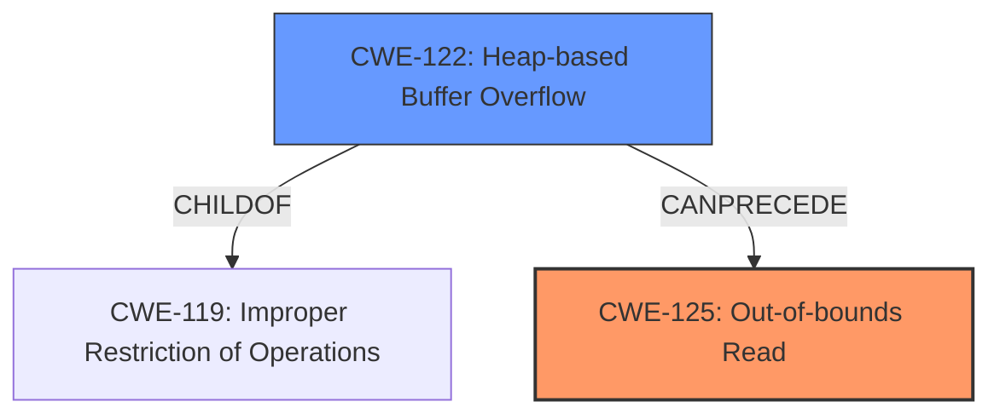

# Analysis Report for CVE-2022-20209

# Vulnerability Analysis Report: CVE-2022-20209

## Description

In hme_add_new_node_to_a_sorted_array of hme_utils.c, there is a possible out of bounds read due to a heap buffer overflow. This could lead to remote information disclosure with no additional execution privileges needed. User interaction is not needed for exploitation.Product AndroidVersions Android-12LAndroid ID A-207502397

## Vulnerability Description Key Phrases

**Rootcause:** heap buffer overflow
**Weakness:** out of bounds read
**Impact:** remote information disclosure
**Product:** Android
**Version:** Android-12L
**Component:** hme_add_new_node_to_a_sorted_array of hme_utils.c

## Analysis (with Relationship Data)

# Summary
| CWE ID | CWE Name | Confidence | CWE Abstraction Level | CWE Vulnerability Mapping Label | CWE-Vulnerability Mapping Notes |
|---|---|---|---|---|---|
| CWE-125 | Out-of-bounds Read | 0.9 | Base | Primary | Allowed |
| CWE-122 | Heap-based Buffer Overflow | 0.7 | Variant | Secondary | Allowed |

## Evidence and Confidence

*   **Confidence Score:** 0.8
*   **Evidence Strength:** MEDIUM

- **Analysis and Justification:**  
  - *Explanation:* The vulnerability description explicitly states an "**out of bounds read** due to a **heap buffer overflow**" in `hme_add_new_node_to_a_sorted_array` of `hme_utils.c`. This aligns directly with CWE-125 (Out-of-bounds Read), which describes a condition where the product reads data past the end, or before the beginning, of the intended buffer. The fact that it's a heap buffer overflow supports the inclusion of CWE-122 (Heap-based Buffer Overflow) as a contributing factor, as the overflow is occurring in heap memory. The impact of this vulnerability is remote information disclosure, indicating that sensitive data can be accessed due to the out-of-bounds read. CWE-125 is selected as the primary CWE because it directly describes the observable weakness.

  - *Relationship Analysis:* CWE-125 is a Base level CWE. CWE-122 is a Variant of CWE-119 (Improper Restriction of Operations within the Bounds of a Memory Buffer). CWE-125 can be caused by a heap buffer overflow.

- **Confidence Score:**  
  - *Example:* Confidence: 0.9 (High confidence due to the explicit description of the out-of-bounds read and the context of heap buffer overflow)
---

## Criticism of Analysis

Okay, here's a review of the analysis, focusing on the appropriateness of the CWE mappings, the confidence levels, and the overall reasoning.

**Summary of the Analysis:**

The analysis correctly identifies CWE-125 (Out-of-bounds Read) as the primary weakness, caused by CWE-122 (Heap-based Buffer Overflow) as a secondary contributing factor. The confidence level is high (0.9) for CWE-125 and medium (0.7) for CWE-122.

**Critique:**

Overall, the analysis is good and the selected CWEs are highly relevant. The justification is well-reasoned. Here's a more detailed breakdown:

*   **CWE-125 (Out-of-bounds Read) - Primary:**
    *   **Appropriateness:** The vulnerability description *explicitly* mentions an "out of bounds read", making CWE-125 a very direct and appropriate mapping.  The description of CWE-125 aligns perfectly with the observable behavior.
    *   **Confidence (0.9):** Justified.  The direct mention of "out of bounds read" provides strong evidence for this mapping.
    *   **CWE Specification Alignment:**
        *   **Description:** The description aligns exactly.
        *   **Mapping Guidance:**  "Usage: Allowed" and "This CWE entry is at the Base level of abstraction, which is a preferred level of abstraction for mapping to the root causes of vulnerabilities." confirms the validity of using this CWE.
        *   **Potential Mitigations:** The provided mitigations are relevant, including input validation (especially for length arguments and offsets) and using languages with appropriate memory abstractions.

*   **CWE-122 (Heap-based Buffer Overflow) - Secondary:**
    *   **Appropriateness:** The description states that the out-of-bounds read is "due to a heap buffer overflow." This makes CWE-122 a valid contributing factor. CWE-122 explains what a heap overflow is and how it is a buffer overflow.
    *   **Confidence (0.7):** Reasonable. The buffer overflow is stated as the "cause" of the out-of-bounds read. While essential, it's one step removed from the direct observation, thus a slightly lower confidence is justified.
    *   **CWE Specification Alignment:**
        *   **Description:** Aligns well, describing the condition where a buffer allocated on the heap is overwritten.
        *   **Mapping Guidance:** "Usage: Allowed" and "This CWE entry is at the Variant level of abstraction, which is a preferred level of abstraction for mapping to the root causes of vulnerabilities." confirms the validity of using this CWE.
        *   **Potential Mitigations:** The mitigations mentioned, such as using languages with automatic bounds checking and using buffer overflow detection mechanisms, are relevant.

**Further Considerations and Potential Improvements**

1.  **Relationship between CWE-122 and CWE-125:** The analysis correctly identifies the relationship. A heap-based buffer overflow *can* lead to an out-of-bounds read.  The overflow allows writing outside the allocated buffer, and if a read operation then occurs in that overwritten area, it results in an out-of-bounds read.

2.  **Alternative CWEs Considered by Retrievers:** The retriever results suggest several other CWEs that *could* be considered, but these are generally less appropriate given the provided vulnerability description.

    *   **CWE-908 (Use of Uninitialized Resource):** This is possible *if* the overflow causes a read from an uninitialized pointer. Without further information, this would be speculative. Since the description explicitly points to the overflow, it's less likely to be the primary issue.
    *   **CWE-190/191 (Integer Overflow/Underflow):** It's possible that an integer overflow/underflow could lead to an incorrect buffer size calculation, which then contributes to the heap overflow. *However,* without more information about the specific code, this would be speculative. CWE-122 and 125 more accurately capture the explicit vulnerability.
    *   **CWE-131 (Incorrect Calculation of Buffer Size):** Similar to CWE-190/191, an incorrect buffer size calculation *could* be a contributing factor, but it is not explicitly stated in the description.
    *   **CWE-416 (Use After Free):** A use-after-free is not indicated by the provided information.
    *   **CWE-843 (Type Confusion):** Type confusion is also not specifically suggested by the vulnerability details.
    *   **CWE-909 (Missing Initialization of Resource):** Similar to CWE-908, this is a possibility but less direct than the identified CWEs.
    *   **CWE-1284 (Improper Validation of Specified Quantity in Input):** If the code uses an external input to determine the buffer size, and this input is not properly validated, then 1284 might be relevant.

**Suggestions**

*   While not necessary, adding a short sentence mentioning why the other top retriever results (CWE-908, CWE-191, CWE-190, CWE-131) were not selected would further strengthen the analysis.  For example, "While CWE-190 and CWE-131 are possible contributing factors to a buffer overflow, the provided description does not indicate a problem with integer handling or buffer size calculation.  Therefore, these CWEs were not selected."

**Revised Summary Table (No Changes Needed, Included for Completeness)**

| CWE ID | CWE Name | Confidence | CWE Abstraction Level | CWE Vulnerability Mapping Label | CWE-Vulnerability Mapping Notes |
|---|---|---|---|---|---|
| CWE-125 | Out-of-bounds Read | 0.9 | Base | Primary | Allowed |
| CWE-122 | Heap-based Buffer Overflow | 0.7 | Variant | Secondary | Allowed |

**Conclusion:**

The analysis is well-done and correctly identifies the primary and secondary CWEs based on the provided information. The high confidence level for CWE-125 and the reasonable confidence level for CWE-122 are justified. The analysis effectively uses the evidence in the vulnerability description. The potential minor improvement of addressing why other retriever results were not selected would only further strengthen the analysis.

## Final Resolution

# Summary
| CWE ID | CWE Name | Confidence | CWE Abstraction Level | CWE Vulnerability Mapping Label | CWE-Vulnerability Mapping Notes |
|---|---|---|---|---|---|
| CWE-125 | Out-of-bounds Read | 0.9 | Base | Primary | Allowed |
| CWE-122 | Heap-based Buffer Overflow | 0.7 | Variant | Secondary | Allowed |

## Evidence and Confidence

*   **Confidence Score:** 0.9
*   **Evidence Strength:** HIGH

## Relationship Analysis
The analysis correctly identifies CWE-125 as the primary **WEAKNESS** because the vulnerability description explicitly mentions "out of bounds read". CWE-122 is correctly identified as a secondary **WEAKNESS** because the description states it is "due to a heap buffer overflow". CWE-122 is a Variant of **CWE-119** (Improper Restriction of Operations within the Bounds of a Memory Buffer), and **CWE-125** can be a consequence of a heap buffer overflow. The abstraction levels are appropriate, with **CWE-125** being a Base and **CWE-122** being a Variant. The retriever results suggested other CWEs like **CWE-908**, **CWE-190/191**, **CWE-131**, **CWE-416**, **CWE-843**, and **CWE-1284**, but these were deemed less appropriate because they were not explicitly stated in the vulnerability description.

## Vulnerability Chain
The vulnerability chain starts with a **ROOTCAUSE** of a heap buffer overflow (**CWE-122**), which allows writing outside the allocated buffer. This leads to an out-of-bounds read (**CWE-125**) when a read operation occurs in the overwritten memory area. The impact is remote information disclosure.

## Summary of Analysis
The initial analysis and criticism are both well-reasoned and align with the provided evidence. The analysis is based on the explicit statements in the vulnerability description. The graph relationships and abstraction levels support the selection of **CWE-125** and **CWE-122**. The decision is justified by the direct mention of "out of bounds read" and "heap buffer overflow" in the vulnerability description. The selected CWEs are at the optimal level of specificity because they accurately reflect the observable **WEAKNESS** (**CWE-125**) and its immediate cause (**CWE-122**).
The vulnerability description explicitly states an "**out of bounds read** due to a **heap buffer overflow**" in `hme_add_new_node_to_a_sorted_array` of `hme_utils.c`.

*Report generated on 2025-03-18 09:14:56*
