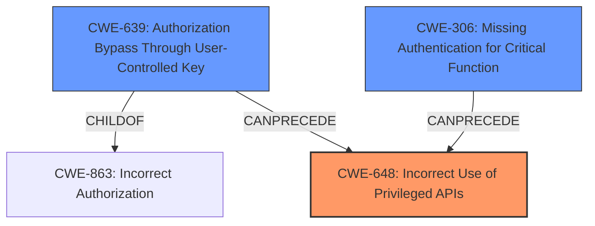

# Final Resolution for CVE-2022-2023

# Summary
| CWE ID | CWE Name | Confidence | CWE Abstraction Level | CWE Vulnerability Mapping Label | CWE-Vulnerability Mapping Notes |
|---|---|---|---|---|---|
| CWE-648 | Incorrect Use of Privileged APIs | 0.85 | Base | Allowed | Primary CWE |
| CWE-639 | Authorization Bypass Through User-Controlled Key | 0.50 | Base | Allowed | Secondary Candidate, if backend does not perform user validation of username |
| CWE-306 | Missing Authentication for Critical Function | 0.40 | Base | Allowed | Secondary Candidate, only if no authentication is performed at `/api/v1/users/:username` |

## Evidence and Confidence

*   **Confidence Score:** 0.75
*   **Evidence Strength:** MEDIUM

## Relationship Analysis
The primary relationship considered was the hierarchical relationship between CWE-863 (Incorrect Authorization) and its child CWE-639 (Authorization Bypass Through User-Controlled Key). While CWE-863 was initially considered, the analysis suggests that CWE-639 is a more specific candidate if the backend doesn't validate the username in the API call. The analysis also considered CWE-306, which is related to authentication, but ultimately deemed it less likely than CWE-639 due to authentication typically being the first line of defense.

## Vulnerability Chain
The vulnerability chain starts with the **incorrect use of a privileged API** (CWE-648). If the backend fails to properly authorize the request or validate the user-controlled key (username), this could lead to authorization bypass (CWE-639). Furthermore, if there is **missing authentication** (CWE-306) on the endpoint, it exacerbates the vulnerability by allowing unauthenticated users to potentially access or modify data through the **incorrect API**.

## Summary of Analysis
The initial analysis correctly identified CWE-648 (Incorrect Use of Privileged APIs) as the primary **rootcause**. The criticism provided further guidance in refining the secondary candidates. Specifically, it suggested considering CWE-639 (Authorization Bypass Through User-Controlled Key) as a more specific alternative to CWE-863 (Incorrect Authorization), contingent on whether the backend validates the username. This aligns with the principle of selecting the most specific CWE.

The confidence in CWE-648 remains high due to the clear evidence from the vulnerability description and CVE reference materials. The confidence in CWE-639 and CWE-306 is lower because they are based on assumptions about the backend implementation.

The graph relationships influenced the final selection by highlighting the hierarchical relationship between CWE-863 and CWE-639, prompting a more specific classification where applicable.

The selected CWEs are at the optimal level of specificity because they directly address the identified weaknesses based on the available evidence. CWE-648 captures the **incorrect API usage**, while CWE-639 and CWE-306 represent potential contributing factors related to authorization and authentication, respectively.