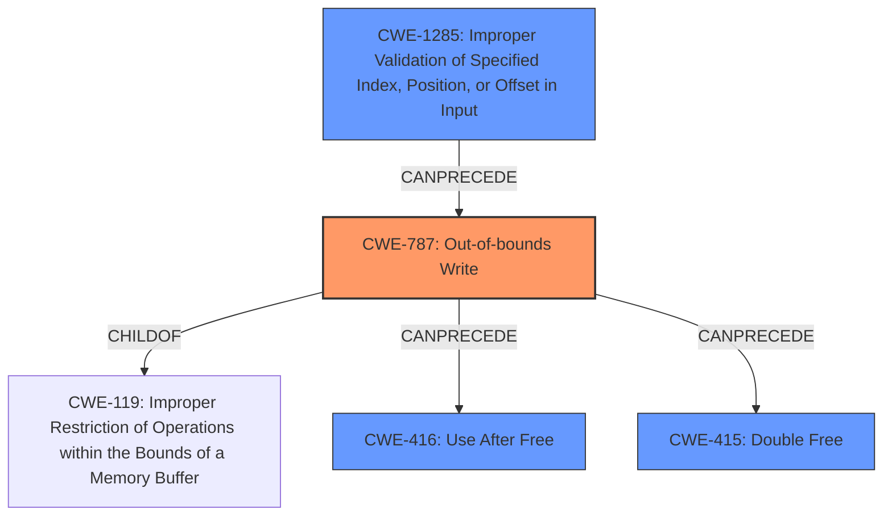

# Final Resolution for CVE-2022-20235

# Summary
| CWE ID | CWE Name | Confidence | CWE Abstraction Level | CWE Vulnerability Mapping Label | CWE-Vulnerability Mapping Notes |
|---|---|---|---|---|---|
| **CWE-787** | **Out-of-bounds Write** | 0.90 | Base | Allowed | Primary CWE: The vulnerability allows writing arbitrary data, which causes memory corruption. |
| CWE-1285 | Improper Validation of Specified Index, Position, or Offset in Input | 0.65 | Base | Allowed | Secondary CWE: Lack of proper validation of the memory address may be part of the root cause. |
| CWE-416 | Use After Free | 0.50 | Variant | Allowed | Secondary Candidate: Memory corruption can potentially lead to use-after-free scenarios. |
| CWE-415 | Double Free | 0.50 | Variant | Allowed | Secondary Candidate: Memory corruption can potentially lead to double-free scenarios. |

## Evidence and Confidence

*   **Confidence Score:** 0.80
*   **Evidence Strength:** MEDIUM

## Relationship Analysis
The primary weakness is **CWE-787 (Out-of-bounds Write)**, which stems from writing arbitrary data to a memory page. This is a specific instance of **CWE-119 (Improper Restriction of Operations within the Bounds of a Memory Buffer)**. **CWE-787** can then lead to **CWE-416 (Use After Free)** and **CWE-415 (Double Free)** as secondary consequences. **CWE-1285 (Improper Validation of Specified Index, Position, or Offset in Input)** could precede **CWE-787** if the out-of-bounds write is due to a failure to validate the target memory address. The abstraction levels are appropriate; **CWE-787** is a Base weakness, while **CWE-416** and **CWE-415** are Variants, representing potential outcomes. **CWE-1285** is also a Base weakness and could represent a contributing root cause.

## Vulnerability Chain
The vulnerability chain starts with a missing or inadequate check on the memory address being written to, which can be represented by **CWE-1285 (Improper Validation of Specified Index, Position, or Offset in Input)**. This leads to **CWE-787 (Out-of-bounds Write)**, where a user-space program writes arbitrary data outside the intended boundaries of a memory page. This memory corruption can then potentially lead to **CWE-416 (Use After Free)** or **CWE-415 (Double Free)** if memory management metadata is overwritten. The root cause is the lack of input validation combined with the ability to write to arbitrary memory locations, and the impacts are memory corruption leading to potential use-after-free or double-free conditions.

## Summary of Analysis
The initial analysis correctly identified **CWE-787 (Out-of-bounds Write)** as the primary issue. The criticism highlighted the need to frame **CWE-416 (Use After Free)** and **CWE-415 (Double Free)** as potential consequences rather than direct causes, which I agree with. I have lowered the confidence in these two CWEs to 0.50 to reflect this.

I have also added **CWE-1285 (Improper Validation of Specified Index, Position, or Offset in Input)** as a secondary CWE with a confidence of 0.65. The vulnerability description states that "a user-space program could write arbitrary data to the page". This implies that there was no validation on where the user-space program could write.

The relationship analysis influenced my decision by highlighting the chain of events: lack of input validation leading to an out-of-bounds write, which in turn can lead to memory corruption and subsequent use-after-free or double-free conditions. **CWE-787** is at the optimal level of specificity as it directly describes the action of writing outside of the intended memory boundaries. The other CWEs represent either contributing factors (**CWE-1285**) or potential consequences (**CWE-416** and **CWE-415**).

The evidence for **CWE-787** is strong: "a user-space program could write arbitrary data to the page, leading to memory corruption issues." This directly supports the out-of-bounds write classification. The other CWEs are more speculative but are plausible given the nature of memory corruption vulnerabilities.