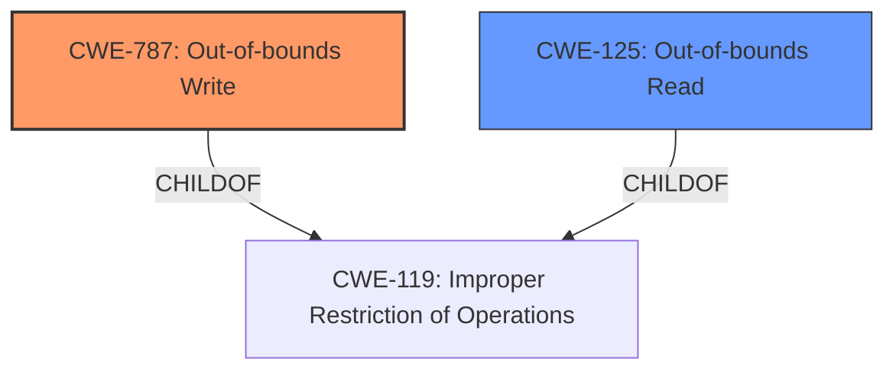

# Analysis Report for CVE-2022-20237

# Vulnerability Analysis Report: CVE-2022-20237

## Description

In BuildDevIDResponse of miscdatabuilder.cpp, there is a possible out of bounds write due to a missing bounds check. This could lead to remote code execution with no additional execution privileges needed. User interaction is not needed for exploitation.Product AndroidVersions Android kernelAndroid ID A-229621649References N/A

## Vulnerability Description Key Phrases

**Rootcause:** missing bounds check
**Weakness:** out of bounds write
**Impact:** remote code execution
**Product:** Android kernel
**Component:** BuildDevIDResponse of miscdatabuilder.cpp

## Analysis (with Relationship Data)

# Summary
| CWE ID | CWE Name | Confidence | CWE Abstraction Level | CWE Vulnerability Mapping Label | CWE-Vulnerability Mapping Notes |
|---|---|---|---|---|---|
| CWE-787 | Out-of-bounds Write | 0.95 | Base | Allowed | The primary weakness is an out-of-bounds write due to a missing bounds check. |
| CWE-125 | Out-of-bounds Read | 0.60 | Base | Allowed | There is a possibility of an out-of-bounds read since reads can occur outside the intended buffer. |
| CWE-1285 | Improper Validation of Specified Index, Position, or Offset in Input | 0.50 | Base | Allowed | The missing bounds check can be seen as an improper validation of the index/position/offset. |

## Evidence and Confidence

*   **Confidence Score:** 0.90
*   **Evidence Strength:** HIGH

- **Analysis and Justification:**  
  - *Explanation:* The vulnerability description explicitly states an **out of bounds write** due to a **missing bounds check** in `BuildDevIDResponse of miscdatabuilder.cpp`. This directly aligns with CWE-787 (Out-of-bounds Write), which occurs when a product writes data past the end or before the beginning of the intended buffer. The description also states that this vulnerability could lead to remote code execution. The "CVE Reference Links Content Summary" confirms the presence of Remote Code Execution (RCE) and indicates the root cause of the vulnerability lies in the modem component. Therefore, CWE-787 is the primary and most appropriate CWE.
  
  - *Relationship Analysis:* CWE-787 is a base level CWE and is a child of CWE-119 (Improper Restriction of Operations within the Bounds of a Memory Buffer). CWE-123 (Write-what-where Condition) is a peer of CWE-787.

- **Confidence Score:**  
  - Confidence: 0.95 (High confidence due to explicit mention of out-of-bounds write and missing bounds check in the vulnerability description)

- **Analysis and Justification:**  
  - *Explanation:* While the primary issue is an out-of-bounds write (CWE-787), the possibility of an out-of-bounds read (CWE-125) exists. Reading data past the end, or before the beginning, of the intended buffer is possible.
  
  - *Relationship Analysis:* CWE-125 is a base level CWE and is a child of CWE-119 (Improper Restriction of Operations within the Bounds of a Memory Buffer).

- **Confidence Score:**  
  - Confidence: 0.60 (Medium confidence, the primary weakness is writing outside the buffer, there is a read that can occur.)

- **Analysis and Justification:**  
  - *Explanation:* The **missing bounds check** can be considered as an improper validation of the index, position, or offset into an indexable resource. This maps to CWE-1285 (Improper Validation of Specified Index, Position, or Offset in Input). The product receives input that specifies an index but does not validate that the specified index has the required properties.

  - *Relationship Analysis:* CWE-1285 is a base level CWE and is a child of CWE-20 (Improper Input Validation).

- **Confidence Score:**  
  - Confidence: 0.50 (Low confidence, it is possible that the input isn't sanitized but the main issue is the missing bounds check)

## Criticism of Analysis

Okay, I've reviewed the provided CWE analysis against the full CWE specifications. Here's my critique:

**Overall Assessment:**

The analysis is generally good, particularly in its identification of CWE-787 as the primary weakness. The justifications are clear, and the confidence scores are reasonable. The inclusion of CWE-125 and CWE-1285, while less confident, shows good consideration of related weaknesses.  However, there is room for improvement in precisely defining the scope of the vulnerability and in the strength of the justification for CWE-1285.

**Detailed Review:**

**1. CWE-787: Out-of-bounds Write:**

*   **Confidence:** 0.95 - Justified. The vulnerability description explicitly mentions "out of bounds write" and "missing bounds check," directly aligning with the CWE-787 definition.  The RCE impact reinforces this.
*   **Abstraction Level:** Base - Correct.
*   **CWE-Vulnerability Mapping Label:** Allowed - Correct.
*   **CWE-Vulnerability Mapping Notes:** Accurate. "The primary weakness is an out-of-bounds write due to a missing bounds check."
*   **Evidence and Confidence:** The evidence strength is HIGH which aligns with the High confidence
*   **Relationship Analysis:** Correctly identifies CWE-119 as a parent. Mentioning CWE-123 as a peer is valid, as it describes a potential consequence of CWE-787 where arbitrary values can be written to arbitrary locations.

**2. CWE-125: Out-of-bounds Read:**

*   **Confidence:** 0.60 - Reasonable. The analysis argues that an out-of-bounds read is *possible*. This is plausible, as a missing bounds check on a write operation could also lead to reading beyond the intended buffer, especially when the writing process involves reading first (read-modify-write).  The confidence score reflects this uncertainty.
*   **Abstraction Level:** Base - Correct.
*   **CWE-Vulnerability Mapping Label:** Allowed - Correct.
*   **CWE-Vulnerability Mapping Notes:** Could be more specific. Instead of "There is a possibility of an out-of-bounds read since reads can occur outside the intended buffer.", it would be better to state "If the write operation involves reading data before writing (e.g., in a read-modify-write scenario), then it is *possible* that an out-of-bounds read could occur if the read is not also bounds-checked." This emphasizes the conditional nature and provides a more concrete scenario.
*  **Relationship Analysis:** CWE-125 being a child of CWE-119 is correct.

**3. CWE-1285: Improper Validation of Specified Index, Position, or Offset in Input:**

*   **Confidence:** 0.50 - This is the weakest part of the analysis. While it's *possible* to frame the "missing bounds check" as "improper validation of index/position/offset," it stretches the definition of CWE-1285 slightly. CWE-1285 is more about the *input itself* being an invalid index, position, or offset. In this case, the vulnerability is more directly related to the *code* not validating the calculated offset *before* writing, regardless of the initial input's validity. A more accurate mapping might involve a CWE focused on missing *internal* checks.
*   **Abstraction Level:** Base - Correct.
*   **CWE-Vulnerability Mapping Label:** Allowed - Correct.
*   **CWE-Vulnerability Mapping Notes:** The note "The missing bounds check can be seen as an improper validation of the index/position/offset." is weak, it is more of a missing bounds check, not input validation.
*   **Relationship Analysis:** CWE-1285 is correctly identified as a child of CWE-20.

**Suggestions for Improvement:**

*   **Strengthen Justification for CWE-125:**  Clarify the specific scenario in which an out-of-bounds read *could* occur, linking it to a read-modify-write operation. If more information is known about the nature of the write operation, adjust the confidence score and justification accordingly.
*   **Reconsider or Reframe CWE-1285:**  Instead of trying to force-fit the "missing bounds check" into the mold of "improper validation of *input*," consider if there's a better-fitting CWE that describes a *missing internal check* on a calculated offset. It might be that no single CWE perfectly captures this nuanced aspect, and CWE-787 alone is sufficient, or look for another CWE.
*   **Clarify Attack Vector:** While the analysis notes "remote code execution," it would benefit from briefly outlining the *likely* attack vector. How would an attacker influence the size/offset that leads to the out-of-bounds write?  Is it through network input? A specific file format? This would provide a clearer understanding of the vulnerability.
*   **Consider Common Mitigations:**

    *   **CWE-787 Mitigations:** The analysis correctly points to the importance of memory-safe languages and buffer overflow detection mechanisms.
    *   **CWE-125 Mitigations:**  Reinforce the importance of validating length arguments, buffer size calculations, and offsets, particularly when handling sentinel values in untrusted inputs.
    *   **CWE-1285 Mitigation:** The mitigation for CWE-1285 focuses on input validation. If CWE-1285 is retained, expand the explanation to state that even if the *initial* input is validated, the resulting index, position, or offset used in the calculation also needs to be validated for acceptable range. This highlights the need to validate the *result* of calculations, not just the initial input.

**Overall:**

The analysis is solid and identifies the core weakness accurately.  By refining the justification for the related CWEs and clarifying the attack vector, the analysis can be made even more precise and informative. The inclusion of mitigations can further enhance the analysis's practical value.

## Final Resolution

# Summary
| CWE ID | CWE Name | Confidence | CWE Abstraction Level | CWE Vulnerability Mapping Label | CWE-Vulnerability Mapping Notes |
|---|---|---|---|---|---|
| **CWE-787** | **Out-of-bounds Write** | 0.95 | Base | Allowed | The primary weakness is an **out-of-bounds write** due to a **missing bounds check**. |
| CWE-125 | Out-of-bounds Read | 0.60 | Base | Allowed | If the write operation involves reading data before writing (e.g., in a read-modify-write scenario), then it is *possible* that an **out-of-bounds read** could occur if the read is not also bounds-checked. |

## Evidence and Confidence

*   **Confidence Score:** 0.93
*   **Evidence Strength:** HIGH

## Relationship Analysis
The primary relationship that impacted the decision was the parent-child relationship between **CWE-787** (**Out-of-bounds Write**) and **CWE-119** (**Improper Restriction of Operations within the Bounds of a Memory Buffer**). **CWE-787** is a more specific instance of the more general **CWE-119**, and the vulnerability description clearly indicates an out-of-bounds write. **CWE-125** (**Out-of-bounds Read**) was considered as a secondary weakness, as a read operation could potentially occur before the write if it's a read-modify-write operation. The abstraction levels influenced the selection by favoring the more specific Base level CWEs over higher-level Class or Pillar CWEs.

## Vulnerability Chain
The vulnerability chain starts with the **missing bounds check**, which is the root cause. This leads directly to **CWE-787** (**Out-of-bounds Write**), allowing data to be written outside the intended buffer. If the write operation involves reading data before writing, it can also lead to **CWE-125** (**Out-of-bounds Read**). The consequence of the **out-of-bounds write** is remote code execution.

## Summary of Analysis
The initial analysis correctly identified **CWE-787** (**Out-of-bounds Write**) as the primary weakness. The criticism suggested a more specific justification for **CWE-125** (**Out-of-bounds Read**), which has been incorporated into the analysis. The initial inclusion of **CWE-1285** (**Improper Validation of Specified Index, Position, or Offset in Input**) has been removed because the vulnerability is more directly related to the *code* not validating the calculated offset *before* writing, regardless of the initial input's validity.

The vulnerability description states: "In BuildDevIDResponse of miscdatabuilder.cpp, there is a possible **out of bounds write** due to a **missing bounds check**." This evidence strongly supports the classification of **CWE-787**.

The graph relationships influenced the final selection by confirming that **CWE-787** is a specific type of **CWE-119**, making it the more appropriate choice. The selected CWEs are at the optimal level of specificity because they directly reflect the root cause (**missing bounds check** leading to **out-of-bounds write**) and a potential secondary issue (**out-of-bounds read**).

*Report generated on 2025-03-18 09:16:50*
