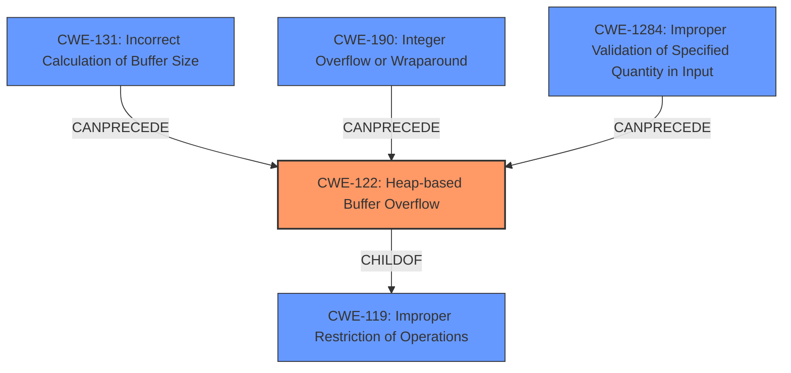

# Final Resolution for CVE-2022-20273

# Summary
| CWE ID | CWE Name | Confidence | CWE Abstraction Level | CWE Vulnerability Mapping Label | CWE-Vulnerability Mapping Notes |
|---|---|---|---|---|---|
| CWE-122 | Heap-based Buffer Overflow | 0.9 | Variant | Allowed | Primary CWE |
| CWE-1284 | Improper Validation of Specified Quantity in Input | 0.4 | Base | Allowed | Secondary Candidate |
| CWE-131 | Incorrect Calculation of Buffer Size | 0.3 | Base | Allowed | Secondary Candidate |
| CWE-190 | Integer Overflow or Wraparound | 0.2 | Base | Allowed | Secondary Candidate |

## Evidence and Confidence

*   **Confidence Score:** 0.85
*   **Evidence Strength:** MEDIUM

## Relationship Analysis
The primary CWE is CWE-122 (**Heap-based Buffer Overflow**), which is a variant of CWE-119 (**Improper Restriction of Operations within the Bounds of a Memory Buffer**). The secondary CWEs like CWE-131 (**Incorrect Calculation of Buffer Size**), CWE-190 (**Integer Overflow or Wraparound**), and CWE-1284 (**Improper Validation of Specified Quantity in Input**) can precede CWE-122 by contributing to the incorrect size calculation or lack of validation that leads to the overflow. The abstraction levels are appropriate as CWE-122 is a Variant providing specificity, while the others are Base level, representing root causes.

## Vulnerability Chain
The vulnerability chain starts with a potential **ROOTCAUSE** such as:
1.  CWE-1284 (**Improper Validation of Specified Quantity in Input**) causing an incorrect size value being used for allocation.
2.  CWE-131 (**Incorrect Calculation of Buffer Size**) due to a flaw in the size calculation logic.
3.  CWE-190 (**Integer Overflow or Wraparound**) happening during the size calculation.

These **WEAKNESSES** lead to:
1.  CWE-122 (**Heap-based Buffer Overflow**) occurs when data is written beyond the allocated buffer on the heap.

This results in:
1.  Out-of-bounds read, leading to remote information disclosure.

## Summary of Analysis
The initial analysis correctly identified CWE-122 (**Heap-based Buffer Overflow**) as the primary **WEAKNESS**, based on the explicit mention of "heap buffer overflow" in the vulnerability description. The criticism suggested considering CWE-131 (**Incorrect Calculation of Buffer Size**), CWE-190 (**Integer Overflow or Wraparound**), and CWE-1284 (**Improper Validation of Specified Quantity in Input**) as contributing factors.

The vulnerability description states: "In Bluetooth, there is a possible out of bounds read due to a heap buffer overflow. This could lead to remote information disclosure with no additional execution privileges needed."

Given the potential for the size calculation or input validation to contribute to the overflow, it's reasonable to include CWE-1284 (**Improper Validation of Specified Quantity in Input**), CWE-131 (**Incorrect Calculation of Buffer Size**), and CWE-190 (**Integer Overflow or Wraparound**) as secondary candidates, but with lower confidence because there is no explicit mention of any of these conditions. The out-of-bounds read mentioned in the vulnerability is a consequence of the heap buffer overflow (out-of-bounds write).

The chosen CWEs are at an optimal level of specificity. CWE-122 (**Heap-based Buffer Overflow**) is a Variant that provides a precise description of the vulnerability. CWE-131 (**Incorrect Calculation of Buffer Size**), CWE-190 (**Integer Overflow or Wraparound**), and CWE-1284 (**Improper Validation of Specified Quantity in Input**) are Base level CWEs that represent potential root causes.