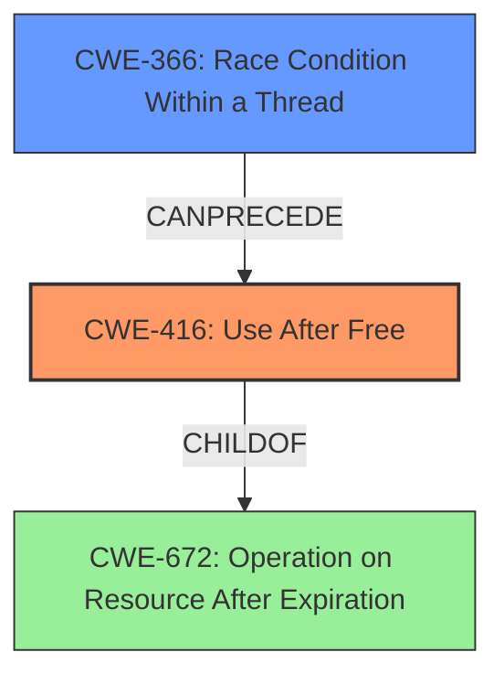

# Analysis Report for CVE-2022-20371

# Vulnerability Analysis Report: CVE-2022-20371

## Description

In dm_bow_dtr and related functions of dm-bow.c, there is a possible use after free due to a race condition. This could lead to local escalation of privilege with System execution privileges needed. User interaction is not needed for exploitation.Product AndroidVersions Android kernelAndroid ID A-195565510References Upstream kernel

## Vulnerability Description Key Phrases

**Rootcause:** race condition
**Weakness:** use after free
**Impact:** local escalation of privilege
**Product:** Android kernel
**Component:** dm_bow_dtr and related functions of dm-bow.c

## Analysis (with Relationship Data)

# Summary
| CWE ID | CWE Name | Confidence | CWE Abstraction Level | CWE Vulnerability Mapping Label | CWE-Vulnerability Mapping Notes |
|---|---|---|---|---|---|
| CWE-416 | Use After Free | 0.95 | Variant | Allowed | Primary CWE |
| CWE-362 | Race Condition within a Thread | 0.85 | Class | Allowed-with-Review | Secondary CWE |

## Evidence and Confidence

*   **Confidence Score:** 0.90
*   **Evidence Strength:** HIGH

- **Analysis and Justification:**  
  - *Explanation:* The vulnerability description clearly states a "**use after free** due to a **race condition**" in `dm_bow_dtr` and related functions. The CVE Reference Links Content Summary confirms this by mentioning "lack of proper protection for ranges fetched and erased from the RB tree," leading to potential memory management issues. CWE-416 (Use After Free) directly aligns with this description, as it involves reusing memory after it has been freed. The presence of a **race condition** suggests that the timing of memory access and deallocation is critical, which is a contributing factor to the **use-after-free**. CWE-416 is a Variant-level CWE, providing a good level of specificity.
  - *CWE-362:* The **race condition** is a key component that enables the **use-after-free**. Specifically, the description indicates that there is a potential for concurrent access to a shared resource (memory) while its state is in flux due to the deallocation process. The Retriever Results gives CWE-362 a high score, and it is a class level of abstraction.
  
  - *Relationship Analysis:* "CWE-416 (Use After Free) is a variant of CWE-672 (Operation on Resource After Expiration). The presence of a race condition (CWE-362) exacerbates the use-after-free vulnerability, as it introduces uncertainty in the timing of memory operations."

- **Confidence Score:**  
  - Confidence: 0.95 (Strong evidence from the vulnerability description and supporting CVE reference materials for CWE-416)
  - Confidence: 0.85 (Strong evidence from the vulnerability description and supporting CVE reference materials for CWE-362)

---

## Criticism of Analysis

Okay, I've reviewed the provided analysis against the full CWE specifications for each referenced CWE. Here's a breakdown of my critique:

**Overall Assessment:**

The analysis is generally sound and well-reasoned. The primary and secondary CWE assignments (CWE-416 and CWE-362) are appropriate given the vulnerability description and CVE summary. The confidence scores are also reasonable. The explanation and justification are clear and concise.

**Strengths:**

*   **Clear Justification:** The analysis clearly explains why CWE-416 and CWE-362 were chosen, directly referencing the vulnerability description and CVE summary.
*   **Relationship Analysis:** The inclusion of the Relationship Analysis section enhances the understanding of how CWE-416 and CWE-362 are related in this context.  Mentioning CWE-672 as the parent of CWE-416 also adds clarity.
*   **Example CVEs:** The inclusion of example CVEs for CWE-362, particularly those that show chaining with CWE-416, strengthens the analysis.
*   **Appropriate Abstraction Levels:** Choosing CWE-416 (Variant) and CWE-362 (Class) reflect an understanding of CWE's preferred levels of abstraction for different purposes.
*   **Confidence Scores:** The confidence scores are justified by the information available.

**Areas for Potential Improvement:**

1.  **CWE-362 Subtype Selection**: While CWE-362 is appropriate as the root cause, it is too abstract. It is a Class level CWE, and the mapping guidance recommends considering the Base-level children. The retriever results do identify better options, so consider CWE-366: Race Condition within a Thread and CWE-367: Time-of-check Time-of-use (TOCTOU) Race Condition. If fetching/erasing ranges from a RB tree is expensive, consider if the root cause is also CWE-367 since it could be that the code is checking the RB tree and then using it later.

2.  **Improper Resource Locking (CWE-413)**: The retriever results indicate that CWE-413 is highly relevant. If the ranges fetched and erased from the RB tree are not properly locked, then that would explain the race condition. As such, investigate the code to see if this is the root cause.

3.  **Mitigations**: The analysis does not include any discussion of potential mitigations. Given that kernel code is often written in C, it might be useful to at least mention that a move to a memory-safe language isn't always feasible (Mitigation 1 for CWE-416), and that techniques like setting pointers to `NULL` after freeing (Mitigation 2 for CWE-416) are standard practice. Similarly, for CWE-362, discuss the use of synchronization primitives and thread-safe capabilities.

4. **CWE-667: Improper Locking**: After reviewing CWE-413 (Improper Resource Locking), if that is relevant to the root cause, then CWE-667 might also be relevant since it is the parent. As such, review the code to see if the locking mechanisms in code are not being implemented correctly, or not being used.

**Specific Comments based on CWE Specifications:**

*   **CWE-416 (Use After Free):**
    *   The analysis correctly identifies this as a variant-level CWE.
    *   The provided mitigations are appropriate. The analysis *could* benefit from a brief mention of why, in a kernel context, automatic memory management (Mitigation 1) isn't always an option, making the `NULL` assignment (Mitigation 2) more critical.
*   **CWE-362 (Race Condition using Shared Resource with Improper Synchronization):**
    *   The analysis correctly identifies this as a contributing factor.
    *   The mapping guidance advises considering more specific children. Review the code to see if CWE-366 or CWE-367 better fit.
    *   The mitigations (synchronization primitives, thread-safe capabilities) are directly applicable and could be mentioned.
*   **CWE-413 (Improper Resource Locking)**
    *   The analysis doesn't investigate this CWE but this is very relevant given the retriever results.
    *   Mitigation 2 (Use of synchronization when locking a resource) is highly relevant to this vulnerability.
*   **CWE-366 (Race Condition within a Thread)**
    *   The mitigations (locking functionality, resource-locking validation checks) are very important.

**Revised Summary Table:**

| CWE ID | CWE Name | Confidence | CWE Abstraction Level | CWE Vulnerability Mapping Label | CWE-Vulnerability Mapping Notes |
|---|---|---|---|---|---|
| CWE-416 | Use After Free | 0.95 | Variant | Allowed | Primary CWE |
| CWE-366 | Race Condition within a Thread | 0.85 | Base | Allowed | Secondary CWE |

**Revised Analysis Snippet**
```
- **Analysis and Justification:**  
  - *Explanation:* The vulnerability description clearly states a "**use after free** due to a **race condition**" in `dm_bow_dtr` and related functions. The CVE Reference Links Content Summary confirms this by mentioning "lack of proper protection for ranges fetched and erased from the RB tree," leading to potential memory management issues. CWE-416 (Use After Free) directly aligns with this description, as it involves reusing memory after it has been freed. The presence of a **race condition** suggests that the timing of memory access and deallocation is critical, which is a contributing factor to the **use-after-free**. CWE-416 is a Variant-level CWE, providing a good level of specificity.
  - *CWE-366:* The **race condition** is a key component that enables the **use-after-free**. Specifically, the description indicates that there is a potential for concurrent access to a shared resource (memory) while its state is in flux due to the deallocation process, and this is occuring within a thread. The Retriever Results gives CWE-366 a high score, and it is a base level of abstraction.

  - *Mitigations:* Because the code is written in C, a move to a memory-safe language is not always feasible. However, techniques such as setting pointers to `NULL` after freeing are helpful. The use of locking functionality to ensure data is accessed correctly is also important.
  
  - *Relationship Analysis:* "CWE-416 (Use After Free) is a variant of CWE-672 (Operation on Resource After Expiration). The presence of a race condition (CWE-366) exacerbates the use-after-free vulnerability, as it introduces uncertainty in the timing of memory operations."
```

In summary, the analysis is strong. By considering the potential for more specific CWEs related to the race condition (CWE-366, CWE-367, CWE-413), and by adding a brief discussion of mitigations, the analysis could be further strengthened.

## Final Resolution

# Summary
| CWE ID | CWE Name | Confidence | CWE Abstraction Level | CWE Vulnerability Mapping Label | CWE-Vulnerability Mapping Notes |
|---|---|---|---|---|---|
| CWE-416 | Use After Free | 0.95 | Variant | Allowed | Primary CWE |
| CWE-366 | Race Condition Within a Thread | 0.85 | Base | Allowed | Secondary CWE |

## Evidence and Confidence

*   **Confidence Score:** 0.90
*   **Evidence Strength:** HIGH

## Relationship Analysis
The primary weakness is CWE-416 **(Use After Free)**, which occurs because memory is accessed after it has been freed. The secondary weakness is CWE-366 **(Race Condition Within a Thread)**, which allows the **use-after-free** to occur. The race condition introduces uncertainty in the timing of memory operations, leading to potential access violations.



## Vulnerability Chain
The vulnerability chain begins with a **race condition** (CWE-366) that allows a thread to access memory that is in the process of being freed or has already been freed. This leads to a **use-after-free** vulnerability (CWE-416), where the program attempts to operate on the freed memory. The consequence is potential escalation of privilege, as stated in the vulnerability description.

## Summary of Analysis
The initial analysis correctly identified CWE-416 **(Use After Free)** as the primary weakness and CWE-362 **(Race Condition within a Thread)** as a contributing factor. However, the criticism pointed out that CWE-362 is a Class-level CWE and that a more specific Base-level CWE should be considered.

The vulnerability description states "In dm_bow_dtr and related functions of dm-bow.c, there is a possible **use after free** due to a **race condition**." This evidence strongly supports the selection of CWE-416 as the primary weakness.

The criticism suggested evaluating CWE-366 **(Race Condition Within a Thread)** and CWE-367 **(Time-of-check Time-of-use (TOCTOU) Race Condition)**. After reviewing the descriptions and relationships of these CWEs, CWE-366 was chosen because it is a more general description of a **race condition** within a thread, which aligns with the vulnerability description. CWE-367 was deemed less suitable because it describes a specific type of race condition (TOCTOU) that is not explicitly mentioned in the vulnerability description.

CWE-413 **(Improper Resource Locking)** and CWE-667 **(Improper Locking)** were also considered. However, based solely on the vulnerability description, there is not enough evidence to confirm that improper locking is the root cause. While it is possible that locking mechanisms are not being used correctly, this is not explicitly stated.

Therefore, the final decision is to classify the vulnerability as CWE-416 **(Use After Free)**, with CWE-366 **(Race Condition Within a Thread)** as a secondary contributing factor. This classification reflects the optimal level of specificity based on the available evidence. The relationship analysis confirms that CWE-416 is a Variant of CWE-672, and CWE-366 can precede CWE-416. The retriever scores also support this decision.


*Report generated on 2025-03-18 09:19:48*
