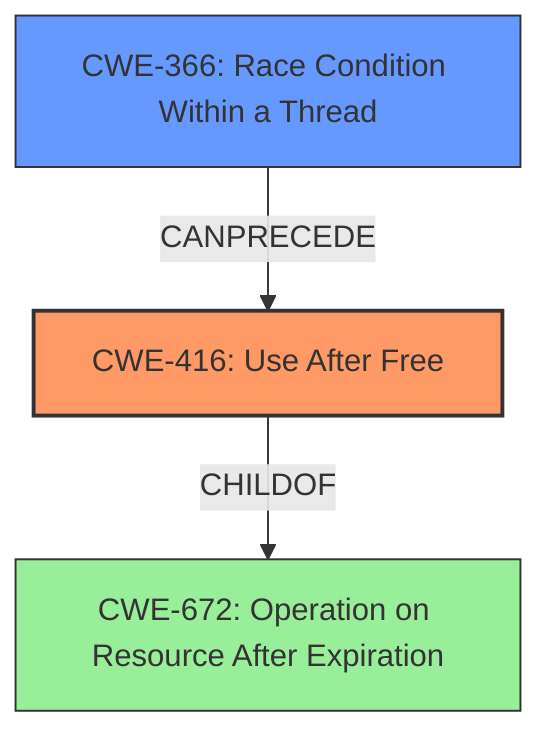

# Final Resolution for CVE-2022-20371

# Summary
| CWE ID | CWE Name | Confidence | CWE Abstraction Level | CWE Vulnerability Mapping Label | CWE-Vulnerability Mapping Notes |
|---|---|---|---|---|---|
| CWE-416 | Use After Free | 0.95 | Variant | Allowed | Primary CWE |
| CWE-366 | Race Condition Within a Thread | 0.85 | Base | Allowed | Secondary CWE |

## Evidence and Confidence

*   **Confidence Score:** 0.90
*   **Evidence Strength:** HIGH

## Relationship Analysis
The primary weakness is CWE-416 **(Use After Free)**, which occurs because memory is accessed after it has been freed. The secondary weakness is CWE-366 **(Race Condition Within a Thread)**, which allows the **use-after-free** to occur. The race condition introduces uncertainty in the timing of memory operations, leading to potential access violations.

## Vulnerability Chain
The vulnerability chain begins with a **race condition** (CWE-366) that allows a thread to access memory that is in the process of being freed or has already been freed. This leads to a **use-after-free** vulnerability (CWE-416), where the program attempts to operate on the freed memory. The consequence is potential escalation of privilege, as stated in the vulnerability description.

## Summary of Analysis
The initial analysis correctly identified CWE-416 **(Use After Free)** as the primary weakness and CWE-362 **(Race Condition within a Thread)** as a contributing factor. However, the criticism pointed out that CWE-362 is a Class-level CWE and that a more specific Base-level CWE should be considered.

The vulnerability description states "In dm_bow_dtr and related functions of dm-bow.c, there is a possible **use after free** due to a **race condition**." This evidence strongly supports the selection of CWE-416 as the primary weakness.

The criticism suggested evaluating CWE-366 **(Race Condition Within a Thread)** and CWE-367 **(Time-of-check Time-of-use (TOCTOU) Race Condition)**. After reviewing the descriptions and relationships of these CWEs, CWE-366 was chosen because it is a more general description of a **race condition** within a thread, which aligns with the vulnerability description. CWE-367 was deemed less suitable because it describes a specific type of race condition (TOCTOU) that is not explicitly mentioned in the vulnerability description.

CWE-413 **(Improper Resource Locking)** and CWE-667 **(Improper Locking)** were also considered. However, based solely on the vulnerability description, there is not enough evidence to confirm that improper locking is the root cause. While it is possible that locking mechanisms are not being used correctly, this is not explicitly stated.

Therefore, the final decision is to classify the vulnerability as CWE-416 **(Use After Free)**, with CWE-366 **(Race Condition Within a Thread)** as a secondary contributing factor. This classification reflects the optimal level of specificity based on the available evidence. The relationship analysis confirms that CWE-416 is a Variant of CWE-672, and CWE-366 can precede CWE-416. The retriever scores also support this decision.