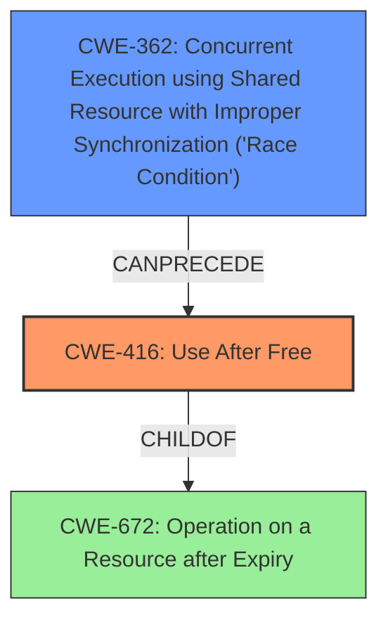

# Analysis Report for CVE-2022-20373

# Vulnerability Analysis Report: CVE-2022-20373

## Description

In st21nfc_loc_set_polaritymode of fc/st21nfc.c, there is a possible use after free due to a race condition. This could lead to local escalation of privilege with System execution privileges needed. User interaction is not needed for exploitation.Product AndroidVersions Android kernelAndroid ID A-208269510References N/A

## Vulnerability Description Key Phrases

**Rootcause:** race condition
**Weakness:** use after free
**Impact:** local escalation of privilege
**Product:** Android kernel
**Component:** st21nfc_loc_set_polaritymode of fc/st21nfc.c

## Analysis (with Relationship Data)

# Summary
| CWE ID | CWE Name | Confidence | CWE Abstraction Level | CWE Vulnerability Mapping Label | CWE-Vulnerability Mapping Notes |
|---|---|---|---|---|---|
| CWE-416 | Use After Free | 0.9 | Variant | Allowed | Primary CWE |
| CWE-362 | Concurrent Execution using Shared Resource with Improper Synchronization ('Race Condition') | 0.7 | Class | Allowed-with-Review | Secondary CWE |

## Evidence and Confidence

*   **Confidence Score:** 0.8
*   **Evidence Strength:** HIGH

- **Analysis and Justification:**  
  - *Explanation:* The vulnerability description explicitly states a "**use after free**" condition exists due to a "**race condition**" in `st21nfc_loc_set_polaritymode` of `fc/st21nfc.c`. CWE-416 (Use After Free) directly addresses this scenario where memory is reused or referenced after being freed, aligning perfectly with the vulnerability description. The CVE Reference Links Content Summary also states "Elevation of Privilege (EoP)" as a weakness. CWE-416 can lead to EoP. CWE-362 (Concurrent Execution using Shared Resource with Improper Synchronization ('Race Condition')) is included as a secondary CWE because it is the root cause of the Use After Free.
  
  - *Relationship Analysis:* CWE-416 is a variant-level CWE, providing a specific description of the vulnerability. It is related to CWE-672 (Operation on a Resource after Expiry), highlighting the temporal aspect of the vulnerability. CWE-362, a class-level CWE, represents the broader category of race conditions that lead to the use-after-free. CWE-416 CanFollow CWE-362.

- **Confidence Score:**  
  - Confidence: 0.9 (High confidence due to explicit mention of "use after free" and "race condition" in the vulnerability description.)
---

## Criticism of Analysis

Okay, here's a review of the provided CWE analysis based on the full CWE specifications:

**Overall Assessment:**

The analysis correctly identifies CWE-416 (Use After Free) as the primary weakness, directly aligning with the vulnerability description's explicit mention of "use after free." The inclusion of CWE-362 (Concurrent Execution using Shared Resource with Improper Synchronization ('Race Condition')) as a secondary weakness is also justified, as it represents the root cause of the use-after-free condition. The confidence level is appropriately high.

**Specific Comments and Suggestions:**

*   **CWE-416: Use After Free:**
    *   **Mapping:** The analysis correctly uses CWE-416 at the Variant level, which is the preferred level for root cause analysis. The justification provided is sound.
    *   **Relationships:** The relationship analysis is accurate. CWE-416 *CanFollow* CWE-362, reflecting that a race condition can lead to a use-after-free. The mention of CWE-672 (Operation on a Resource after Expiry) is appropriate as it highlights the temporal aspect of the vulnerability.
    *   **Mitigations:** The potential mitigations are relevant. Suggesting a language with automatic memory management (like Rust, Java, or Go) is a strong preventative measure. Setting pointers to NULL after freeing them is a common, but less robust, mitigation strategy.

*   **CWE-362: Concurrent Execution using Shared Resource with Improper Synchronization ('Race Condition'):**
    *   **Mapping:** The analysis acknowledges that CWE-362 is a Class-level CWE and might have more specific children. However, given the information available, using CWE-362 is acceptable, especially since no specific synchronization primitives are mentioned as being mishandled in the description.
    *   **Relationships:** The relationships outlined are valid. CWE-362 *CanPrecede* CWE-416.  The analysis could consider some of the child CWEs of CWE-362 for more precise identification if more details about the vulnerability are known.
    *   **Mitigations:** The mitigations provided are standard and relevant.  Using synchronization primitives (mutexes, semaphores, etc.) is the most common solution. Thread-safe capabilities are also a good recommendation. Minimizing shared resource usage is a good design principle to reduce concurrency risks.

**Potential Improvements and Considerations:**

1.  **Explore Child CWEs of CWE-362:** While CWE-362 is a reasonable starting point, consider if more specific child CWEs of CWE-362 might be more appropriate if more details are known about the exact type of race condition:
    *   **CWE-366: Race Condition within a Thread:** if the race occurs between threads within the same process.
    *   **CWE-367: Time-of-check Time-of-use (TOCTOU) Race Condition:** If the vulnerability involves checking a resource's state and then using it later, but the state changes in between. Although from the retriever results, the TOCTOU score is lower.
        *   **CWE-413: Improper Resource Locking:** If the race condition stems from a failure to properly lock resources.
    *   **CWE-667: Improper Locking:** If the race is caused by improper use of locks.

2.  **CVE Examples:**
    *   The analysis includes examples of CVEs that link race conditions to use-after-free vulnerabilities. This is useful in illustrating the relationship between the two CWEs. However, the analysis could also mention mitigations used in those CVEs to prevent similar vulnerabilities.

3.  **CVE Reference Links Content Summary:** The CVE Reference Links Content Summary provides very general details about the vulnerability. It only states, "An unspecified vulnerability in the kernel." Because of the general nature of these details, it is best to only use them for basic confirmation of the weakness and impact.

4.  **Abstraction Level Considerations:** The analysis does a good job of recognizing the abstraction levels of the CWEs and selecting the most appropriate one. Choosing CWE-416 (Variant) over CWE-672 (Class) is correct because CWE-416 provides a more specific description of the vulnerability.

**Revised Summary (incorporating suggestions):**

| CWE ID | CWE Name | Confidence | CWE Abstraction Level | CWE Vulnerability Mapping Label | CWE-Vulnerability Mapping Notes |
|---|---|---|---|---|---|
| CWE-416 | Use After Free | 0.9 | Variant | Allowed | Primary CWE |
| CWE-362 | Concurrent Execution using Shared Resource with Improper Synchronization ('Race Condition') | 0.7 | Class | Allowed-with-Review | Secondary CWE, consider child CWEs if further details are known (e.g. CWE-366, CWE-367, CWE-413) |

**Revised Evidence and Confidence:**

*   **Confidence Score:** 0.8
*   **Evidence Strength:** HIGH

- **Analysis and Justification:**
  - *Explanation:* The vulnerability description explicitly states a "**use after free**" condition exists due to a "**race condition**" in `st21nfc_loc_set_polaritymode` of `fc/st21nfc.c`. CWE-416 (Use After Free) directly addresses this scenario where memory is reused or referenced after being freed, aligning perfectly with the vulnerability description. The CVE Reference Links Content Summary also states "Elevation of Privilege (EoP)" as a weakness. CWE-416 can lead to EoP. CWE-362 (Concurrent Execution using Shared Resource with Improper Synchronization ('Race Condition')) is included as a secondary CWE because it is the root cause of the Use After Free. If more details are known about the nature of the race condition, child CWEs of CWE-362 should be considered. For example, If the race condition stems from a failure to properly lock resources, CWE-413 (Improper Resource Locking) would be a better fit.

  - *Relationship Analysis:* CWE-416 is a variant-level CWE, providing a specific description of the vulnerability. It is related to CWE-672 (Operation on a Resource after Expiry), highlighting the temporal aspect of the vulnerability. CWE-362, a class-level CWE, represents the broader category of race conditions that lead to the use-after-free. CWE-416 CanFollow CWE-362.

- **Confidence Score:**
  - Confidence: 0.9 (High confidence due to explicit mention of "use after free" and "race condition" in the vulnerability description.)

By incorporating these suggestions, the analysis can be made even more comprehensive and informative.

## Final Resolution

# Summary
| CWE ID | CWE Name | Confidence | CWE Abstraction Level | CWE Vulnerability Mapping Label | CWE-Vulnerability Mapping Notes |
|---|---|---|---|---|---|
| CWE-416 | Use After Free | 0.9 | Variant | Allowed | Primary CWE |
| CWE-362 | Concurrent Execution using Shared Resource with Improper Synchronization ('Race Condition') | 0.7 | Class | Allowed-with-Review | Secondary CWE |

## Evidence and Confidence

*   **Confidence Score:** 0.85
*   **Evidence Strength:** HIGH

## Relationship Analysis
The primary relationship impacting the decision is the CAN_FOLLOW relationship between CWE-362 and CWE-416. The **race condition** (CWE-362) allows code to execute in an order that results in a **use-after-free** (CWE-416). While there are more specific children of CWE-362, the provided information is insufficient to determine which of those children is most appropriate. The variant-level CWE-416 provides a more specific description of the vulnerability than its class-level parent, CWE-672 (Operation on a Resource after Expiry).

## Vulnerability Chain
The vulnerability chain starts with a **race condition** (CWE-362) in the `st21nfc_loc_set_polaritymode` function. This leads to memory being freed while another thread is still using it. Subsequently, the thread attempts to access the freed memory, resulting in a **use-after-free** (CWE-416) vulnerability. This can lead to local escalation of privilege.

## Summary of Analysis
The initial analysis and criticism both correctly identify CWE-416 as the primary weakness and CWE-362 as a contributing factor. The vulnerability description explicitly states a "**use after free**" condition exists due to a "**race condition**" in `st21nfc_loc_set_polaritymode`.

The selection of CWE-416 is based on the direct evidence of a "use-after-free" condition. The decision to include CWE-362 is based on the explicit mention of a "race condition" being the root cause. The CAN_FOLLOW relationship between CWE-362 and CWE-416 supports this classification. The analysis also considered the abstraction levels of the CWEs and selected CWE-416 (Variant) because it provides a more specific description of the vulnerability than its parent class CWE-672 (Operation on a Resource after Expiry). While the criticism suggested exploring child CWEs of CWE-362, the available evidence is not specific enough to confidently select one of those children.

*Report generated on 2025-03-18 09:20:34*
