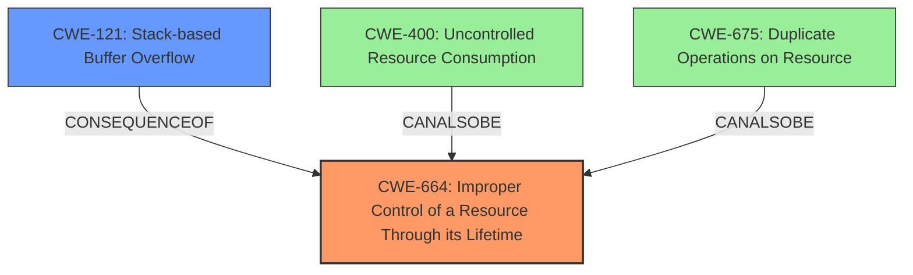

# Final Resolution for CVE-2022-20382

# Summary
| CWE ID | CWE Name | Confidence | CWE Abstraction Level | CWE Vulnerability Mapping Label | CWE-Vulnerability Mapping Notes |
|---|---|---|---|---|---|
| CWE-664 | Improper Control of a Resource Through its Lifetime | 0.85 | Base | Primary | The `incfs_mount_fs` function does not properly manage the lifetime of superblocks, leading to uncontrolled allocation and eventual stack overflow. |
| CWE-121 | Stack-based Buffer Overflow | 0.70 | Base | Secondary | The stack overflow is a consequence of the recursive calls, but not the direct root cause. |

## Evidence and Confidence

*   **Confidence Score:** 0.83
*   **Evidence Strength:** HIGH

## Relationship Analysis
The primary relationship impacting the decision is the ParentOf relationship, where CWE-664 (Improper Control of a Resource Through its Lifetime) is a parent of potential resource exhaustion issues. The chain relationship involves the improper resource control leading to stack overflow. Alternatives considered were CWE-675 (Duplicate Operations on Resource) and CWE-400 (Uncontrolled Resource Consumption), but CWE-664 offers a more direct explanation of the root cause. The Base abstraction level of CWE-664 is appropriate for mapping to the root cause.

## Vulnerability Chain
The vulnerability chain starts with **CWE-664 (Improper Control of a Resource Through its Lifetime)** in the `incfs_mount_fs` function. The function fails to properly manage the lifetime of superblocks, leading to uncontrolled allocation. This uncontrolled allocation results in recursive calls and eventual **CWE-121 (Stack-based Buffer Overflow)**, leading to a local escalation of privilege.

## Summary of Analysis
The initial analysis identified **CWE-675 (Duplicate Operations on Resource)** as the primary **WEAKNESS**, but after considering the criticism and reviewing the CWE specifications, **CWE-664 (Improper Control of a Resource Through its Lifetime)** emerges as a more accurate representation of the **ROOTCAUSE**. The vulnerability description states that the `incfs_mount_fs()` function incorrectly handles multiple mount requests, allocating a new superblock for each call. This directly relates to improper control of the superblock resource.

The graph relationships, particularly the potential relationship between CWE-664 and resource exhaustion, influenced the final selection. While **CWE-675** attempts to capture the duplicate operation, it's the lack of proper resource control that enables the duplicate operations and leads to the stack overflow. The choice of **CWE-664** is at the optimal level of specificity because it directly addresses the root cause, which is the mismanagement of the superblock resource's lifetime. **CWE-121** remains a relevant secondary classification as it describes the direct consequence of the uncontrolled resource consumption.