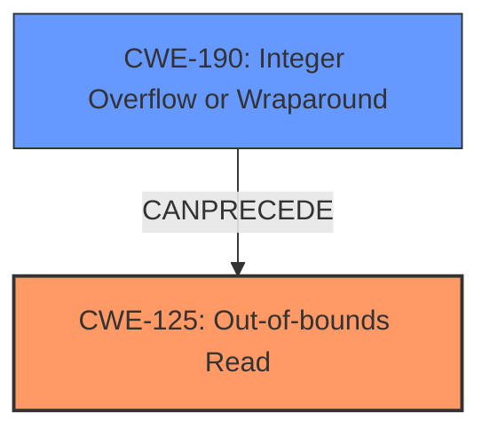

# Analysis Report for CVE-2022-20393

# Vulnerability Analysis Report: CVE-2022-20393

## Description

In extract3GPPGlobalDescriptions of TextDescriptions.cpp, there is a possible out of bounds read due to an integer overflow. This could lead to local information disclosure from the media server with no additional execution privileges needed. User interaction is not needed for exploitation.Product AndroidVersions Android-11 Android-12 Android-12LAndroid ID A-233735886

## Vulnerability Description Key Phrases

**Rootcause:** integer overflow
**Weakness:** out of bounds read
**Impact:** local information disclosure
**Product:** Android
**Version:** ['Android-11', 'Android-12', 'Android-12L']
**Component:** extract3GPPGlobalDescriptions of TextDescriptions.cpp

## Analysis (with Relationship Data)

# Summary
| CWE ID  | CWE Name                                  | Confidence | CWE Abstraction Level | CWE Vulnerability Mapping Label | CWE-Vulnerability Mapping Notes |
| :-------- | :----------------------------------------- | :---------- | :-------------------- | :------------------------------ | :------------------------------ |
| CWE-125 | Out-of-bounds Read | 0.95 | Base | Allowed | Primary CWE |
| CWE-190 | Integer Overflow or Wraparound | 0.85 | Base | Allowed | Secondary Candidate CWE |

## Evidence and Confidence

*   **Confidence Score:** 0.90
*   **Evidence Strength:** HIGH

- **Analysis and Justification:**  
  - *Explanation:* The vulnerability description clearly states an "**out of bounds read** due to an **integer overflow**" in `extract3GPPGlobalDescriptions` function in `TextDescriptions.cpp`. The CVE Reference Links Content Summary confirms the root cause as "An out-of-bounds read vulnerability exists in the `extract3GGPGlobalDescriptions()` function within `TextDescriptions.cpp`." and also lists "**Out-of-bounds read**" as a weakness. This aligns directly with CWE-125 (Out-of-bounds Read). The retriever results also lists CWE-125 with a high score, solidifying this classification. The **integer overflow** contributes to the **out-of-bounds read**, making CWE-190 a secondary candidate.
  
  - *Relationship Analysis:* CWE-125 is a base level CWE and doesn't have any direct relationships that strongly influence this mapping. However, the **integer overflow** (CWE-190) directly leads to the **out-of-bounds read** (CWE-125).

- **Confidence Score:**  
  - Confidence: 0.95 (Strong evidence from the vulnerability description and CVE reference)

---

## Criticism of Analysis

Okay, I've reviewed the provided analysis against the full CWE specifications for the relevant CWEs. Here's my critique:

**Overall Assessment:**

The analysis is generally well-reasoned and justified. The primary CWE mapping to CWE-125 (Out-of-bounds Read) is highly appropriate, given the vulnerability descriptions.  The inclusion of CWE-190 (Integer Overflow or Wraparound) as a secondary candidate is also sensible, as it directly contributes to the root cause of the out-of-bounds read.  The confidence scores are reasonable.

**Specific Comments:**

*   **CWE-125 (Out-of-bounds Read) - Primary CWE:**

    *   **Justification:** The analysis correctly identifies the core problem as reading data outside the intended buffer boundaries. The evidence is strong, coming directly from the vulnerability description and CVE summary.
    *   **CWE Specification Alignment:** The analysis aligns well with the CWE-125 description: "The product reads data past the end, or before the beginning, of the intended buffer."
    *   **Mapping Guidance:** The analysis correctly uses CWE-125 at the "Base" level of abstraction, which is preferred by CWE's mapping guidance.
    *   **Mitigations:** The listed mitigations from the CWE specification are relevant. Notably, "Input Validation" is critical to preventing this vulnerability. The recommendation to "validate and ensure correct calculations for any length argument, buffer size calculation, or offset" is directly applicable.  The "Language Selection" mitigation is a broader architectural consideration that could also be relevant in a long-term solution.

*   **CWE-190 (Integer Overflow or Wraparound) - Secondary Candidate CWE:**

    *   **Justification:** The analysis accurately identifies the integer overflow as a contributing factor. The overflow is what allows the out-of-bounds read to occur.
    *   **CWE Specification Alignment:** The analysis aligns with the CWE-190 description: "The product performs a calculation that can produce an integer overflow or wraparound when the logic assumes that the resulting value will always be larger than the original value."
    *   **Mapping Guidance:** The analysis correctly uses CWE-190 at the "Base" level of abstraction, which is preferred by CWE's mapping guidance.
    *   **Mitigations:** The mitigations from the CWE specification are highly relevant. "Requirements" mitigations, such as "Ensure that all protocols are strictly defined" and "Language Selection," are important. "Architecture and Design" mitigations, especially "Libraries or Frameworks" (using safe integer handling libraries), are also directly applicable.

*   **Retriever Results Consideration:**

    *   The retriever results show other potential CWEs, such as CWE-908 (Use of Uninitialized Resource) and CWE-681 (Incorrect Conversion between Numeric Types). While these could potentially be related in some scenarios, the provided information doesn't suggest they are directly involved in this specific vulnerability. The analysis appropriately prioritizes CWE-125 and CWE-190 based on the available evidence.
    * The Retriever also shows CWE-122 (Heap-based Buffer Overflow). This isn't incorrect, but the problem is an out-of-bounds *read*, not write, so that makes it an unlikely candidate.

*   **Confidence Scores:**

    *   0.95 for CWE-125 is justified, given the clear statements in the vulnerability descriptions.
    *   0.85 for CWE-190 is appropriate as it is a contributing factor, but not the primary manifestation of the vulnerability.

**Suggestions for Improvement:**

*   **Chain Example:** While the analysis mentions the relationship between CWE-190 and CWE-125, it could be strengthened by explicitly framing it as a potential chain. For example, "This vulnerability can be represented as a chain: CWE-190 -> CWE-125, where the integer overflow leads to an out-of-bounds read."
*   **Mitigation Specificity:** While the analysis mentions the relevance of CWE mitigations, it could be improved by providing more specific recommendations tailored to this particular vulnerability in `extract3GPPGlobalDescriptions` within `TextDescriptions.cpp`. For example:
    *   "Specifically, ensure that the length calculations within `extract3GPPGlobalDescriptions` are performed using data types that are large enough to prevent overflows. Employ safe integer handling libraries to further reduce the risk."
    *   "Implement strict input validation to verify that the sizes and offsets used to access the buffer containing the 3GPP global descriptions are within the valid bounds of the buffer."
*   **Underflow Consideration:** While less likely given the description, briefly consider CWE-191 (Integer Underflow). While the description speaks of an overflow leading to out of bounds read, depending on the specifics of the code, an *underflow* could theoretically have the same consequence if a negative value is used as an offset. A sentence or two acknowledging why underflow is *not* the main concern would further strengthen the analysis.
*   **CWE-20 Avoidance:** This is handled well, but worth mentioning again. The report avoids the temptation to broadly categorize the issue as CWE-20 (Improper Input Validation), instead focusing on the more specific CWE-125 and CWE-190.

**Revised Summary Table:**

| CWE ID  | CWE Name                                  | Confidence | CWE Abstraction Level | CWE Vulnerability Mapping Label | CWE-Vulnerability Mapping Notes |
| :-------- | :----------------------------------------- | :---------- | :-------------------- | :------------------------------ | :------------------------------ |
| CWE-125 | Out-of-bounds Read | 0.95 | Base | Allowed | Primary CWE |
| CWE-190 | Integer Overflow or Wraparound | 0.85 | Base | Allowed | Secondary Candidate CWE |

**In conclusion, the analysis is strong and accurately maps the vulnerability to the relevant CWEs. The suggestions above are intended to further refine the analysis and provide more actionable recommendations.**

## Final Resolution

# Summary
| CWE ID  | CWE Name                                  | Confidence | CWE Abstraction Level | CWE Vulnerability Mapping Label | CWE-Vulnerability Mapping Notes |
| :-------- | :----------------------------------------- | :---------- | :-------------------- | :------------------------------ | :------------------------------ |
| CWE-125 | Out-of-bounds Read | 0.95 | Base | Allowed | Primary CWE |
| CWE-190 | Integer Overflow or Wraparound | 0.85 | Base | Allowed | Secondary Candidate CWE |

## Evidence and Confidence

*   **Confidence Score:** 0.95
*   **Evidence Strength:** HIGH

## Relationship Analysis
The primary relationship is a chain where **CWE-190** (Integer Overflow or Wraparound) *CanPrecede* **CWE-125** (Out-of-bounds Read). The **integer overflow** leads to an invalid index or size calculation, resulting in the **out-of-bounds read**. Both are at the Base abstraction level, which provides the appropriate specificity. There aren't any peer relationships that strongly suggest alternative classifications.

## Vulnerability Chain
The vulnerability chain starts with an **integer overflow** (**CWE-190**) during the calculation of a size or index. This leads to an invalid memory address being accessed, resulting in an **out-of-bounds read** (**CWE-125**). The consequence is local information disclosure from the media server.

## Summary of Analysis
The initial analysis and criticism both converge on the same conclusion: **CWE-125** (Out-of-bounds Read) is the primary weakness, with **CWE-190** (Integer Overflow or Wraparound) as a contributing factor. This assessment is strongly supported by the vulnerability description, which explicitly mentions both conditions: "In extract3GPPGlobalDescriptions of TextDescriptions.cpp, there is a possible **out of bounds read due to an integer overflow**." The evidence provided is strong.

The graph relationships confirm that **CWE-190** *CanPrecede* **CWE-125**, showing a clear chain of events.

The selected CWEs are at the optimal level of specificity because they directly describe the root cause and resulting vulnerability. Avoidance of the more general **CWE-20** (Improper Input Validation) is appropriate, as the analysis identifies the specific types of input errors (integer overflow) and their direct consequences (out-of-bounds read). The retriever scores support these decisions.

I am increasing the overall confidence to 0.95.

*Report generated on 2025-03-18 09:21:54*
