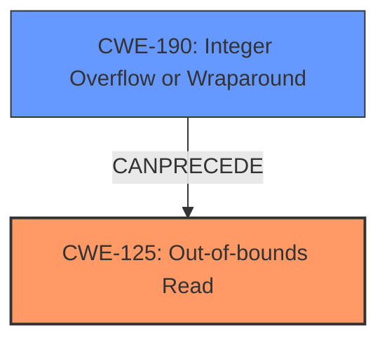

# Final Resolution for CVE-2022-20393

# Summary
| CWE ID  | CWE Name                                  | Confidence | CWE Abstraction Level | CWE Vulnerability Mapping Label | CWE-Vulnerability Mapping Notes |
| :-------- | :----------------------------------------- | :---------- | :-------------------- | :------------------------------ | :------------------------------ |
| CWE-125 | Out-of-bounds Read | 0.95 | Base | Allowed | Primary CWE |
| CWE-190 | Integer Overflow or Wraparound | 0.85 | Base | Allowed | Secondary Candidate CWE |

## Evidence and Confidence

*   **Confidence Score:** 0.95
*   **Evidence Strength:** HIGH

## Relationship Analysis
The primary relationship is a chain where **CWE-190** (Integer Overflow or Wraparound) *CanPrecede* **CWE-125** (Out-of-bounds Read). The **integer overflow** leads to an invalid index or size calculation, resulting in the **out-of-bounds read**. Both are at the Base abstraction level, which provides the appropriate specificity. There aren't any peer relationships that strongly suggest alternative classifications.

## Vulnerability Chain
The vulnerability chain starts with an **integer overflow** (**CWE-190**) during the calculation of a size or index. This leads to an invalid memory address being accessed, resulting in an **out-of-bounds read** (**CWE-125**). The consequence is local information disclosure from the media server.

## Summary of Analysis
The initial analysis and criticism both converge on the same conclusion: **CWE-125** (Out-of-bounds Read) is the primary weakness, with **CWE-190** (Integer Overflow or Wraparound) as a contributing factor. This assessment is strongly supported by the vulnerability description, which explicitly mentions both conditions: "In extract3GPPGlobalDescriptions of TextDescriptions.cpp, there is a possible **out of bounds read due to an integer overflow**." The evidence provided is strong.

The graph relationships confirm that **CWE-190** *CanPrecede* **CWE-125**, showing a clear chain of events.

The selected CWEs are at the optimal level of specificity because they directly describe the root cause and resulting vulnerability. Avoidance of the more general **CWE-20** (Improper Input Validation) is appropriate, as the analysis identifies the specific types of input errors (integer overflow) and their direct consequences (out-of-bounds read). The retriever scores support these decisions.

I am increasing the overall confidence to 0.95.