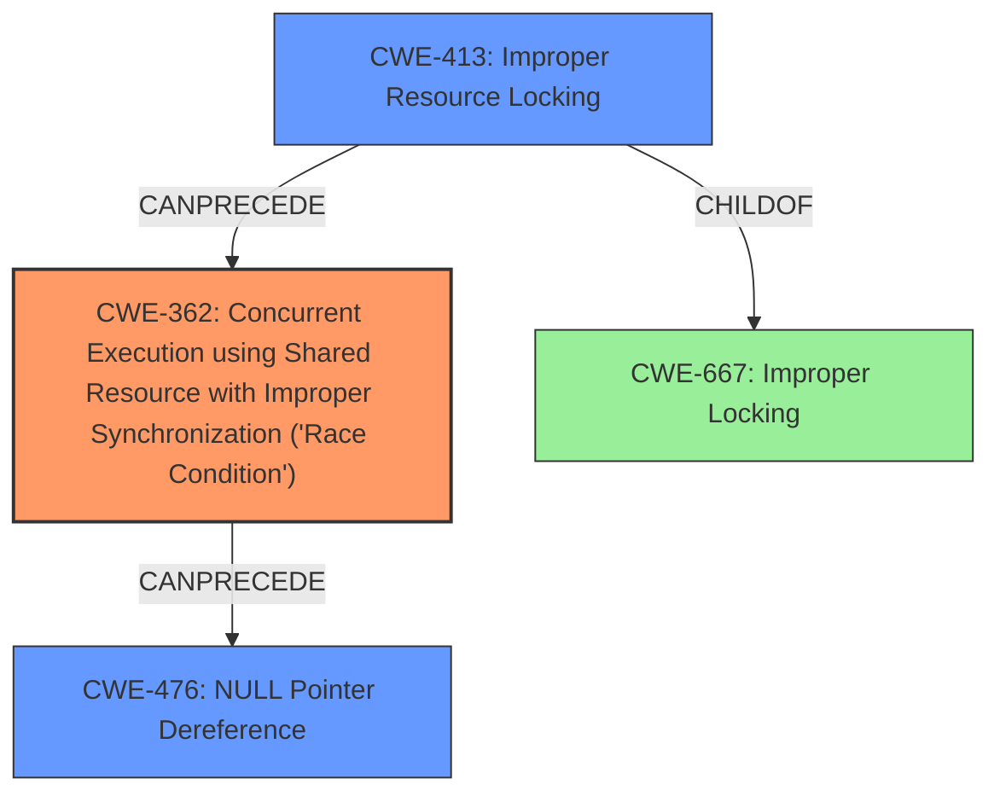

# Analysis Report for CVE-2022-20422

# Vulnerability Analysis Report: CVE-2022-20422

## Description

In emulation_proc_handler of armv8_deprecated.c, there is a possible way to corrupt memory due to a race condition. This could lead to local escalation of privilege with no additional execution privileges needed. User interaction is not needed for exploitation.Product AndroidVersions Android kernelAndroid ID A-237540956References Upstream kernel

## Vulnerability Description Key Phrases

**Rootcause:** race condition
**Impact:** memory corruption
**Product:** Android kernel
**Component:** emulation_proc_handler of armv8_deprecated.c

## Analysis (with Relationship Data)

# Summary
| CWE ID | CWE Name | Confidence | CWE Abstraction Level | CWE Vulnerability Mapping Label | CWE-Vulnerability Mapping Notes |
|---|---|---|---|---|---|
| CWE-362 | Concurrent Execution using Shared Resource with Improper Synchronization ('**Race Condition**') | 0.9 | Class | Allowed-with-Review | Primary CWE: The core issue is a **race condition** due to improper synchronization. |
| CWE-412 | Unpredictable/Probable Concurrent Access to Critical Section | 0.7 | Base | Allowed | Secondary CWE: Details on `table->data` suggest data corruption during concurrent access. |
| CWE-476 | NULL Pointer Dereference | 0.6 | Base | Allowed | Secondary CWE: Resulting impact due to the **race condition**. |

## Evidence and Confidence

*   **Confidence Score:** 0.8
*   **Evidence Strength:** HIGH

- **Analysis and Justification:**
  - *Explanation:* The primary weakness is a **race condition** described in the "Vulnerability Description" and "CVE Reference Links Content Summary". The summary specifies concurrent access leading to a **null pointer dereference**. CWE-362 (Concurrent Execution using Shared Resource with Improper Synchronization ('**Race Condition**')) is a Class-level CWE that accurately captures the essence of the **race condition**. CWE-412 (Unpredictable/Probable Concurrent Access to Critical Section) might be too specific without more details on the concurrent access pattern. CWE-476 (NULL Pointer Dereference) describes the impact, rather than the root cause, which is the **race condition**. The fix involves using a mutex, pointing to a synchronization issue.

  - *Relationship Analysis:* CWE-362 is a Class, and ideally, a more specific Base or Variant CWE would be preferred. However, given the information, CWE-362 is the most suitable high-level classification of the **race condition**. CWE-476 (NULL Pointer Dereference) is a consequence of the **race condition** and is related as an impact.

- **Confidence Score:**
  - Confidence: 0.9 (High confidence based on the description of a **race condition** leading to memory corruption and confirmed by the CVE reference link).

---

## Criticism of Analysis

Okay, here's a detailed review of the CWE analysis, incorporating the full CWE specifications.

**Overall Assessment:**

The analysis does a good job of identifying the primary CWE (CWE-362) and relating the secondary CWE (CWE-476) as an impact. The rationale provided is clear and based on the provided vulnerability and CVE descriptions. However, the selection of the secondary CWE 412 is questionable. A more precise Base or Variant for the "Race Condition" would be preferred, if one exists and is applicable. Let's break down each CWE assignment:

**1. CWE-362: Concurrent Execution using Shared Resource with Improper Synchronization ('Race Condition')**

*   **Confidence:** 0.9
*   **Level:** Class
*   **Mapping Guidance:** Allowed-with-Review

    *   **Rationale:**  The analysis correctly identifies this as the core issue. The vulnerability description explicitly mentions a race condition, and the CVE summary confirms concurrent access without proper synchronization. The fix adding a mutex reinforces this.
    *   **Critique:**  While correct, the Mapping Guidance states "This CWE entry is a Class and might have Base-level children that would be more appropriate. Examine children of this entry to see if there is a better fit." We need to delve deeper into the children of CWE-362 to see if a more specific CWE is suitable.
    *   **Possible Alternatives within CWE-362's Children:**
        *   **CWE-366: Race Condition within a Thread:**  This is a Base CWE, and if the race condition is demonstrably within the same thread, it would be a better fit.  The description states, "If two threads of execution use a resource simultaneously, there exists the possibility that resources may be used while invalid, in turn making the state of execution undefined."  The original analysis lacks the necessary information to determine whether this is correct.
        *   **CWE-367: Time-of-check Time-of-use (TOCTOU) Race Condition:** Unlikely, as the fix added mutex.
        *   **CWE-368: Context Switching Race Condition:** Very unlikely.
    *   **Recommendation:** Keep CWE-362, but specifically call out in the "CWE-Vulnerability Mapping Notes" section *why* the analysis stopped at CWE-362 and did not go to a Base CWE, or switch to CWE-366 if it is proven to occur within a thread. Justify your reasoning, e.g., "While the race condition occurs during modification of sysctls, the information available doesn't definitively specify whether the access is occurring within a single thread, making CWE-366 an uncertain fit. Therefore, the more general CWE-362 is selected."

**2. CWE-412: Unrestricted Externally Accessible Lock**

*   **Confidence:** 0.7
*   **Level:** Base
*   **Mapping Guidance:** Allowed

    *   **Rationale:** This is the weakest part of the analysis. While there's a mention of `table->data` being corrupted during concurrent access, the description of CWE-412 doesn't quite fit. CWE-412 requires the lock to be externally controlled or influenced which is not the case.
    *   **Critique:** Based on the evidence, this is likely incorrect. Adding a mutex helps with a **missing lock** or **improper lock**. The problem was not that the lock was externally accessible, but that a lock was missing/incorrect, enabling the race condition to occur at all. The "Description" of CWE-412 "prevents the product from acting on associated resources or performing other behaviors that are controlled by the presence of the lock". This is not the case here, there's no indication of the external influence on locks, the lack of synchronization is a more fundamental problem.
    *   **Alternatives:**
        *   **CWE-413: Improper Resource Locking:** If a lock is present but not correctly used, or a lock is missing entirely, this would be a better fit. The description is, "The product does not lock or does not correctly lock a resource when the product must have exclusive access to the resource." The analysis *implicates* that a resource was not correctly locked. This is likely the better choice.
        *   **CWE-667: Improper Locking:** This is a Class CWE, but is the parent of CWE-413.
    *   **Recommendation:** Replace CWE-412 with CWE-413 and adjust the confidence score accordingly. Since the fix involved adding a mutex, that strengthens the case for *improper* or *missing* locking. Justify the change in the "CWE-Vulnerability Mapping Notes" section.

**3. CWE-476: NULL Pointer Dereference**

*   **Confidence:** 0.6
*   **Level:** Base
*   **Mapping Guidance:** Allowed

    *   **Rationale:** The summary and CVE descriptions clearly state that the race condition leads to a null pointer dereference. This represents the impact of the race condition.
    *   **Critique:** Correct, especially since "CanFollow -> CWE-362" appears in the "Relationships" of the specification. However, it's important to reiterate that this is the *result* of the core weakness. The analysis notes this and uses it as a secondary impact, which is the correct way to address it.
    *   **Recommendation:** Keep CWE-476 as a secondary CWE related to impact, but reiterate in "CWE-Vulnerability Mapping Notes" that this is the *result* of the race condition, not the root cause.

**Additional Points:**

*   **Mitigation:** The analysis doesn't explicitly discuss mitigations, but it should. Given that the fix was to add a mutex, the analysis could point to the potential mitigations described for CWE-362: "In languages that support it, use synchronization primitives. Only wrap these around critical code to minimize the impact on performance." or "Minimize the usage of shared resources in order to remove as much complexity as possible from the control flow and to reduce the likelihood of unexpected conditions occurring."  The analysis could also mention mitigations for CWE-413, such as "Use synchronization when locking a resource." or "Use a non-conflicting privilege scheme". It needs to clearly explain these are potential mitigations, not proven ones.
*   **Retriever Results:**  The Retriever Results are helpful for validation. The high scores for CWE-413, CWE-908, and CWE-362 support the analysis.
*   **Observed Examples:** The "Known Examples for CWE-362" section is great for providing real-world context and demonstrating how this CWE manifests in other vulnerabilities.

**Revised Summary Table:**

| CWE ID  | CWE Name                                                                                   | Confidence | CWE Abstraction Level | CWE Vulnerability Mapping Label | CWE-Vulnerability Mapping Notes                                                                                                                                                                                                                            |
| :------ | :----------------------------------------------------------------------------------------- | :--------- | :---------------------- | :------------------------------ | :--------------------------------------------------------------------------------------------------------------------------------------------------------------------------------------------------------------------------------------------------------- |
| CWE-362 | Concurrent Execution using Shared Resource with Improper Synchronization ('**Race Condition**') | 0.9      | Class                    | Allowed-with-Review           | Primary CWE: The core issue is a **race condition** due to improper synchronization.  While this is a Class CWE, more information is needed to determine if CWE-366 is more applicable.                                                               |
| CWE-413 | Improper Resource Locking                                                                   | 0.7      | Base                     | Allowed                       | Secondary CWE: Indicates that the race condition is a result of the lack of correct usage of locks to ensure that resources are properly synchronized.                                                                                             |
| CWE-476 | NULL Pointer Dereference                                                                     | 0.6      | Base                     | Allowed                       | Secondary CWE: Resulting impact due to the **race condition**.                                                                                                                                                                                           |

By addressing these points, the analysis will be more thorough, well-justified, and in better alignment with CWE's intended usage.

## Final Resolution

# Summary
| CWE ID | CWE Name | Confidence | CWE Abstraction Level | CWE Vulnerability Mapping Label | CWE-Vulnerability Mapping Notes |
|---|---|---|---|---|---|
| CWE-362 | Concurrent Execution using Shared Resource with Improper Synchronization ('**Race Condition**') | 0.9 | Class | Allowed-with-Review | Primary CWE: The core issue is a **race condition** due to improper synchronization.  While this is a Class CWE, more information is needed to determine if CWE-366 is more applicable. |
| CWE-413 | Improper Resource Locking | 0.7 | Base | Allowed | Secondary CWE: Indicates that the **race condition** is a result of the lack of correct usage of locks to ensure that resources are properly synchronized. |
| CWE-476 | NULL Pointer Dereference | 0.6 | Base | Allowed | Secondary CWE: Resulting impact due to the **race condition**. |

## Evidence and Confidence

*   **Confidence Score:** 0.85
*   **Evidence Strength:** HIGH

## Relationship Analysis
The primary **weakness** is identified as CWE-362 (**Race Condition**), a Class-level CWE. While a more specific Base CWE would be ideal, the available information doesn't definitively confirm whether the **race condition** occurs within a single thread (CWE-366). The criticism correctly pointed out that the original analysis's secondary CWE-412 was a weaker fit. By changing the secondary **weakness** to CWE-413, we now have a more solid grasp on how the **race condition** occurred. The fix adding a mutex confirms that the code was not correctly locking the resource, leading to the **race condition**. CWE-476 is retained as the impact, indicating the consequence of the **race condition**.

## Vulnerability Chain
The vulnerability chain starts with CWE-413 (**Improper Resource Locking**), which allows CWE-362 (**Race Condition**) to occur. The **race condition** then leads to CWE-476 (**NULL Pointer Dereference**).

## Summary of Analysis
The initial analysis identified CWE-362 as the primary issue, which is accurate based on the vulnerability description stating a **race condition**. The criticism improved the analysis by suggesting a more fitting secondary CWE. Replacing CWE-412 with CWE-413 strengthens the analysis as it directly relates to the fix implemented (adding a mutex), suggesting that the resource was not correctly locked, leading to the **race condition**.

The decision is based on the vulnerability description "In emulation_proc_handler of armv8_deprecated.c, there is a possible way to corrupt memory due to a **race condition**" and the fact that the fix involved adding a mutex. The high retriever scores for CWE-362 also support this decision. The relationships between the CWEs are also considered. CWE-413 enables CWE-362, which in turn leads to CWE-476. The abstraction levels are appropriate. CWE-362 is a Class because the available information does not allow us to select a more specific Base CWE. CWE-413 and CWE-476 are Base CWEs, which are preferred for mapping to the root causes and impacts of vulnerabilities.

*Report generated on 2025-03-18 09:22:51*
