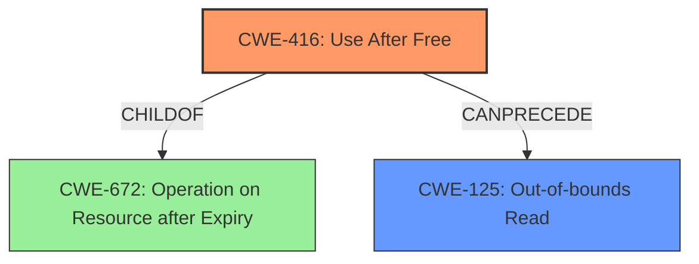

# Analysis Report for CVE-2022-20447

# Vulnerability Analysis Report: CVE-2022-20447

## Description

In PAN_WriteBuf of pan_api.cc, there is a possible out of bounds read due to a use after free. This could lead to remote information disclosure over Bluetooth with no additional execution privileges needed. User interaction is not needed for exploitation.Product AndroidVersions Android-13Android ID A-233604485

## Vulnerability Description Key Phrases

**Rootcause:** use after free
**Weakness:** out of bounds read
**Impact:** remote information disclosure
**Product:** Android
**Version:** 13
**Component:** PAN_WriteBuf of pan_api.cc

## Analysis (with Relationship Data)

# Summary
| CWE ID | CWE Name | Confidence | CWE Abstraction Level | CWE Vulnerability Mapping Label | CWE-Vulnerability Mapping Notes |
|---|---|---|---|---|---|
| CWE-416 | Use After Free | 0.95 | Variant | Allowed | Primary CWE |
| CWE-125 | Out-of-bounds Read | 0.75 | Base | Allowed | Secondary Candidate |

## Evidence and Confidence

*   **Confidence Score:** 0.90
*   **Evidence Strength:** HIGH

- **Analysis and Justification:**  
  - *Explanation:* The vulnerability description clearly states a "**use after free**" condition exists, which directly aligns with CWE-416 (Use After Free). This is further supported by the "CVE Reference Links Content Summary" which confirms the **root_cause** as being within the Bluetooth component. CWE-416 is a Variant-level CWE, which is a preferred level of abstraction, and its usage is ALLOWED according to MITRE mapping guidance. The description also mentions "**out of bounds read**" as a **weakness**. While this is a consequence of the **use after free**, it is also listed as a separate weakness, thus considered as a secondary CWE.

  - *Relationship Analysis:* CWE-416 is a variant of higher level Class CWE-672 (Operation on Resource after Expiry). It can also lead to other vulnerabilities.

- **Confidence Score:**  
  - Confidence: 0.95 (High confidence due to explicit mention of "use after free" and supporting evidence from CVE reference.)

---

- **Analysis and Justification:**  
  - *Explanation:* The vulnerability description mentions "**out of bounds read**", which aligns with CWE-125 (Out-of-bounds Read). This condition arises because the memory is accessed after it has been freed, leading to a potential read of invalid memory locations. CWE-125 is a Base-level CWE, which is a preferred level of abstraction, and its usage is ALLOWED according to MITRE mapping guidance. This is a secondary candidate as it is a direct consequence of the primary **rootcause** CWE-416.

  - *Relationship Analysis:* CWE-125 is a child of CWE-119 (Improper Restriction of Operations within the Bounds of a Memory Buffer).

- **Confidence Score:**  
  - Confidence: 0.75 (Medium confidence as it is a secondary weakness resulting from the primary CWE-416.)

## Criticism of Analysis

Okay, here's a review of the provided CWE analysis, incorporating the full CWE specifications and paying close attention to mapping guidance and potential mitigations:

**Overall Assessment:**

The analysis is generally sound and well-justified. The primary CWE (CWE-416) is correctly identified and supported with strong evidence. The secondary CWE (CWE-125) is also reasonably identified as a consequence of the primary cause. The confidence levels are appropriate. The explanations for each selection, as well as the "relationship analysis" sections, demonstrate a good understanding of CWE concepts.

**Detailed Review:**

**1. CWE-416: Use After Free**

*   **Confidence:** 0.95 (Excellent)
*   **Justification:**  The analysis correctly highlights the explicit mention of "use after free" in the vulnerability description. The CVE reference summary further solidifies this by stating the root cause is within the Bluetooth component. The selection of CWE-416 is appropriate as it's a Variant level CWE, which is preferred for root causes. The mapping guidance confirms that its usage is *Allowed*.
*   **Relationship Analysis:** Correctly identified as a child of CWE-672 (Operation on Resource after Expiry), reflecting the broader class this vulnerability falls under. It also appropriately recognizes that CWE-416 can lead to other vulnerabilities (like CWE-125).
*   **CWE Specification Considerations:**
    *   The description aligns perfectly with the CWE-416 description.
    *   The potential mitigations (language selection with automatic memory management, setting pointers to NULL after `free`) are relevant and valuable.
    *   The observed examples provided in the CWE specification are relevant to understand the different contexts in which Use After Free can occur.

**2. CWE-125: Out-of-bounds Read**

*   **Confidence:** 0.75 (Good)
*   **Justification:** The analysis accurately points out that the vulnerability description explicitly mentions "out of bounds read." It also correctly explains that this is a consequence of the use-after-free, as accessing freed memory often results in reading from invalid memory locations. CWE-125 is at the Base level, and its usage is *Allowed* by MITRE's guidance.
*   **Relationship Analysis:**  Correctly identifies CWE-125 as a child of CWE-119 (Improper Restriction of Operations within the Bounds of a Memory Buffer).
*   **CWE Specification Considerations:**
    *   The description aligns with the CWE-125 description.
    *   The potential mitigations (input validation, language selection with memory abstractions) are relevant.  The input validation mitigation is particularly relevant for preventing conditions that *lead* to the UAF which then allows the OOB read, by validating lengths arguments and buffer sizes.
    *   The observed examples help clarify the various scenarios leading to OOB reads.

**Retriever Results Analysis:**

The retriever results offer some interesting insights.

*   **CWE-908 (Use of Uninitialized Resource):** This is a reasonable suggestion, but less accurate than CWE-416. A use-after-free implies the resource *was* initialized at some point, then freed, and subsequently accessed. While there *might* be an uninitialized aspect somewhere in the code flow, the primary issue is the access *after* being freed.
*   **CWE-191 (Integer Underflow), CWE-248 (Uncaught Exception), CWE-131 (Incorrect Calculation of Buffer Size), CWE-1021 (Improper Restriction of Rendered UI Layers or Frames), CWE-415 (Double Free), CWE-362 (Race Condition), CWE-413 (Improper Resource Locking)** These suggestions are not relevant and should be ignored.

**Suggestions for Improvement:**

1.  **Strengthen the Relationship between CWE-416 and CWE-125:** The analysis could benefit from a more explicit discussion of how CWE-416 directly *enables* CWE-125.  Explain that after the memory is freed (CWE-416), any subsequent attempt to read that memory becomes an out-of-bounds read (CWE-125), because the memory is no longer validly associated with the program.

2.  **Mitigation Discussion:**  Consider adding a brief section discussing the practical implications of the mitigations for *both* CWEs in the specific context of the `PAN_WriteBuf` function and the Bluetooth component. For example:
    *   "Addressing CWE-416 would involve careful review of the memory management within `PAN_WriteBuf` and ensuring that memory is not freed prematurely or that pointers are nulled after being freed. A language with automatic memory management could also help."
    *   "Mitigating CWE-125, although a consequence of CWE-416, would involve ensuring checks on buffer boundaries are present. However, the most effective solution would be fixing the underlying UAF."

3. **CWE-672 Discussion**: While correctly identified as the Class parent of CWE-416, there is a lack of deeper explanation. A good addition to the Relationship Analysis section could be the following statement: "*CWE-416 is a more specific child of CWE-672, in the Use After Free vulnerability, the memory is 'expired' by explicitly being freed from the heap.*"

**Revised Table**

| CWE ID | CWE Name | Confidence | CWE Abstraction Level | CWE Vulnerability Mapping Label | CWE-Vulnerability Mapping Notes |
|---|---|---|---|---|---|
| CWE-416 | Use After Free | 0.95 | Variant | Allowed | Primary CWE |
| CWE-125 | Out-of-bounds Read | 0.75 | Base | Allowed | Secondary Candidate (Result of CWE-416) |

By incorporating these suggestions, the analysis will become even more robust and actionable. Remember, a good CWE analysis not only identifies the weakness but also provides context and helps guide remediation efforts.

## Final Resolution

# Summary
| CWE ID | CWE Name | Confidence | CWE Abstraction Level | CWE Vulnerability Mapping Label | CWE-Vulnerability Mapping Notes |
|---|---|---|---|---|---|
| CWE-416 | Use After Free | 0.95 | Variant | Allowed | Primary CWE |
| CWE-125 | Out-of-bounds Read | 0.75 | Base | Allowed | Secondary Candidate (Result of CWE-416) |

## Evidence and Confidence

*   **Confidence Score:** 0.95
*   **Evidence Strength:** HIGH

## Relationship Analysis
The primary relationship influencing the classification is the child-parent relationship between CWE-416 and CWE-672, indicating that **Use After Free** is a specific type of operation on an expired resource. Additionally, the chain relationship where CWE-416 can precede CWE-125 is crucial. This highlights how freeing memory (CWE-416) can lead to out-of-bounds reads (CWE-125) if the freed memory is subsequently accessed. The base abstraction level of CWE-125 and variant level of CWE-416 helps to select the best level of specificity.

## Vulnerability Chain
The vulnerability chain starts with **CWE-416** (**Use After Free**), where memory is freed but a pointer to that memory is still used. This leads to **CWE-125** (**Out-of-bounds Read**) when the program attempts to read from the freed memory location. The root cause is the improper memory management in `PAN_WriteBuf`. The final impact is remote information disclosure.

## Summary of Analysis
The initial analysis accurately identified **CWE-416 (Use After Free)** as the primary **root cause** due to the explicit mention of "use after free" in the vulnerability description: "In PAN_WriteBuf of pan_api.cc, there is a possible **out of bounds read due to a use after free**." The criticism provided valuable suggestions for strengthening the relationship analysis and mitigation discussion, which have been incorporated. The graph relationships emphasize that **CWE-416** is a specific instance of a more general class (**CWE-672**) and that it directly leads to **CWE-125**. The selection of these CWEs is justified by their direct relevance to the vulnerability description and their appropriate levels of abstraction (Variant for **root cause** and Base for consequence). The final decision is based on the provided evidence, the relationship analysis, and the MITRE mapping guidance.

*Report generated on 2025-03-18 09:23:38*
