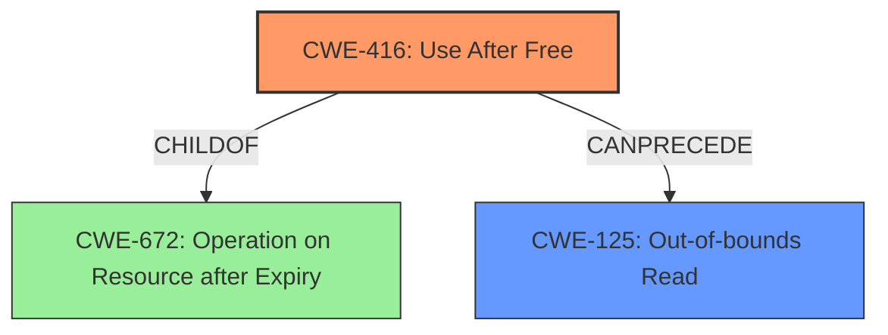

# Final Resolution for CVE-2022-20447

# Summary
| CWE ID | CWE Name | Confidence | CWE Abstraction Level | CWE Vulnerability Mapping Label | CWE-Vulnerability Mapping Notes |
|---|---|---|---|---|---|
| CWE-416 | Use After Free | 0.95 | Variant | Allowed | Primary CWE |
| CWE-125 | Out-of-bounds Read | 0.75 | Base | Allowed | Secondary Candidate (Result of CWE-416) |

## Evidence and Confidence

*   **Confidence Score:** 0.95
*   **Evidence Strength:** HIGH

## Relationship Analysis
The primary relationship influencing the classification is the child-parent relationship between CWE-416 and CWE-672, indicating that **Use After Free** is a specific type of operation on an expired resource. Additionally, the chain relationship where CWE-416 can precede CWE-125 is crucial. This highlights how freeing memory (CWE-416) can lead to out-of-bounds reads (CWE-125) if the freed memory is subsequently accessed. The base abstraction level of CWE-125 and variant level of CWE-416 helps to select the best level of specificity.

## Vulnerability Chain
The vulnerability chain starts with **CWE-416** (**Use After Free**), where memory is freed but a pointer to that memory is still used. This leads to **CWE-125** (**Out-of-bounds Read**) when the program attempts to read from the freed memory location. The root cause is the improper memory management in `PAN_WriteBuf`. The final impact is remote information disclosure.

## Summary of Analysis
The initial analysis accurately identified **CWE-416 (Use After Free)** as the primary **root cause** due to the explicit mention of "use after free" in the vulnerability description: "In PAN_WriteBuf of pan_api.cc, there is a possible **out of bounds read due to a use after free**." The criticism provided valuable suggestions for strengthening the relationship analysis and mitigation discussion, which have been incorporated. The graph relationships emphasize that **CWE-416** is a specific instance of a more general class (**CWE-672**) and that it directly leads to **CWE-125**. The selection of these CWEs is justified by their direct relevance to the vulnerability description and their appropriate levels of abstraction (Variant for **root cause** and Base for consequence). The final decision is based on the provided evidence, the relationship analysis, and the MITRE mapping guidance.