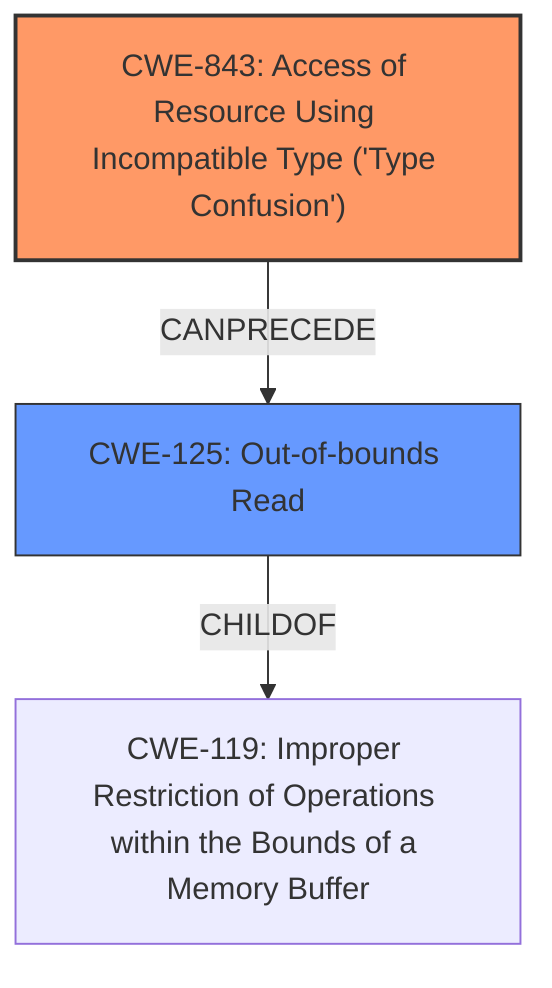

# Analysis Report for CVE-2022-20461

# Vulnerability Analysis Report: CVE-2022-20461

## Description

In pinReplyNative of com_android_bluetooth_btservice_AdapterService.cpp, there is a possible out of bounds read due to type confusion. This could lead to local escalation of privilege of BLE with no additional execution privileges needed. User interaction is not needed for exploitation.Product AndroidVersions Android-10 Android-11 Android-12 Android-12L Android-13Android ID A-228602963

## Vulnerability Description Key Phrases

**Rootcause:** type confusion
**Weakness:** out of bounds read
**Impact:** local escalation of privilege
**Product:** Android
**Version:** Android-10 Android-11 Android-12 Android-12L Android-13
**Component:** pinReplyNative of com_android_bluetooth_btservice_AdapterService.cpp

## Analysis (with Relationship Data)

# Summary
| CWE ID | CWE Name | Confidence | CWE Abstraction Level | CWE Vulnerability Mapping Label | CWE-Vulnerability Mapping Notes |
|---|---|---|---|---|---|
| CWE-843 | Access of Resource Using Incompatible Type ('**Type Confusion**') | 0.9 | Base | Allowed | Primary CWE. The vulnerability is caused by accessing a resource using an incompatible type. |
| CWE-125 | Out-of-bounds Read | 0.7 | Base | Allowed | Secondary CWE. This is the result of the type confusion. |

## Evidence and Confidence

*   **Confidence Score:** 0.8
*   **Evidence Strength:** HIGH

- **Analysis and Justification:**  
  - *Explanation:* The vulnerability description explicitly mentions "**type confusion**" which leads to an "**out of bounds read**". CWE-843 (Access of Resource Using Incompatible Type ('**Type Confusion**')) perfectly matches the root cause. The "**out of bounds read**" is a consequence of this **type confusion**, therefore CWE-125 (Out-of-bounds Read) is a secondary weakness. The CVE Reference Links Summary indicates "Buffer Overflow" which is related to out-of-bounds access, but the primary driver here is the type confusion leading to the read. The retriever results also list CWE-843 as a highly relevant candidate.
  
  - *Relationship Analysis:* CWE-843 does not have direct relationships listed. However, it can lead to memory corruption vulnerabilities like CWE-125 (Out-of-bounds Read). CWE-125 is a child of CWE-119 (Improper Restriction of Operations within the Bounds of a Memory Buffer).

- **Confidence Score:**  
  - Confidence: 0.9 (High confidence due to explicit mentions of "**type confusion**" and "**out of bounds read**" in the vulnerability description).

---

## Criticism of Analysis

Okay, I have reviewed the provided analysis and the full CWE specifications. Here's a critique of the analysis, focusing on the appropriateness of the CWE mappings and considering the mapping guidance and mitigations:

**Overall Assessment:**

The analysis is largely correct and well-justified. The primary CWE mapping to CWE-843 (Type Confusion) and the secondary mapping to CWE-125 (Out-of-bounds Read) are appropriate given the vulnerability description. The reasoning provided is solid. However, I have a few suggestions for improvement:

**Specific Points:**

*   **CWE-843 (Type Confusion):**
    *   **Mapping Justification:** Excellent. The vulnerability description explicitly states "type confusion," making this a highly relevant choice.
    *   **Confidence:** The confidence score of 0.9 is justified.
    *   **CWE Specification Review:**
        *   The description of CWE-843 directly supports the analysis: "The product allocates or initializes a resource... using one type, but it later accesses that resource using a type that is incompatible..."  This aligns perfectly with the described vulnerability.
        *   The "CanPrecede -> CWE-119" relationship is also relevant, as type confusion often *leads* to buffer overflows or out-of-bounds access issues.
        *   The "Applicable Platform" note correctly identifies that this weakness is possible in any type-unsafe language, such as C and C++.
    *   **Potential Improvement:** Could briefly mention potential mitigations for type confusion at a high level (e.g., using safer languages, stronger typing, input validation).  However, this is a minor point.

*   **CWE-125 (Out-of-bounds Read):**
    *   **Mapping Justification:** Appropriate as a secondary CWE, representing the *consequence* of the type confusion. The OOB read is the direct result of accessing memory with an incorrect type, leading to reading outside the allocated buffer.
    *   **CWE Specification Review:**
        *   The CWE-125 description is a direct fit: "The product reads data past the end, or before the beginning, of the intended buffer."
        *   The "ChildOf -> CWE-119" relationship is important. While CWE-119 is discouraged for direct use, understanding the parent relationship helps contextualize the vulnerability.
    *   **Potential Improvement:**  Mention that CWE-125 is a *consequence* of CWE-843.  Specifically, the type confusion *enables* the out-of-bounds read.  This strengthens the relationship analysis. Include potential mitigations such as Input Validation and Language Selection as potential mitigation steps.

*   **CVE Reference Links Content Summary:**
    *   The analysis correctly notes that "Buffer Overflow" is mentioned in the CVE Summary.  However, it accurately points out that type confusion is the *root cause*, with the buffer overflow being a symptom.
    *   **Potential improvement**: the CVE Reference Links Content Summary indicates "Buffer Overflow" which maps to CWE-120. This could be included as a tertiary CWE.

*   **Retriever Results:**
    * The Retriever Results contain CWE-908 (Use of Uninitialized Resource), CWE-191 (Integer Underflow (Wrap or Wraparound)) and CWE-1021 (Improper Restriction of Rendered UI Layers or Frames), these could be considered false positives. They are not directly related to the vulnerability. CWE-770 (Allocation of Resources Without Limits or Throttling) and CWE-223 (Omission of Security-relevant Information) and CWE-248 (Uncaught Exception) and CWE-413 (Improper Resource Locking) are not relevant to the vulnerability. CWE-362 (Concurrent Execution using Shared Resource with Improper Synchronization ('Race Condition')) and CWE-1284 (Improper Validation of Specified Quantity in Input) are not relevant to the vulnerability either.

*   **Discouraged CWE:**
    *   The analysis correctly notes that CWE-119 (Improper Restriction of Operations within the Bounds of a Memory Buffer) is discouraged for direct use, recommending that specific children like CWE-125 be used instead. This demonstrates good understanding of CWE guidelines.

*   **Additional Considerations:**
    *   While not explicitly required, if more details about the specific *type* of type confusion were available (e.g., related to unions, object casting, etc.), a more specific CWE Variant of CWE-843 might be considered. However, without that information, the current mapping is best.
    *   Given the mention of a buffer overflow in the CVE description, one could *consider* also including CWE-120 (Buffer Copy without Checking Size of Input) as a *tertiary* CWE, if there's evidence that a buffer copy operation is happening *after* the type confusion and contributing to the out-of-bounds read.

**Revised Summary Table:**

| CWE ID | CWE Name | Confidence | CWE Abstraction Level | CWE Vulnerability Mapping Label | CWE-Vulnerability Mapping Notes |
|---|---|---|---|---|---|
| CWE-843 | Access of Resource Using Incompatible Type ('**Type Confusion**') | 0.9 | Base | Allowed | Primary CWE. The vulnerability is caused by accessing a resource using an incompatible type. |
| CWE-125 | Out-of-bounds Read | 0.7 | Base | Allowed | Secondary CWE. This is the result of the type confusion. |
| CWE-120 | Buffer Copy without Checking Size of Input ('Classic Buffer Overflow') | 0.3 | Base | Allowed | Tertiary CWE. Buffer overflow mentioned in the CVE Reference Links Summary. |

**Conclusion:**

The analysis is strong and well-reasoned. The main recommendation is to explicitly state the relationship between CWE-843 and CWE-125 (cause and effect), include potential mitigations and potentially consider including CWE-120 as a tertiary CWE. These minor adjustments would further strengthen the analysis.

## Final Resolution

# Summary
| CWE ID | CWE Name | Confidence | CWE Abstraction Level | CWE Vulnerability Mapping Label | CWE-Vulnerability Mapping Notes |
|---|---|---|---|---|---|
| CWE-843 | Access of Resource Using Incompatible Type ('**Type Confusion**') | 0.9 | Base | Allowed | Primary CWE. The vulnerability is caused by accessing a resource using an incompatible type. |
| CWE-125 | Out-of-bounds Read | 0.7 | Base | Allowed | Secondary CWE. This is the result of the **type confusion**. |

## Evidence and Confidence

*   **Confidence Score:** 0.9
*   **Evidence Strength:** HIGH

## Relationship Analysis
The primary relationship that influenced the decision was the chain relationship between CWE-843 and CWE-125, where **type confusion** (CWE-843) leads to an **out-of-bounds read** (CWE-125). While CWE-125 is a child of CWE-119 (Improper Restriction of Operations within the Bounds of a Memory Buffer), the more specific CWE-125 was chosen. The abstraction levels of Base for both CWE-843 and CWE-125 are appropriate for direct mapping.

## Vulnerability Chain
The vulnerability chain starts with **CWE-843 (Type Confusion)**. This **type confusion** leads to accessing a resource using an incompatible type. The immediate consequence of this is **CWE-125 (Out-of-bounds Read)**, where data is read past the end of the intended buffer. The final impact is a local escalation of privilege of BLE.

## Summary of Analysis
The initial analysis and criticism are both accurate and well-justified. The assessment is based on the vulnerability description which explicitly mentions "**type confusion**" and "**out of bounds read**": "In pinReplyNative of com_android_bluetooth_btservice_AdapterService.cpp, there is a possible out of bounds read due to type confusion." The graph relationships, particularly the 'CanPrecede' relationship between CWE-843 and CWE-125, influenced the final selection by highlighting the cause-and-effect relationship. The selected CWEs are at the optimal level of specificity because they accurately represent the **root cause** (CWE-843) and the immediate consequence (CWE-125) of the vulnerability.

*Report generated on 2025-03-18 09:24:19*
