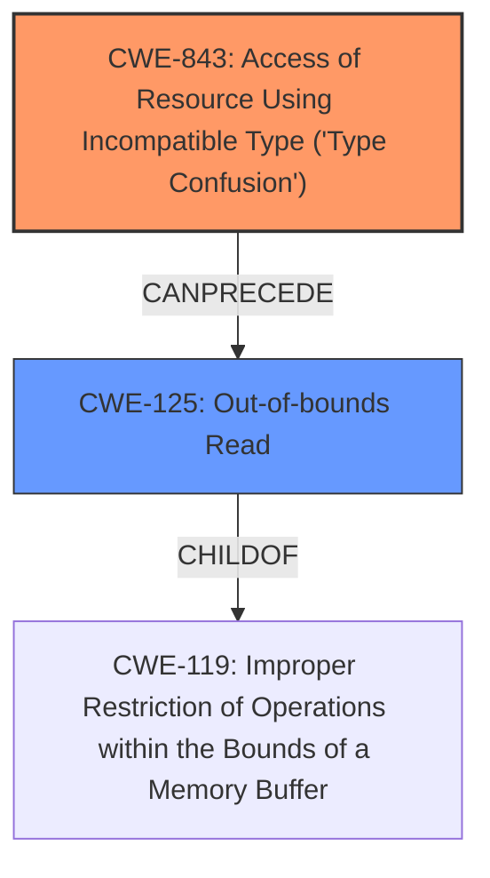

# Final Resolution for CVE-2022-20461

# Summary
| CWE ID | CWE Name | Confidence | CWE Abstraction Level | CWE Vulnerability Mapping Label | CWE-Vulnerability Mapping Notes |
|---|---|---|---|---|---|
| CWE-843 | Access of Resource Using Incompatible Type ('**Type Confusion**') | 0.9 | Base | Allowed | Primary CWE. The vulnerability is caused by accessing a resource using an incompatible type. |
| CWE-125 | Out-of-bounds Read | 0.7 | Base | Allowed | Secondary CWE. This is the result of the **type confusion**. |

## Evidence and Confidence

*   **Confidence Score:** 0.9
*   **Evidence Strength:** HIGH

## Relationship Analysis
The primary relationship that influenced the decision was the chain relationship between CWE-843 and CWE-125, where **type confusion** (CWE-843) leads to an **out-of-bounds read** (CWE-125). While CWE-125 is a child of CWE-119 (Improper Restriction of Operations within the Bounds of a Memory Buffer), the more specific CWE-125 was chosen. The abstraction levels of Base for both CWE-843 and CWE-125 are appropriate for direct mapping.

## Vulnerability Chain
The vulnerability chain starts with **CWE-843 (Type Confusion)**. This **type confusion** leads to accessing a resource using an incompatible type. The immediate consequence of this is **CWE-125 (Out-of-bounds Read)**, where data is read past the end of the intended buffer. The final impact is a local escalation of privilege of BLE.

## Summary of Analysis
The initial analysis and criticism are both accurate and well-justified. The assessment is based on the vulnerability description which explicitly mentions "**type confusion**" and "**out of bounds read**": "In pinReplyNative of com_android_bluetooth_btservice_AdapterService.cpp, there is a possible out of bounds read due to type confusion." The graph relationships, particularly the 'CanPrecede' relationship between CWE-843 and CWE-125, influenced the final selection by highlighting the cause-and-effect relationship. The selected CWEs are at the optimal level of specificity because they accurately represent the **root cause** (CWE-843) and the immediate consequence (CWE-125) of the vulnerability.