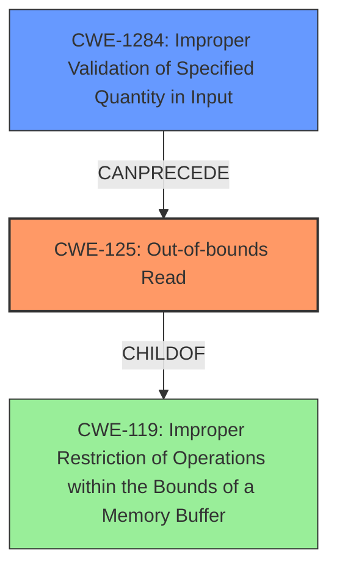

# Final Resolution for CVE-2022-20513

# Summary
| CWE ID | CWE Name | Confidence | CWE Abstraction Level | CWE Vulnerability Mapping Label | CWE-Vulnerability Mapping Notes |
|---|---|---|---|---|---|
| CWE-125 | Out-of-bounds Read | 1.0 | Base | Allowed | Primary CWE: The vulnerability is explicitly described as an **out-of-bounds read**. |
| CWE-1284 | Improper Validation of Specified Quantity in Input | 0.7 | Base | Allowed | Secondary Candidate: The **missing bounds check** implies a failure to validate the input quantity, which leads to the **out-of-bounds read**. |

## Evidence and Confidence

*   **Confidence Score:** 0.9
*   **Evidence Strength:** HIGH

## Relationship Analysis
The primary relationship is that CWE-1284 (Improper Validation of Specified Quantity in Input) can precede CWE-125 (Out-of-bounds Read). The **missing bounds check** (CWE-1284) allows the program to read beyond the intended buffer (CWE-125). CWE-125 is a child of the more general CWE-119 (Improper Restriction of Operations within the Bounds of a Memory Buffer).

## Vulnerability Chain
The vulnerability chain starts with **Improper Validation of Specified Quantity in Input (CWE-1284)**, specifically a **missing bounds check**. This leads to an **Out-of-bounds Read (CWE-125)**, resulting in local information disclosure.

## Summary of Analysis
The initial analysis and the criticism are both aligned in identifying CWE-125 as the primary **weakness** due to the explicit description of an **out-of-bounds read**. The **root cause** is correctly identified as a **missing bounds check**, which aligns with CWE-1284. The evidence provided in the vulnerability description ("**out of bounds read** due to a **missing bounds check**") strongly supports this classification. The graph relationships show that CWE-1284 can precede CWE-125, indicating that the input validation failure enables the out-of-bounds read. Both CWEs are at the Base level of abstraction, providing optimal specificity. The analysis focuses on the most relevant CWEs supported by clear evidence from the description. Including CWE-119 is more general and less specific than CWE-125, so using CWE-125 is a better decision. Therefore, the final decision is to classify this vulnerability as CWE-125 (Primary) and CWE-1284 (Secondary).