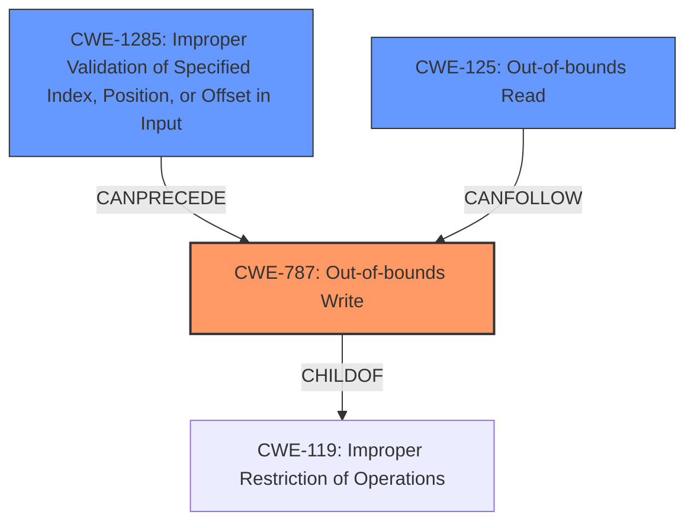

# Final Resolution for CVE-2022-20542

# Summary
| CWE ID | CWE Name | Confidence | CWE Abstraction Level | CWE Vulnerability Mapping Label | CWE-Vulnerability Mapping Notes |
|---|---|---|---|---|---|
| CWE-787 | Out-of-bounds Write | 0.95 | Base | Allowed | Primary CWE. Missing bounds check allows writing past the end of the allocated buffer. |
| CWE-1285 | Improper Validation of Specified Index, Position, or Offset in Input | 0.7 | Base | Allowed | Secondary Candidate CWE. The missing bounds check is a failure to validate the index/offset before writing to the buffer. |
| CWE-125 | Out-of-bounds Read | 0.6 | Base | Allowed | Secondary Candidate CWE. Out-of-bounds read may result from an out-of-bounds write. |

## Evidence and Confidence

*   **Confidence Score:** 0.9
*   **Evidence Strength:** HIGH

## Relationship Analysis
The primary CWE is CWE-787 (**Out-of-bounds Write**). This CWE is a base level weakness and a child of CWE-119 (**Improper Restriction of Operations within the Bounds of a Memory Buffer**). CWE-1285 (**Improper Validation of Specified Index, Position, or Offset in Input**) is a secondary candidate because the root cause is a missing bounds check, which is a type of input validation. CWE-125 (**Out-of-bounds Read**) is included as a secondary candidate because the CVE summary mentions an out-of-bounds read.

## Vulnerability Chain
The vulnerability chain starts with a **missing bounds check** (CWE-1285). This allows an attacker to potentially control the index or offset used to write data to a buffer. Because there is no validation of the index or offset, the write operation can occur outside the intended boundaries of the buffer, resulting in an **out-of-bounds write** (CWE-787). This can then lead to an **out-of-bounds read** (CWE-125) and ultimately, "local escalation of privilege".

## Summary of Analysis
The initial analysis correctly identified CWE-787 (**Out-of-bounds Write**) as the primary weakness, supported by the statement "out of bounds write due to a missing bounds check". The criticism provided valuable suggestions, which have been incorporated into this final analysis. Specifically, the role of a missing bounds check and how it relates to CWE-1285 (**Improper Validation of Specified Index, Position, or Offset in Input**) has been strengthened. The possibility of an out-of-bounds read resulting from the write has also been clarified, reinforcing the inclusion of CWE-125 (**Out-of-bounds Read**) as a secondary candidate.

The graph relationships, particularly the CANPRECEDE relationship between CWE-1285 and CWE-787, and the CANFOLLOW relationship between CWE-787 and CWE-125, helped to refine the vulnerability chain analysis. The base level abstraction of CWE-787 and CWE-1285 is optimal, as they represent the specific root cause and impact of the vulnerability.

The final decision is based on the provided evidence and the relationship analysis. The selected CWEs are at the optimal level of specificity, providing a clear and accurate representation of the vulnerability.