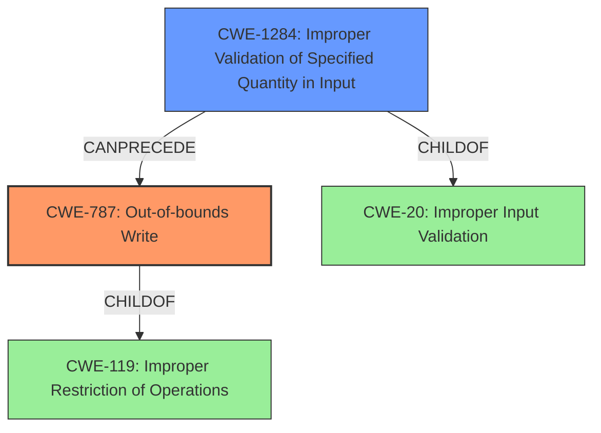

# Final Resolution for CVE-2022-20569

# Summary
| CWE ID | CWE Name | Confidence | CWE Abstraction Level | CWE Vulnerability Mapping Label | CWE-Vulnerability Mapping Notes |
|---|---|---|---|---|---|
| CWE-787 | Out-of-bounds Write | 0.95 | Base | Allowed | Primary CWE |
| CWE-1284 | Improper Validation of Specified Quantity in Input | 0.75 | Base | Allowed | Secondary Candidate CWE |

## Evidence and Confidence

*   **Confidence Score:** 0.93
*   **Evidence Strength:** HIGH

## Relationship Analysis
The primary relationship influencing my decision is the parent-child relationship between CWE-119 (Improper Restriction of Operations within the Bounds of a Memory Buffer) and CWE-787 (**Out-of-bounds Write**). While CWE-119 is a parent, CWE-787 is more specific and directly aligns with the vulnerability description. I also considered the chain relationship where **improper input validation** (CWE-1284) can precede **out-of-bounds write** (CWE-787). CWE-1284 is also a child of CWE-20 (**Improper Input Validation**), but using CWE-1284 provides more granularity. The abstraction levels (Base for CWE-787 and CWE-1284) are appropriate for vulnerability mapping.

## Vulnerability Chain
The vulnerability chain starts with **improper input validation** (CWE-1284) leading to an **out-of-bounds write** (CWE-787).
  - The root cause is the failure to properly validate the size or quantity of input.
  - The weakness is the out-of-bounds write, which can overwrite adjacent memory regions.
  - The impact is a potential escalation of privilege.

## Summary of Analysis
I agree with the initial analysis and the criticism. The vulnerability description clearly indicates an **out-of-bounds write** due to **improper input validation**: "In thermal_cooling_device_stats_update of thermal_sysfs.c, there is a possible out of bounds write due to improper input validation." I am slightly increasing the confidence in CWE-1284 and removing CWE-1285. The vulnerability description mentions "thermal_cooling_device_stats_update" which is more indicative of a quantity (stats) rather than an index/offset. Therefore, CWE-1284 is a slightly better fit than CWE-1285.
My selected CWEs are at the optimal level of specificity because they directly address the **weakness** (CWE-787) and the root cause (CWE-1284) described in the vulnerability.