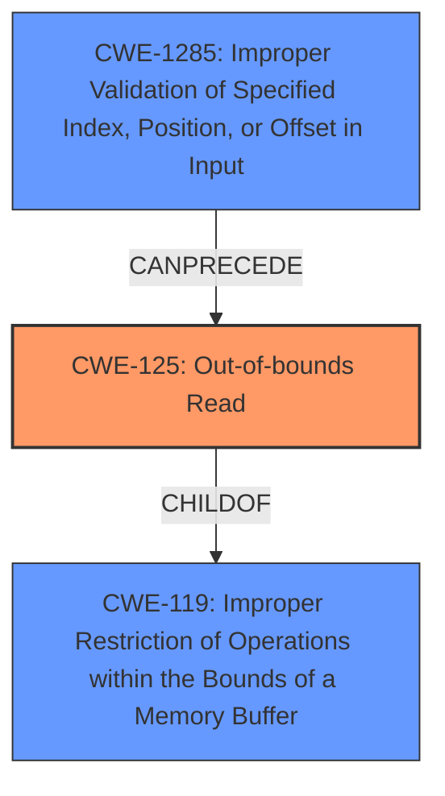

# Final Resolution for CVE-2022-20574

# Summary
| CWE ID | CWE Name | Confidence | CWE Abstraction Level | CWE Vulnerability Mapping Label | CWE-Vulnerability Mapping Notes |
|---|---|---|---|---|---|
| CWE-125 | Out-of-bounds Read | 0.95 | Base | Allowed | Primary CWE. The product reads data past the end of the intended buffer due to improper index validation. |
| CWE-1285 | Improper Validation of Specified Index, Position, or Offset in Input | 0.85 | Base | Allowed | Secondary CWE. The product does not properly validate the index/offset used to access the buffer, leading to CWE-125. An "accept known good" input validation strategy could mitigate this.|

## Evidence and Confidence

*   **Confidence Score:** 0.95
*   **Evidence Strength:** HIGH

## Relationship Analysis
The analysis identifies CWE-125 as the primary issue, representing the **out-of-bounds read**. CWE-1285 is correctly identified as the secondary issue, representing the **improper validation** that leads to the **out-of-bounds read**. The relationship here is that CWE-1285 `CANPRECEDE` CWE-125. CWE-125 is a base level CWE and is a `CHILDOF` CWE-119 (Improper Restriction of Operations within the Bounds of a Memory Buffer).

## Vulnerability Chain
The vulnerability chain starts with **improper input validation (CWE-1285)**. The product does not properly validate the index/offset used to access the buffer. This leads to an **out-of-bounds read (CWE-125)**, where the product reads data past the end of the intended buffer. This results in **information disclosure**.

## Summary of Analysis
The initial analysis and criticism were both very strong. The vulnerability description clearly states an "**out of bounds read**" due to "**improper input validation**" in `sec_sysmmu_info` of `drm_fw.c`. This directly aligns with CWE-125 (Out-of-bounds Read), where the product reads data past the end or before the beginning of the intended buffer. The **improper input validation** suggests a failure to properly check the index or offset being used to access the buffer, making CWE-1285 (Improper Validation of Specified Index, Position, or Offset in Input) a contributing factor. CWE-125 is a Base level CWE and is ALLOWED according to MITRE's mapping guidance. The CVE Reference Links Content Summary also points to the root cause being within the LDFW component which contributes to Information Disclosure. The final decision remains with CWE-125 and CWE-1285 because they are the most specific and relevant CWEs based on the provided evidence. The relationship analysis further supports this decision, as CWE-1285 `CANPRECEDE` CWE-125. The "Potential Mitigations" from the CWE-1285 specification, specifically, "Assume all input is malicious. Use an "accept known good" input validation strategy" emphasizes the core problem. The CWEs selected are at the optimal level of specificity, as they are both Base level CWEs and accurately reflect the **root cause** and the resulting **weakness**.