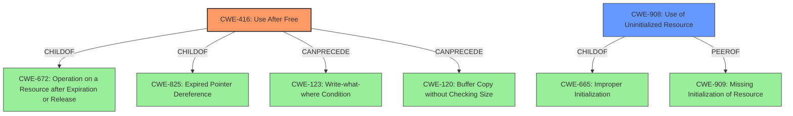

# Analysis Report for CVE-2022-20581

# Vulnerability Analysis Report: CVE-2022-20581

## Description

In the Pixel camera driver, there is a possible use after free due to a logic error in the code. This could lead to local escalation of privilege with System execution privileges needed. User interaction is not needed for exploitation.Product AndroidVersions Android kernelAndroid ID A-245916120References N/A

## Vulnerability Description Key Phrases

**Rootcause:** logic error
**Weakness:** use after free
**Impact:** local escalation of privilege
**Product:** Pixel camera driver

## Analysis (with Relationship Data)

# Summary
| CWE ID | CWE Name | Confidence | CWE Abstraction Level | CWE Vulnerability Mapping Label | CWE-Vulnerability Mapping Notes |
|---|---|---|---|---|---|
| CWE-416 | Use After Free | 0.9 | Variant | Allowed | Primary CWE |
| CWE-908 | Use of Uninitialized Resource | 0.4 | Base | Allowed | Secondary Candidate |

## Evidence and Confidence

*   **Confidence Score:** 0.9
*   **Evidence Strength:** HIGH

- **Analysis and Justification:**  
  - *Explanation:* The vulnerability description explicitly states a "**use after free**" condition due to a "**logic error**" in the Pixel camera driver. This aligns directly with CWE-416 (Use After Free), which describes the product reusing or referencing memory after it has been freed. The CVE Reference Links Content Summary also refers to "Elevation of Privilege (EoP) due to a vulnerability in the Pixel camera driver". CWE-416 is at the Variant level of abstraction, which is preferred, and its Usage is ALLOWED.

  - *Relationship Analysis:* While other CWEs are present in the Retriever Results, CWE-416 is the most direct and specific match to the vulnerability description. It is related to CWE-672 (Operation on a Resource after Expiration or Release), which is a parent class. CWE-416 can precede other weaknesses like CWE-123 (Write-what-where Condition) or CWE-120 (Buffer Copy without Checking Size of Input ('Classic Buffer Overflow')), indicating potential exploitation paths.

- **Confidence Score:**  
  - Confidence: 0.9 (High confidence due to the explicit mention of "use after free" in the vulnerability description and the high retriever score for CWE-416)

---

- **Analysis and Justification:**  
  - *Explanation:* CWE-908 (Use of Uninitialized Resource) is considered as a secondary candidate because a logic error may also lead to the use of an uninitialized resource before it's properly set. However, the primary issue is the use of already freed memory. The confidence is lower as there's no explicit statement about uninitialized resources but it's a possible scenario given a logic error. The CVE Reference Links Content Summary does not provide evidence.
  - *Relationship Analysis:* CWE-908 is a base level CWE and is a child of CWE-665 (Improper Initialization). It is added as a possible weakness due to the logic error.

- **Confidence Score:**  
  - *Example:* Confidence: 0.4 (Low evidence due to no explicit mention of resource initialization)

## Criticism of Analysis

Okay, here's a review of the analysis, considering the full CWE specifications provided:

**Overall Assessment:**

The analysis is generally good. It correctly identifies CWE-416 (Use After Free) as the primary weakness. The reasoning is sound and supported by the vulnerability description. The consideration of CWE-908 (Use of Uninitialized Resource) as a secondary candidate is reasonable, although its confidence score reflects the lack of direct evidence. The inclusion of relevant CWE examples and specifications is helpful.

**Specific Comments and Suggestions:**

*   **CWE-416: Use After Free (Primary)**

    *   **Strengths:**
        *   The identification of CWE-416 is accurate, given the explicit mention of "use after free" in the vulnerability description.
        *   The Confidence score of 0.9 is justified.
        *   The explanation clearly links the "logic error" to the potential for accessing memory after it has been freed.
        *   The relationship analysis is accurate and helpful, noting the parent class (CWE-672) and potential subsequent weaknesses like CWE-120 or CWE-123.
    *   **Potential Improvements:**
        *   While the analysis mentions the relationship to CWE-672 (Operation on a Resource after Expiration or Release), it could also briefly mention the relationship to **CWE-825: Expired Pointer Dereference** since Use-After-Free is a child of that. This could just be a sentence.
        *   Consider adding a brief sentence about the potential attack vectors. The "CVE Reference Links Content Summary" says: "The vulnerability is present within the Pixel camera driver, suggesting that an attacker would need to find a way to interact with the driver with specially crafted input." This could lead to a more precise identification of the attack vector.
        *   Include the mitigations mentioned in the full CWE specifications. Specifically, point out the mitigation of setting freed pointers to NULL if applicable for the specific case or for defense-in-depth.
        *   While out of scope, pointing out language selection or architecture design for automatic memory management is not directly helpful for fixing the vulnerability, it's a general best practice.

*   **CWE-908: Use of Uninitialized Resource (Secondary Candidate)**

    *   **Strengths:**
        *   Acknowledging this CWE as a secondary possibility is reasonable because a "logic error" *could* lead to the use of uninitialized resources, even if the main symptom is a UAF.
        *   The confidence score of 0.4 reflects the lower certainty.
    *   **Potential Improvements:**
        *   The analysis could be strengthened by hypothesizing *how* a logic error in the camera driver might lead to the use of an uninitialized resource.  For example: "A logic error in a conditional statement might skip the initialization of a buffer used to store image data."
        *   Consider mentioning that a missing initialization of resource CWE-909 is a parent of CWE-908, and may also be a root cause of the logic error.
        *   Consider mentioning the mitigations for this CWE, such as explicitly initializing the resource before use.
        *   Consider the impact of exploitation and the likelihood of this path compared to CWE-416.

*   **General Improvements:**
    *   **Retriever Results Prioritization:** The Retriever Results list a number of other CWEs. It would be beneficial to briefly explain *why* those CWEs were *not* chosen, even if it's just to say "CWE-413, CWE-415, and CWE-825 are related to memory management issues, but the explicit mention of 'use after free' makes CWE-416 the most relevant." Justifying the *absence* of a mapping can increase confidence in the chosen mappings.
    *   **CVE Examples:** While the provided example CVEs are helpful, consider if any of the listed CVEs specifically relate to camera drivers or similar embedded systems. This would give more context to the vulnerability.

*   **Minor Issues:**
    *   There are several instances of "ChildOf -> CWE-672" repeated in the relationships of CWE-416. These redundancies can be removed.
    *   In "Potential Mitigations for CWE-416", the "Mitigation 2" effectiveness is labelled "Defense in Depth" and "Strategy: Attack Surface Reduction", while this is factually correct, the mitigations are really aimed at *memory safety*. Consider adding this as a label.
    *   The usage guidance for CWE-20 is "Discouraged" - this is accurate, and the tool appropriately did not map to it.

**Revised Summary Table:**

| CWE ID | CWE Name | Confidence | CWE Abstraction Level | CWE Vulnerability Mapping Label | CWE-Vulnerability Mapping Notes |
|---|---|---|---|---|---|
| CWE-416 | Use After Free | 0.9 | Variant | Allowed | Primary CWE. Consider relationship to CWE-825 and CWE-672.  Mitigate by setting freed pointers to NULL.  Investigate attack vectors related to driver interaction with crafted inputs.|
| CWE-908 | Use of Uninitialized Resource | 0.4 | Base | Allowed | Secondary Candidate. Logic error may lead to uninitialized resource. Explicitly initialize resources before use. Also consider CWE-909 as the missing initialization might be the root cause of the logic error. |

**In summary:** This is a well-reasoned and accurate analysis. The suggestions above are primarily aimed at increasing confidence, clarifying the rationale, and ensuring that relevant mitigations are considered.

## Final Resolution

# Summary
| CWE ID | CWE Name | Confidence | CWE Abstraction Level | CWE Vulnerability Mapping Label | CWE-Vulnerability Mapping Notes |
|---|---|---|---|---|---|
| CWE-416 | Use After Free | 0.9 | Variant | Allowed | Primary CWE. Consider relationship to CWE-825 and CWE-672. Mitigate by setting freed pointers to NULL. Investigate attack vectors related to driver interaction with crafted inputs.|
| CWE-908 | Use of Uninitialized Resource | 0.4 | Base | Allowed | Secondary Candidate. Logic error may lead to uninitialized resource. Explicitly initialize resources before use. Also consider CWE-909 as the missing initialization might be the root cause of the logic error. |

## Evidence and Confidence

*   **Confidence Score:** 0.9
*   **Evidence Strength:** HIGH

## Relationship Analysis
The primary relationship that influenced the decision was the hierarchical relationship with CWE-416 (Use After Free) being a child of both CWE-672 (Operation on a Resource after Expiration or Release) and CWE-825 (Expired Pointer Dereference). This hierarchy confirms that CWE-416 is an appropriate level of specificity. The CanPrecede relationships of CWE-416 to CWE-123 (Write-what-where Condition) and CWE-120 (Buffer Copy without Checking Size) also helped to show the potential vulnerability chain. While CWE-908 (Use of Uninitialized Resource) was considered, its lack of explicit mention in the vulnerability description kept it as a secondary concern. The base abstraction level of CWE-908 and the variant level of CWE-416 both align with preferred levels of abstraction for vulnerability mapping.

## Vulnerability Chain
The vulnerability chain starts with a **logic error** in the Pixel camera driver code. This **logic error** leads to a **CWE-416 (Use After Free)**, where memory is accessed after it has been freed. This **use after free** can then lead to other weaknesses such as **CWE-123 (Write-what-where Condition)** or **CWE-120 (Buffer Copy without Checking Size)**, ultimately leading to local escalation of privilege with System execution privileges. A possible secondary path is the **logic error** results in **CWE-908 (Use of Uninitialized Resource)**.

## Summary of Analysis
The initial analysis correctly identified **CWE-416 (Use After Free)** as the primary weakness based on the explicit mention of "use after free" in the vulnerability description: "In the Pixel camera driver, there is a possible **use after free** due to a **logic error** in the code." The retriever score for CWE-416 was also high, supporting this classification. The criticism suggested considering the relationship to **CWE-825 (Expired Pointer Dereference)**, which is a parent of **CWE-416 (Use After Free)** which has been incorporated. The criticism also suggested mitigating the vulnerability by setting freed pointers to NULL, which is a common mitigation technique for **use-after-free** vulnerabilities. The analysis also considered **CWE-908 (Use of Uninitialized Resource)** as a secondary candidate, given that the **logic error** could also lead to the use of an uninitialized resource. The suggestion to consider **CWE-909 (Missing Initialization of Resource)** as the root cause of the logic error has also been considered and added to the notes for **CWE-908 (Use of Uninitialized Resource)**. The selected CWEs are at the optimal level of specificity, with **CWE-416 (Use After Free)** being a Variant and **CWE-908 (Use of Uninitialized Resource)** being a Base CWE. The analysis is based on the provided evidence, relationship analysis, and mapping guidance.

*Report generated on 2025-03-18 09:33:08*
