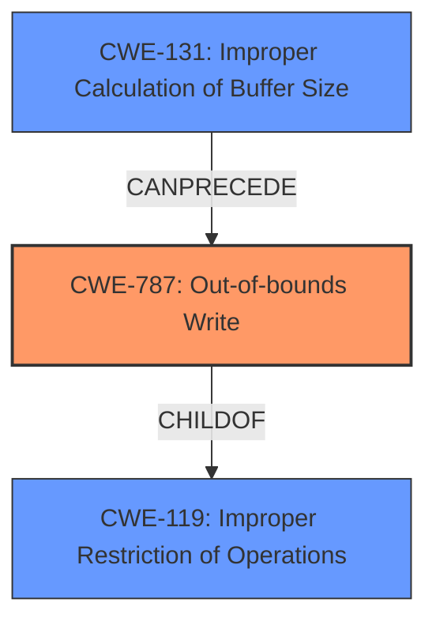

# Final Resolution for CVE-2022-20600

# Summary
| CWE ID | CWE Name | Confidence | CWE Abstraction Level | CWE Vulnerability Mapping Label | CWE-Vulnerability Mapping Notes |
|---|---|---|---|---|---|
| CWE-787 | Out-of-bounds Write | 0.9 | Base | Primary | ALLOWED |
| CWE-131 | Improper Calculation of Buffer Size | 0.5 | Base | Secondary | ALLOWED |

## Evidence and Confidence

*   **Confidence Score:** 0.7
*   **Evidence Strength:** MEDIUM

## Relationship Analysis
The primary weakness is **CWE-787 (Out-of-bounds Write)**. While the initial analysis only considered **CWE-119 (Improper Restriction of Operations within the Bounds of a Memory Buffer)** as a secondary CWE, the criticism suggested considering potential chains involving input validation (**CWE-20**), calculation errors (**CWE-131**, **CWE-190**, **CWE-191**), or resource management issues (**CWE-416**, **CWE-908**). Given the information "Improper input validation in the LWIS component", I am adding **CWE-131 (Improper Calculation of Buffer Size)** as a secondary issue. This represents a potential root cause that can lead to the **out-of-bounds write** as a consequence.

## Vulnerability Chain
The vulnerability chain starts with "Improper input validation in the LWIS component" which can result in an **improper calculation of a buffer size (CWE-131)**. This leads to an **out-of-bounds write (CWE-787)** due to memory corruption, ultimately allowing for local escalation of privilege.

## Summary of Analysis
The initial analysis correctly identified **CWE-787 (Out-of-bounds Write)** as the primary weakness. However, the additional context from the CVE summary, "Improper input validation in the LWIS component" suggests a possible root cause that needs to be included. I have included **CWE-131 (Improper Calculation of Buffer Size)** as a secondary weakness, indicating that an error in calculating the buffer size likely contributed to the **out-of-bounds write**. This adds more specificity to the classification and provides a clearer picture of how the vulnerability arises. My overall confidence is 0.7 because while the **out-of-bounds write** is explicit, the chain leading to it is inferred from the CVE summary.