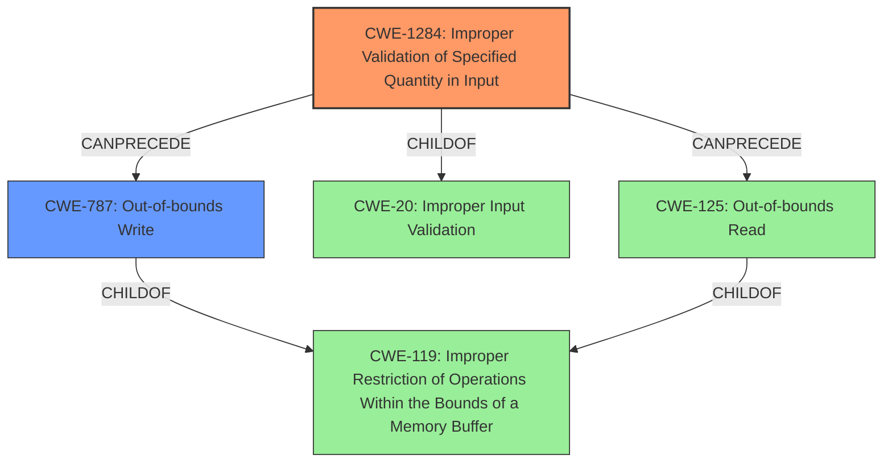

# Final Resolution for CVE-2022-20689

# Summary
| CWE ID | CWE Name | Confidence | CWE Abstraction Level | CWE Vulnerability Mapping Label | CWE-Vulnerability Mapping Notes |
|---|---|---|---|---|---|
| CWE-1284 | Improper Validation of Specified Quantity in Input | 0.95 | Base | Primary | Allowed |
| CWE-787 | Out-of-bounds Write | 0.8 | Base | Secondary | Allowed |

## Evidence and Confidence

*   **Confidence Score:** 0.9
*   **Evidence Strength:** HIGH

## Relationship Analysis
The primary weakness is **CWE-1284 (Improper Validation of Specified Quantity in Input)**, which is a base-level CWE and a child of **CWE-20 (Improper Input Validation)**. We chose CWE-1284 because it is more specific to the vulnerability description, that clearly shows "**missing length validation checks** when processing Cisco Discovery Protocol messages." The secondary weakness is **CWE-787 (Out-of-bounds Write)**, which represents the memory corruption aspect, which stems from the **missing length validation**. While **CWE-125 (Out-of-bounds Read)** was originally considered, it does not fully cover the database memory corruption.

## Vulnerability Chain
The vulnerability chain starts with **CWE-1284 (Improper Validation of Specified Quantity in Input)**. Because of the **missing length validation checks**, an attacker can send a malicious CDP packet. This leads to an **CWE-787 (Out-of-bounds Write)** which causes corruption in the internal Cisco Discovery Protocol database of the affected device. The original analysis considered **CWE-125 (Out-of-bounds Read)**, but we are making a decision to change this to a write, as memory corruption is part of the description.

## Summary of Analysis
The initial analysis correctly identified **CWE-1284 (Improper Validation of Specified Quantity in Input)** as the primary **ROOTCAUSE**. The description explicitly mentions "**missing length validation checks** when processing Cisco Discovery Protocol messages". However, the description also mentions, "corruption in the internal Cisco Discovery Protocol database of the affected device", which implies a write operation. Therefore, we are changing the secondary weakness from **CWE-125 (Out-of-bounds Read)** to **CWE-787 (Out-of-bounds Write)**. This is the optimal level of specificity and aligns with the evidence from the vulnerability description.