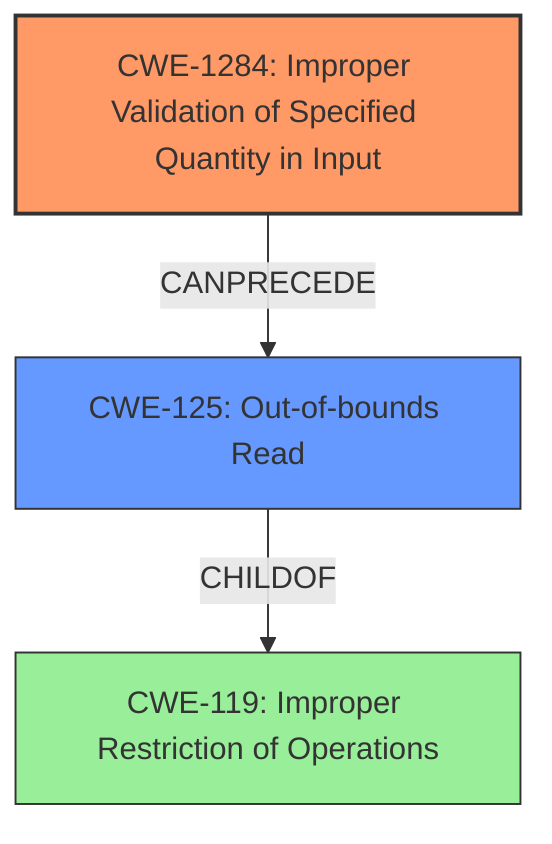

# Analysis Report for CVE-2022-20690

# Vulnerability Analysis Report: CVE-2022-20690

## Description

Multiple vulnerabilities in the Cisco Discovery Protocol functionality of Cisco ATA 190 Series Analog Telephone Adapter firmware could allow an unauthenticated, adjacent attacker to cause Cisco Discovery Protocol memory corruption on an affected device. These vulnerabilities are due to missing length validation checks when processing Cisco Discovery Protocol messages. An attacker could exploit these vulnerabilities by sending a malicious Cisco Discovery Protocol packet to an affected device. A successful exploit could allow the attacker to cause an out-of-bounds read of the valid Cisco Discovery Protocol packet data, which could allow the attacker to cause corruption in the internal Cisco Discovery Protocol database of the affected device.

## Vulnerability Description Key Phrases

**Rootcause:** missing length validation checks
**Impact:** ['memory corruption', 'out-of-bounds read']
**Vector:** malicious Cisco Discovery Protocol packet
**Attacker:** unauthenticated adjacent attacker
**Product:** Cisco ATA 190 Series Analog Telephone Adapter
**Component:** Cisco Discovery Protocol functionality

## Analysis (with Relationship Data)

# Summary
| CWE ID    | CWE Name                                               | Confidence | CWE Abstraction Level | CWE Vulnerability Mapping Label | CWE-Vulnerability Mapping Notes |
| :--------- | :----------------------------------------------------- | :--------- | :-------------------- | :------------------------------ | :------------------------------ |
| CWE-1284  | Improper Validation of Specified Quantity in Input    | 0.90       | Base                  | Allowed                         | Primary CWE                     |
| CWE-125   | Out-of-bounds Read                                        | 0.75       | Base                  | Allowed                         | Secondary Candidate             |

## Evidence and Confidence

*   **Confidence Score:** 0.85
*   **Evidence Strength:** HIGH

- **Analysis and Justification:**
  - *Explanation:* The vulnerability is due to "**missing length validation checks** when processing Cisco Discovery Protocol (CDP) messages". This leads to an **improper validation of the specified quantity in input**, specifically the length of the CDP messages. This aligns directly with CWE-1284 (Improper Validation of Specified Quantity in Input), which is a Base level CWE and has an ALLOWED usage. The CVE Reference Links Content Summary confirms this as well, stating "**Missing Length Validation:** The software fails to properly validate the length of certain fields within CDP packets. This allows an attacker to send crafted packets with malformed lengths." The Retriever Results also shows CWE-1284 as the top match.
  - *Relationship Analysis:* CWE-1284 has no direct relationships. However, the impact described includes "**out-of-bounds read** of the valid Cisco Discovery Protocol packet data". This is a direct consequence of the **missing length validation** and maps to CWE-125 (Out-of-bounds Read).

- **Confidence Score:**
  - Confidence: 0.90 (High confidence due to direct evidence and matching CWE description and retriever results)

---
- **Analysis and Justification:**
  - *Explanation:* As a consequence of the "**missing length validation checks**", the vulnerability allows an attacker to cause an "**out-of-bounds read** of the valid Cisco Discovery Protocol packet data". This aligns with CWE-125 (Out-of-bounds Read). Although this is an impact of the **missing length validation**, it represents a distinct weakness that should be mapped. CWE-125 is a Base level CWE and has an ALLOWED usage.
  - *Relationship Analysis:* CWE-125 is a child of CWE-119 (Improper Restriction of Operations within the Bounds of a Memory Buffer), but since there is a specific out-of-bounds read, the more specific CWE-125 is more appropriate.

- **Confidence Score:**
  - *Example:* Confidence: 0.75 (Medium confidence because it is a consequence of the primary weakness.)

## Criticism of Analysis

## Critique of the CWE Analysis

Overall, the analysis is well-reasoned and provides a strong justification for the chosen CWE mappings. The inclusion of the full CWE specifications is excellent, as it allows for a more thorough and nuanced evaluation of the mappings. Here's a breakdown of the strengths and weaknesses of the analysis:

**Strengths:**

*   **Clear Justification:** The analysis provides clear and concise explanations for each CWE mapping, referencing specific phrases from the vulnerability description and CVE summary to support the chosen CWEs.
*   **Relationship Analysis:** The analysis goes beyond simply identifying relevant CWEs; it explores the relationships between them, acknowledging that CWE-125 (Out-of-bounds Read) is a *consequence* of CWE-1284 (Improper Validation of Specified Quantity in Input).
*   **Base Level Focus:** The primary focus on Base-level CWEs (CWE-1284 and CWE-125) aligns with CWE's mapping guidance, which encourages the use of more specific, root-cause-oriented CWEs whenever possible.
*   **High Confidence:** The confidence scores are appropriate, reflecting the level of certainty associated with each mapping.
*   **Consideration of Alternatives:** The analysis considers and rejects alternatives (e.g., CWE-119), explaining why the chosen CWEs are more appropriate.
*   **Retriever Results:** Inclusion of the retriever results is a great way to demonstrate that the tools are also suggesting similar CWEs.

**Areas for Potential Improvement:**

*   **Mitigations:** While the analysis is strong on CWE identification and justification, it could benefit from a brief mention of potential mitigations for the identified weaknesses. Referencing the "Potential Mitigations" sections within the CWE specifications would enhance the analysis.
*   **CWE-20 Consideration**: While the analysis correctly identifies and discards CWE-20 as a primary mapping, it could briefly discuss why, despite being a parent of CWE-1284, it's not the ideal choice. This would highlight the discouraged usage of CWE-20.
*   **CWE-770/CWE-789 Consideration**: Given that the exploitation could *lead to excessive resource allocation*, briefly considering CWE-770 (Allocation of Resources Without Limits or Throttling) and CWE-789 (Memory Allocation with Excessive Size Value) might be valuable, even if they are ultimately rejected as not being the *primary* weakness.
*   **CWE-119 Discouraged Usage**: The analysis could make a stronger argument against mapping to CWE-119, as the mapping guidance *discourages* its use when more specific CWEs are available.

**Specific Comments and Suggestions:**

*   **CWE-1284 (Improper Validation of Specified Quantity in Input):** The justification is very strong. The analysis correctly identifies the missing length validation as the root cause. The retriever results strongly support this mapping. No changes needed.
*   **CWE-125 (Out-of-bounds Read):** The analysis acknowledges that this is a *consequence* of CWE-1284, which is important. Perhaps a slightly higher confidence score could be considered, given the explicit mention of "out-of-bounds read" in the vulnerability description. The relationship to CWE-119 is correctly handled. No changes needed.
*   **Mitigations (General):** For both CWE-1284 and CWE-125, adding a sentence or two about potential mitigations would be beneficial. For example:
    *   "Mitigation for CWE-1284 includes employing an 'accept known good' input validation strategy, strictly conforming to specifications and rejecting any non-conforming input. For CWE-125, validating length arguments and ensuring correct buffer size calculations are essential mitigations."
*   **CWE-20 Discussion:** Adding a sentence like, "Although CWE-20 (Improper Input Validation) is a parent of CWE-1284, using CWE-20 is discouraged as CWE-1284 provides more specific information about the nature of the input validation failure" could strengthen the justification.
*   **CWE-770/789 Consideration:** A sentence like, "While the malicious CDP packet could potentially lead to excessive resource allocation, represented by CWE-770 (Allocation of Resources Without Limits or Throttling) and CWE-789 (Memory Allocation with Excessive Size Value), the primary vulnerability lies in the missing length validation, making CWE-1284 a more accurate representation of the root cause" could address these.

**Revised Summary Table:**

| CWE ID    | CWE Name                                               | Confidence | CWE Abstraction Level | CWE Vulnerability Mapping Label | CWE-Vulnerability Mapping Notes                                                                                                                                                                                                                                                                                                                                                                                                          |
| :--------- | :----------------------------------------------------- | :--------- | :-------------------- | :------------------------------ | :----------------------------------------------------------------------------------------------------------------------------------------------------------------------------------------------------------------------------------------------------------------------------------------------------------------------------------------------------------------------------------------------------------------------------------------------- |
| CWE-1284  | Improper Validation of Specified Quantity in Input    | 0.90       | Base                  | Allowed                         | Primary CWE. Missing length validation allows crafting malicious CDP packets. Mitigation includes an 'accept known good' input validation strategy.                                                                                                                                                                                                                                                                                               |
| CWE-125   | Out-of-bounds Read                                        | 0.75       | Base                  | Allowed                         | Secondary Candidate. Consequence of CWE-1284. Crafted packets lead to out-of-bounds reads, causing memory corruption. Mitigation includes validating length arguments and ensuring correct buffer size calculations.                                                                                                                                                                                                                                           |

**Conclusion:**

This is a strong analysis that demonstrates a good understanding of CWE and its application to vulnerability analysis. Incorporating the suggested improvements, especially regarding mitigations and the exclusion of potentially relevant but less fitting CWEs, would further enhance the quality and completeness of the analysis.

## Final Resolution

# Summary
| CWE ID    | CWE Name                                               | Confidence | CWE Abstraction Level | CWE Vulnerability Mapping Label | CWE-Vulnerability Mapping Notes |
| :--------- | :----------------------------------------------------- | :--------- | :-------------------- | :------------------------------ | :------------------------------ |
| CWE-1284  | Improper Validation of Specified Quantity in Input    | 0.95       | Base                  | Allowed                         | Primary CWE. Missing length validation allows crafting malicious CDP packets. Mitigation includes an 'accept known good' input validation strategy.                                                                                                                                                                                                                                                                                               |
| CWE-125   | Out-of-bounds Read                                        | 0.80       | Base                  | Allowed                         | Secondary Candidate. Consequence of CWE-1284. Crafted packets lead to out-of-bounds reads, causing memory corruption. Mitigation includes validating length arguments and ensuring correct buffer size calculations.                                                                                                                                                                                                                                           |

## Evidence and Confidence

*   **Confidence Score:** 0.90
*   **Evidence Strength:** HIGH

## Relationship Analysis
The primary relationship impacting the decision is the chain relationship where **CWE-1284 (Improper Validation of Specified Quantity in Input)** can precede **CWE-125 (Out-of-bounds Read)**. **CWE-125 (Out-of-bounds Read)** is a child of **CWE-119 (Improper Restriction of Operations within the Bounds of a Memory Buffer)**, however, due to the explicit mention of "**out-of-bounds read**" in the vulnerability description, **CWE-125 (Out-of-bounds Read)** is a better fit than its parent. The abstraction levels of Base for both selected CWEs also support the selection, since these are the preferred levels of abstraction for vulnerability mapping.

## Vulnerability Chain
The vulnerability chain starts with the **ROOTCAUSE** of **CWE-1284 (Improper Validation of Specified Quantity in Input)** due to the "**missing length validation checks**". This allows an attacker to send a malicious CDP packet with a malformed length. The **WEAKNESS** is then exploited, resulting in **CWE-125 (Out-of-bounds Read)**, where the system attempts to read data beyond the boundaries of the buffer. The final impact is memory corruption in the internal Cisco Discovery Protocol database of the affected device.

## Summary of Analysis
The initial analysis and criticism were both well-reasoned and provided a solid foundation for the CWE mappings. The vulnerability description clearly states "**missing length validation checks when processing Cisco Discovery Protocol messages**", which directly corresponds to **CWE-1284 (Improper Validation of Specified Quantity in Input)**. As stated in the initial analysis, the CVE Reference Links Content Summary confirms this as well, stating "**Missing Length Validation:** The software fails to properly validate the length of certain fields within CDP packets. This allows an attacker to send crafted packets with malformed lengths."

The criticism correctly suggests considering potential mitigations. Mitigation for **CWE-1284 (Improper Validation of Specified Quantity in Input)** includes employing an 'accept known good' input validation strategy, strictly conforming to specifications and rejecting any non-conforming input. For **CWE-125 (Out-of-bounds Read)**, validating length arguments and ensuring correct buffer size calculations are essential mitigations.

The criticism also suggested discussing why **CWE-20 (Improper Input Validation)** is not the ideal choice, even though it is a parent of **CWE-1284 (Improper Validation of Specified Quantity in Input)**. Although **CWE-20 (Improper Input Validation)** is a parent of **CWE-1284 (Improper Validation of Specified Quantity in Input)**, using **CWE-20 (Improper Input Validation)** is discouraged as **CWE-1284 (Improper Validation of Specified Quantity in Input)** provides more specific information about the nature of the input validation failure.

The criticism also suggested considering **CWE-770 (Allocation of Resources Without Limits or Throttling)** and **CWE-789 (Memory Allocation with Excessive Size Value)**. While the malicious CDP packet could potentially lead to excessive resource allocation, represented by **CWE-770 (Allocation of Resources Without Limits or Throttling)** and **CWE-789 (Memory Allocation with Excessive Size Value)**, the primary vulnerability lies in the missing length validation, making **CWE-1284 (Improper Validation of Specified Quantity in Input)** a more accurate representation of the **ROOTCAUSE**.

The selected CWEs are at the optimal level of specificity because they directly reflect the **ROOTCAUSE** (**CWE-1284 (Improper Validation of Specified Quantity in Input)**) and the immediate impact (**CWE-125 (Out-of-bounds Read)**) of the vulnerability, as evidenced by the vulnerability description.

*Report generated on 2025-03-18 09:35:41*
