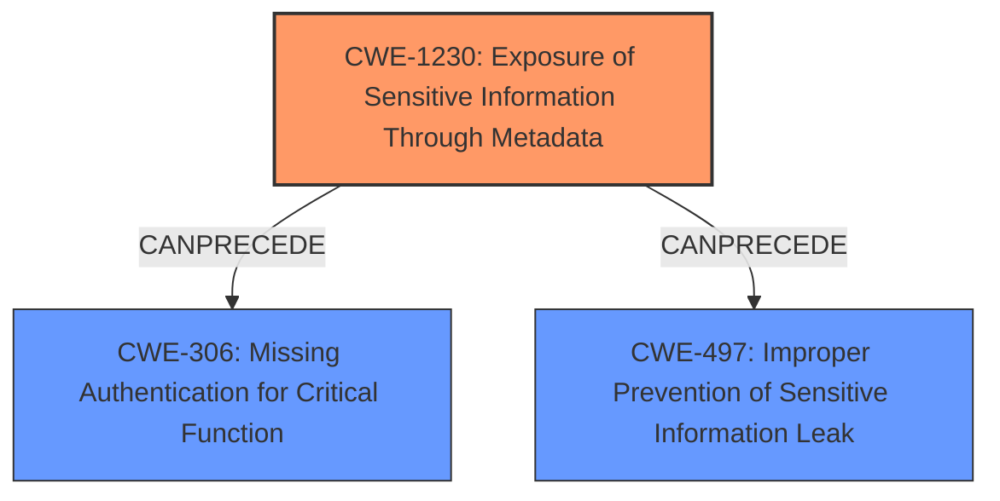

# Final Resolution for CVE-2022-20733

# Summary
| CWE ID | CWE Name | Confidence | CWE Abstraction Level | CWE Vulnerability Mapping Label | CWE-Vulnerability Mapping Notes |
|---|---|---|---|---|---|
| CWE-1230 | Exposure of Sensitive Information Through Metadata | 0.95 | Base | Allowed | Primary CWE: Root cause is the **exposed sensitive Security Assertion Markup Language (SAML) metadata**. |
| CWE-306 | Missing Authentication for Critical Function | 0.65 | Base | Allowed | Secondary Candidate: Impact is bypassed authentication, a consequence of the root cause. |
| CWE-497 | Improper Prevention of Sensitive Information Leak | 0.55 | Base | Allowed | Secondary Candidate: Captures the broad Information Exposure aspect, contributing to the overall risk. |

## Evidence and Confidence

*   **Confidence Score:** 0.9
*   **Evidence Strength:** HIGH

## Relationship Analysis
The primary CWE, CWE-1230, lacks direct hierarchical relationships. However, the vulnerability chain analysis reveals its impact on authentication mechanisms, leading to CWE-306. CWE-497 serves as a broader classification, highlighting the general risk of sensitive information exposure. The selection is influenced by the need to represent the root cause (CWE-1230), the immediate consequence (CWE-306), and the general information exposure (CWE-497).

## Vulnerability Chain
The vulnerability chain starts with the **exposed sensitive Security Assertion Markup Language (SAML) metadata** (CWE-1230). This exposure allows an attacker to bypass authentication (CWE-306), leading to unauthorized access. The broader issue of sensitive information leakage (CWE-497) contributes to the overall risk. The root cause is the insufficient limitation of access to metadata. The consequence is full access without restrictions.

## Summary of Analysis
The initial analysis and criticism both accurately identify CWE-1230 as the primary **WEAKNESS**. The vulnerability description explicitly states the root cause is "**exposed sensitive Security Assertion Markup Language (SAML) metadata**". The selection of CWE-1230 is justified by its direct relevance to the **ROOTCAUSE**.

The graph relationships influenced the selection by highlighting the chain of events. The **exposed metadata** (CWE-1230) directly leads to the **bypass of authentication** (CWE-306). The inclusion of CWE-497 is to capture the broader context of sensitive information exposure, even though CWE-1230 is more specific.

The selected CWEs are at the optimal level of specificity. CWE-1230 accurately describes the root cause. CWE-306 describes the immediate impact. CWE-497 describes the more general risk.