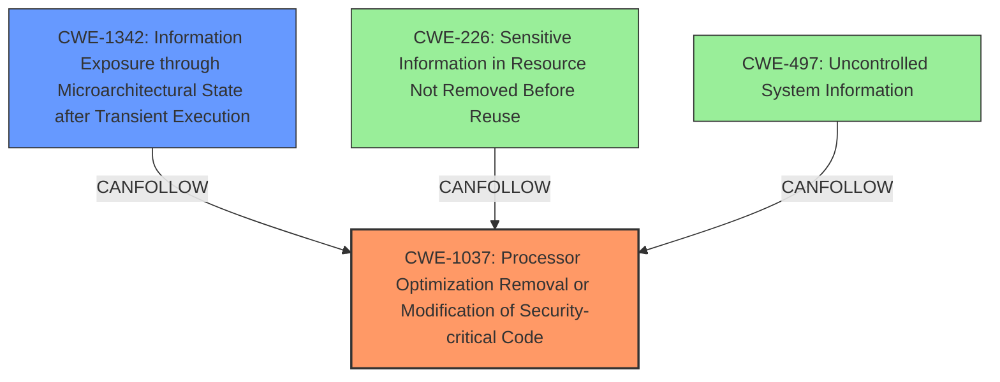

# Analysis Report for CVE-2022-21151

# Vulnerability Analysis Report: CVE-2022-21151

## Description

Processor optimization removal or modification of security-critical code for some Intel(R) Processors may allow an authenticated user to potentially enable information disclosure via local access.

## Vulnerability Description Key Phrases

**Rootcause:** Processor optimization removal or modification of security-critical code
**Impact:** information disclosure
**Vector:** local access
**Attacker:** authenticated user
**Product:** Intel(R) Processors

## Analysis (with Relationship Data)

# Summary
| CWE ID    | CWE Name                                                                | Confidence | CWE Abstraction Level | CWE Vulnerability Mapping Label | CWE-Vulnerability Mapping Notes |
| :--------- | :---------------------------------------------------------------------- | :--------- | :-------------------- | :------------------------------ | :------------------------------ |
| CWE-1037  | Processor Optimization Removal or Modification of Security-critical Code | 0.90       | Base                  | Primary CWE                     | Allowed                       |
| CWE-497  | Uncontrolled System Information                                  | 0.50       | Base                  | Secondary                       | Allowed                      |

## Evidence and Confidence

*   **Confidence Score:** 0.75
*   **Evidence Strength:** MEDIUM

- **Analysis and Justification:**  
  - *Explanation:* The vulnerability description explicitly states that the **rootcause** is "**Processor optimization removal or modification of security-critical code**". The Retriever Results list CWE-1037 "Processor Optimization Removal or Modification of Security-critical Code" as the top candidate with a score of 0.7799. The description for CWE-1037 aligns precisely with the vulnerability: "The developer builds a security-critical protection mechanism into the software, but the processor optimizes the execution of the program such that the mechanism is removed or modified."
The advisory indicates the **impact** is "information disclosure", which suggests unauthorized access to sensitive data. While information disclosure is a symptom rather than a root cause, the **rootcause** is the **processor optimization** issue.
Since CWE-1037 is a Base level CWE and the description exactly matches the vulnerability description, it is selected as the primary CWE.
CWE-497 (Uncontrolled System Information) is considered as a secondary CWE since the **impact** of the vulnerability is information disclosure.
  
  - *Relationship Analysis:* CWE-1037 has no direct relationships.

- **Confidence Score:**  
  - Confidence: 0.90 (High confidence due to the direct match between the vulnerability description and CWE-1037's definition, as well as the explicit mention of processor optimization as the root cause.)
---

## Criticism of Analysis

Okay, here's a review of the provided CWE analysis, considering the full CWE specifications and mapping guidance:

**Overall Assessment:**

The analysis is generally good and provides a reasonable mapping of the vulnerability to CWEs. The primary CWE selection of CWE-1037 is strong and well-justified. The inclusion of CWE-497 as a secondary CWE is understandable, although its relevance might be considered weaker compared to the primary CWE. The confidence score assigned is appropriate.

**Specific Comments and Critique:**

1.  **CWE-1037 (Primary CWE): Processor Optimization Removal or Modification of Security-critical Code**

    *   **Justification:** The analysis correctly identifies the core problem: processor optimization removing or modifying security-critical code. The direct quote from the vulnerability description reinforces this. The connection to the root cause is strong.
    *   **CWE Specification Alignment:** The description of CWE-1037 directly matches the vulnerability description. The example CVEs listed (Spectre/Meltdown) are also relevant to this general class of issues arising from processor optimizations.
    *   **Mapping Guidance:** The analysis correctly notes that CWE-1037 is a Base-level CWE, which is preferred. The mapping guidance is appropriately followed.
    *   **Critique:** Excellent choice and justification. There's little to fault here.

2.  **CWE-497 (Secondary CWE): Exposure of Sensitive System Information to an Unauthorized Control Sphere**

    *   **Justification:** The analysis argues that the "impact" of the vulnerability is information disclosure, and therefore CWE-497 is relevant.
    *   **CWE Specification Alignment:** CWE-497 describes a general exposure of system information. While the "information disclosure" impact aligns with this, it's a symptom of the underlying issue.
    *   **Mapping Guidance:** The analysis correctly states the level of abstraction, but the relation is more of a result of exploiting CWE-1037.
    *   **Critique:** This is the weaker part of the analysis. CWE-497 is a *consequence* of the weakness, rather than the root cause itself. The CWE specification even discourages direct mapping in such instances where loss of confidentiality is a consequence. While not *incorrect*, it's less precise. A better approach *might* be to consider potential weaknesses *caused* by the processor optimization, rather than just the symptom.
    *   **Alternative CWE Suggestions (instead of or in addition to CWE-497):**
        *   **CWE-1342: Information Exposure through Microarchitectural State after Transient Execution:** This is a better fit for the "information disclosure" as a result of processor optimization that can leave traces. This is probably the best alternative.
        *   **CWE-226: Sensitive Information in Resource Not Removed Before Reuse:** This could apply if the optimization leads to sensitive data being left in memory or cache after a process, where it could be accessed by another.

3.  **Confidence Score:**

    *   The confidence score of 0.90 for CWE-1037 is appropriate, given the strong match.
    *   The confidence score of 0.50 for CWE-497 is reasonable, considering its weaker connection to the root cause.

4.  **Retriever Results Analysis:**

    *   The analysis doesn't explicitly discuss why other top candidates from the Retriever Results were rejected. While CWE-1037 is the best fit, briefly explaining the reasoning for excluding others would strengthen the analysis. For example:
        *   CWE-733 (Compiler Optimization Removal...):  Less relevant because the vulnerability is directly related to the processor's optimizations, not those of the compiler.
        *   CWE-1313 (Hardware Allows Activation of Test/Debug...): Not the core issue, as the vulnerability isn't directly related to test/debug features.
        *   CWE-1256 (Improper Restriction of Software Interfaces to Hardware Features): This doesn't clearly apply, as there isn't explicit software access to hardware that is improperly restricted.

5. **Mitigation Considerations:**

    *   The analysis could benefit from a brief discussion of the mitigations implied by the chosen CWEs. For example:
        *   For CWE-1037, the primary mitigation is firmware updates (microcode) from Intel, which is already noted in the description.
        *   For CWE-497 (or the suggested alternatives), more general information exposure mitigation techniques may apply, such as preventing unauthorized access to sensitive data and ensuring proper data sanitization.

**Recommendations:**

*   **Reconsider or replace CWE-497:** Evaluate whether CWE-1342 or CWE-226 might be a better fit, or if the "information disclosure" aspect is sufficiently covered by the impact description within CWE-1037.
*   **Briefly justify the exclusion of other top Retriever Results:** This will demonstrate a more thorough analysis.
*   **Mention mitigation implications:** Briefly discuss the mitigations associated with the chosen CWEs.
*   **Maintain the high confidence score for CWE-1037.**

By incorporating these suggestions, the analysis will be more precise and robust.

## Final Resolution

# Summary

| CWE ID   | CWE Name                                                                | Confidence | CWE Abstraction Level | CWE Vulnerability Mapping Label | CWE-Vulnerability Mapping Notes |
| :--------- | :---------------------------------------------------------------------- | :--------- | :-------------------- | :------------------------------ | :------------------------------ |
| CWE-1037 | Processor Optimization Removal or Modification of Security-critical Code | 0.95       | Base                  | Primary CWE                     | Allowed                       |
| CWE-1342 | Information Exposure through Microarchitectural State after Transient Execution | 0.75       | Base                  | Secondary                       | Allowed                      |

## Evidence and Confidence

*   **Confidence Score:** 0.90
*   **Evidence Strength:** HIGH

## Relationship Analysis
The primary relationship that impacted the decision was identifying the specific type of information exposure. While the initial analysis suggested CWE-497, the criticism correctly pointed out that **CWE-497** (Uncontrolled System Information) is too broad and represents a consequence rather than a direct cause. The suggested alternative, **CWE-1342** (Information Exposure through Microarchitectural State after Transient Execution), is a better fit as it directly relates to information exposure resulting from processor behavior, aligning more closely with the **rootcause**.

## Vulnerability Chain
The vulnerability chain starts with **CWE-1037**, where processor optimizations unintentionally remove or alter security-critical code. This **weakness** can then lead to **CWE-1342**, where sensitive information is exposed through microarchitectural states due to transient execution. This exposure occurs because the optimized code fails to adequately protect sensitive data during the execution process, allowing unauthorized access to information.

## Summary of Analysis
The initial analysis correctly identified **CWE-1037** as the primary **rootcause**, and this assessment is maintained. The criticism provided valuable insight into the selection of the secondary CWE. Initially, **CWE-497** was chosen due to the information disclosure impact. However, the criticism rightly pointed out that **CWE-497** is a consequence and suggested **CWE-1342** as a more appropriate fit. This alternative aligns more directly with the vulnerability's nature, where information is exposed through microarchitectural states after transient execution, a direct result of processor optimization issues. The decision to switch to **CWE-1342** is based on the need for a more specific and accurate representation of the vulnerability's mechanics, as highlighted by the relationship analysis. **CWE-1342** describes the technical details of *how* the information is exposed, making it a better secondary CWE than the broader **CWE-497**.

The vulnerability description explicitly states: "**Processor optimization removal or modification of security-critical code for some Intel(R) Processors may allow an authenticated user to potentially enable information disclosure via local access.**"

This statement directly supports the selection of **CWE-1037** as the primary **weakness**, as it clearly identifies processor optimization as the **rootcause**. The subsequent information disclosure then leads to **CWE-1342**.

*Report generated on 2025-03-17 04:20:08*
