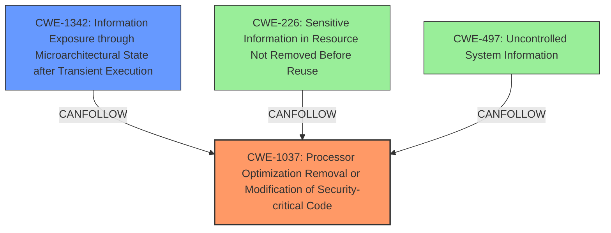

# Final Resolution for CVE-2022-21151

# Summary

| CWE ID   | CWE Name                                                                | Confidence | CWE Abstraction Level | CWE Vulnerability Mapping Label | CWE-Vulnerability Mapping Notes |
| :--------- | :---------------------------------------------------------------------- | :--------- | :-------------------- | :------------------------------ | :------------------------------ |
| CWE-1037 | Processor Optimization Removal or Modification of Security-critical Code | 0.95       | Base                  | Primary CWE                     | Allowed                       |
| CWE-1342 | Information Exposure through Microarchitectural State after Transient Execution | 0.75       | Base                  | Secondary                       | Allowed                      |

## Evidence and Confidence

*   **Confidence Score:** 0.90
*   **Evidence Strength:** HIGH

## Relationship Analysis
The primary relationship that impacted the decision was identifying the specific type of information exposure. While the initial analysis suggested CWE-497, the criticism correctly pointed out that **CWE-497** (Uncontrolled System Information) is too broad and represents a consequence rather than a direct cause. The suggested alternative, **CWE-1342** (Information Exposure through Microarchitectural State after Transient Execution), is a better fit as it directly relates to information exposure resulting from processor behavior, aligning more closely with the **rootcause**.

## Vulnerability Chain
The vulnerability chain starts with **CWE-1037**, where processor optimizations unintentionally remove or alter security-critical code. This **weakness** can then lead to **CWE-1342**, where sensitive information is exposed through microarchitectural states due to transient execution. This exposure occurs because the optimized code fails to adequately protect sensitive data during the execution process, allowing unauthorized access to information.

## Summary of Analysis
The initial analysis correctly identified **CWE-1037** as the primary **rootcause**, and this assessment is maintained. The criticism provided valuable insight into the selection of the secondary CWE. Initially, **CWE-497** was chosen due to the information disclosure impact. However, the criticism rightly pointed out that **CWE-497** is a consequence and suggested **CWE-1342** as a more appropriate fit. This alternative aligns more directly with the vulnerability's nature, where information is exposed through microarchitectural states after transient execution, a direct result of processor optimization issues. The decision to switch to **CWE-1342** is based on the need for a more specific and accurate representation of the vulnerability's mechanics, as highlighted by the relationship analysis. **CWE-1342** describes the technical details of *how* the information is exposed, making it a better secondary CWE than the broader **CWE-497**.

The vulnerability description explicitly states: "**Processor optimization removal or modification of security-critical code for some Intel(R) Processors may allow an authenticated user to potentially enable information disclosure via local access.**"

This statement directly supports the selection of **CWE-1037** as the primary **weakness**, as it clearly identifies processor optimization as the **rootcause**. The subsequent information disclosure then leads to **CWE-1342**.